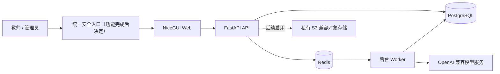

# Child Manager 幼儿园教育管理系统

Child Manager 是面向幼儿园日常教育工作的 Cloud 教育管理系统。项目以模块化、可扩展和可审计为基本原则，首期交付在线“一日活动计划”管理系统，后续逐步接入游戏观察记录、一对一倾听等子系统。

当前项目服务于单所幼儿园，但核心业务数据保留 `kindergarten_id`，为未来多园部署和数据隔离预留扩展边界。

> 当前为内部开发项目，未经授权不得复制或分发。项目暂未采用开源许可证。

## 项目状态

当前 `main` 分支用于维护项目总纲、需求文档、模板、架构约束和变更记录，暂不承载业务实现。Codex 与 Trae 将在各自分支中独立实现完整系统；未来是否将某一实现合并到 `main`，根据项目进展另行决定。

项目目前处于系统框架与首期业务设计阶段。`main` 仅提供共享文档，因此没有可执行的安装、
启动或部署入口；`codex` 已完成 M1 的本地安装及 API、Worker、Web 工程入口，后续业务功能仍
按路线图实现。Trae 状态只以其分支和 Issue #3 的实时证据为准。

共享实施顺序、阶段依赖和完成门禁见 [`docs/ROADMAP.md`](docs/ROADMAP.md)。

## 技术基线

- Python 3.14+
- NiceGUI Web 服务
- FastAPI API 服务
- PostgreSQL 生产数据库
- SQLAlchemy 2.x 与 Alembic
- Redis、Dramatiq 2.x 与独立后台 Worker
- `uv` 与 `pyproject.toml` 依赖管理
- Ruff、Pyright、Pytest

开发和自动化测试允许使用 SQLite，但业务代码不得依赖特定数据库实现。依赖版本必须锁定并验证与 Python 3.14 的兼容性。

## 总体架构

NiceGUI 与 FastAPI 从首期开始即作为两个可独立部署的服务。Web 只能通过 API 访问业务能力，不得直接连接数据库。后续子系统继续以独立应用模块接入 monorepo，达到拆分条件后再考虑独立仓库或服务。



建议的实现分支代码布局：

```text
apps/
├── web/          # NiceGUI 页面与交互
├── api/          # FastAPI 路由与后端装配
└── worker/       # Dramatiq 后台任务进程
packages/
├── contracts/    # 稳定的请求、响应与任务契约
└── backend/      # API 与 Worker 复用的后端业务实现
```

详细服务边界与任务可靠性见 [`docs/design/system-architecture.md`](docs/design/system-architecture.md)，领域数据模型与 PostgreSQL 物理 Schema 分别见 [`docs/design/data-model.md`](docs/design/data-model.md) 和 [`docs/design/database-schema.md`](docs/design/database-schema.md)。API 契约见 [`specs/001-daily-activity-plan/contracts/openapi.yaml`](specs/001-daily-activity-plan/contracts/openapi.yaml) 和 [`specs/001-daily-activity-plan/contracts/README.md`](specs/001-daily-activity-plan/contracts/README.md)，前端页面信息架构见 [`specs/001-daily-activity-plan/research.md`](specs/001-daily-activity-plan/research.md)。

## 用户与权限

首期不开放公众注册。系统初始化时创建首位管理员，后续教师账号由管理员创建。

### 管理员

- 管理教师、班级、学期、幼儿园信息和系统设置
- 配置 AI 模型连接与提示词
- 查看、归档和恢复全园教案

### 教师

- 访问本人关联班级的教案
- 创建、编辑、生成、导出、归档和恢复教案
- 维护本人任教班级的室内与户外区域

教师与班级采用多对多关系，一个班级可关联多名教师并设置一名主班教师。教案默认记录当前教师为编写者，也可从本班关联教师中选择多名共同编写者。

登录采用“用户名或手机号 + 密码”，密码使用 Argon2id 哈希。API 使用短期访问令牌与可撤销刷新令牌，并通过安全的 HttpOnly Cookie 管理会话。

## 首期范围：一日活动计划

首期系统围绕教案的创建、AI 辅助生成、编辑、归档和 Word 导出形成完整闭环。

### 基本规则

- 同一幼儿园、班级和日期只允许存在一份当前教案，以 `(kindergarten_id, class_id, plan_date)` 建立唯一约束。
- 教案持续保存，不设置草稿、完成、审核等复杂状态，仅以 `archived_at` 表示是否归档。
- 任课教师可归档或恢复本人关联班级的教案，管理员可操作全部教案。
- 教师可手动保存；停止输入约 3 秒后自动保存。
- 页面显示“保存中”“已保存”或“保存失败”，并通过版本号乐观锁避免并发覆盖。
- 自动保存只更新当前内容；手动保存、归档、恢复归档、恢复历史版本及教师采用 AI 预览时创建可恢复的历史快照。AI 生成、重试、拒绝和失败本身不创建教案快照。

### 学期、周次与班级

- 管理员设置学期起止日期。
- 学期开始日期所在的自然周为第一周（自然周从周一开始，到周日结束）。如果学期周三开始，周三至周日属于第一周；此前周一、周二仍在学期外，教学周次及显示文本为空。此后每到下一个周一递增一周。
- 系统判断所选日期是否在当前学期内；超出时软提示，但不阻止继续填写。
- 创建教案前必须存在当前学期；学期外日期仍绑定当前学期快照，但教学周次及其文本为空。
- 班级必须设置年龄段，首期内置托班、小班、中班和大班，并允许后续扩展。
- 教师维护本班室内、户外区域，AI 只能从该班级已配置的区域中选择重点指导对象。

### 工作日校验

系统使用本地节假日库作为主要判断来源，以在线节假日 API 作为补充或校验，并缓存查询结果。

- 非工作日只显示软提示，不阻止填写。
- 两种来源均不可用时，显示“无法确认是否为工作日”。
- 两种来源均不可用时，缓存记录为 `result=unknown`、`source=unavailable`，不得伪造普通工作日结论。
- 系统不接入天气服务，也不要求教师选择天气标签。
- AI 只使用系统根据日期推断的季节，以及教师填写的上下文信息。

### 查找与浏览

教案首页提供日历视图和列表视图，支持按班级、日期范围、编写教师和归档状态筛选。首期不包含全文搜索。

## AI 生成规则

系统通过 OpenAI 兼容接口接入模型，不硬编码供应商。管理员可配置多个模型档案，每个档案包括：

- `API_BASE_URL`
- 加密保存且不回显明文的 `API_KEY`
- `MODEL_NAME`
- 模型能力，例如 `text`、`vision`、`structured_output`

系统设置一个默认模型档案，也允许已发布的提示词指定其他档案。业务代码只能依赖统一 AI 服务接口，不得直接依赖 OpenAI、DeepSeek、通义或其他具体供应商 SDK。

### 一键生成与分栏目生成

- 一键生成固定覆盖晨间活动、晨间谈话、室内区域游戏和下午户外游戏四栏；不包含集体活动或一日活动反思。
- 每个栏目都必须提供独立的生成或重新生成功能。
- 一日活动反思仅在前五个上游栏目满足结构化完整性后，由教师显式发起生成。
- 集体活动必须由教师先粘贴纯文本或上传 `.docx` 原始教案。拆分/补全和新增适龄环节分别生成、预览和采用；教师先采用并保存拆分结果后才能生成新增环节。
- 首期不支持 PDF 和图片 OCR 教案导入。
- AI 结果必须先成为结构化预览；只有目标栏目及实际生成输入未变化且教师明确采用时，才更新正文并创建快照。无关栏目变化不使预览失效。
- 一键生成时各栏目作为独立子任务执行；部分失败不回滚已成功栏目，可只重试失败栏目。

### 异步任务与反馈

AI 生成由 Dramatiq、Redis 和独立 Worker 异步执行。API 返回任务 ID，Web 每 1–2 秒短轮询任务状态；任务完成、失败或页面离开后停止轮询。

- 生成时显示“AI 正在生成，请稍候”。
- 自动重试时显示“生成失败，正在重试”。
- 结构化结果校验失败时最多自动重试两次。
- 最终失败后保留教师原有内容，显示可理解的错误并允许单栏目重试。
- 调用日志记录耗时、状态、模型、提示词版本和错误摘要，不记录 API 密钥或完整敏感内容。

AI 请求遵循数据最小化原则，只发送当前栏目生成所必需的数据，默认不发送教师账号、幼儿姓名等身份信息。管理员首次启用模型档案时必须确认外部服务的数据处理风险，系统记录启用人与启用时间。

## AI 提示词管理子系统

提示词作为独立系统能力提供，后续所有业务子系统通过统一接口使用，只有管理员可以管理。

每个提示词应具备：

- 稳定标识
- 输入变量及类型定义
- 所需模型能力
- 指定或默认模型档案
- 草稿与已发布版本
- 历史版本与回滚
- 创建人、修改人和发布时间

业务生成只能读取已发布版本。变量占位符仅允许白名单纯替换语法 `{{ name }}`；不得执行表达式、过滤器、循环或嵌套字段访问。每次 AI 生成需记录所用提示词版本和模型信息，但不得记录 API 密钥。

## Word 导出

首期仅导出 `.docx`，不提供 PDF 导出和在线打印排版。

- 严格基于现有 Word 模板填充，保留表格、字体、字号和段落格式。
- AI 为集体活动新增的环节必须标红，其他内容保持模板原有样式。
- 幼儿园名称从系统设置读取，不在代码中硬编码。
- 教师姓名按教案中选定的编写者顺序导出。

当前模板与填写说明：

- [`templates/teacherplan/teacherplan.docx`](templates/teacherplan/teacherplan.docx)
- [`templates/teacherplan/一日活动计划系统说明.md`](templates/teacherplan/一日活动计划系统说明.md)

## 数据与安全

- 生产环境使用 PostgreSQL，所有结构变更通过 Alembic 迁移。
- 数据库时间戳统一存储为 UTC，业务日期、自然周、节假日和任务展示按 `Asia/Shanghai` 计算。
- 首期界面仅提供简体中文。
- PostgreSQL 每日自动备份，至少保留 30 天。
- 升级和数据库迁移前必须备份，并定期验证恢复流程。
- 备份文件加密保存于应用服务器之外。
- 所有权限必须由 API 服务端校验，不能只依赖页面隐藏操作入口。

后续照片类子系统使用私有 S3 兼容对象存储，数据库只保存对象标识和元数据。系统预留对象存储接口、访问审计、短时签名地址、保留期限和彻底删除能力；一日活动计划首期不部署对象存储，也不实现照片上传。

## 部署时序

生产部署延后到首期全部功能完成并通过功能验收之后。当前不创建生产入口、Caddyfile、生产 Compose 拓扑、公网发布或 Tailscale 配置。

功能完成后先进行威胁建模和访问网络评审，再以新 ADR 确认私有网络或其他入口、生产拓扑、备份恢复和上线流程。本地开发与自动化测试仍可启动所需的 PostgreSQL、Redis 等最小依赖。

## 分支协作规范

| 分支 | 职责 |
| --- | --- |
| `main` | 当前只维护根目录说明、`docs/`、共享 `specs/`、模板、架构约束和变更记录 |
| `codex` | Codex 的完整独立实现、迁移和测试；生产部署文件后续另行设计 |
| `trae` | Trae 的完整独立实现、迁移和测试；生产部署文件后续另行设计 |

不创建长期 `docs` 分支。`main` 中的文档、共享规格和模板更新必须使用只包含 `docs/`、`specs/`、`templates/` 或根目录说明文件的独立提交，再分别 cherry-pick 到 `codex` 和 `trae`。

完整的双 Agent 分支边界、Issue 层级、规格冻结、只读交叉评审和交接协议见 [`docs/development/dual-agent-development.md`](docs/development/dual-agent-development.md)。同机并行开发的 worktree、端口、数据隔离与中国大陆镜像配置见 [`docs/development/local-development-environments.md`](docs/development/local-development-environments.md)。该文档是 M1 的环境合同，不表示当前 `main` 已有可执行启动命令。

示例：

```bash
git switch codex
git cherry-pick <docs-commit>

git switch trae
git cherry-pick <docs-commit>
```

若只需要同步目录当前快照，也可以使用：

```bash
git restore --source main -- docs/ templates/
git commit -m "docs: sync specifications from main"
```

该方式复制目录状态，但不保留原文档提交之间的历史关联，因此优先使用独立文档提交与 cherry-pick。

## 质量标准

`codex` 和 `trae` 分支均应配置 GitHub Actions，并在每次推送时至少执行：

- 依赖锁定校验
- Ruff 格式与静态检查
- Pyright 类型检查
- Pytest 自动化测试
- Docker 镜像构建

首期优先适配桌面浏览器和平板，保证教案表格编辑和 Word 预览体验。手机端只保证登录、浏览和简单修改，不承诺完整排版编辑体验。

## 后续子系统

计划逐步接入：

- 游戏观察记录
- 一对一倾听
- 照片上传与视觉模型识别
- 更多幼儿园教育管理模块

后续子系统应复用统一认证授权、AI 模型档案、提示词管理、异步任务和审计能力；对象存储须在照片能力获批并完成安全设计后才可引入。

## 文档职责与开发工具

README 仅提供产品概览和导航；当前状态见 [`CONTEXT.md`](CONTEXT.md)，里程碑见 [`docs/ROADMAP.md`](docs/ROADMAP.md)，详细业务规则见 [`docs/PRD/lesson-management.md`](docs/PRD/lesson-management.md)，架构与数据库契约见 `docs/design/`。出现冲突时按 [`AGENTS.md`](AGENTS.md) 停止实现并请求确认。

开发环境已安装 `fdfind`、`rg`、`sg`、graphify、Spec Kit、Superpowers 和 `mattpocock/skills`。具体选择和使用规则以 `AGENTS.md` 为准。
