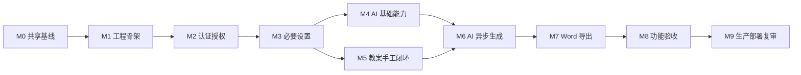

# Child Manager 产品与工程路线图

文档版本：v1.0

状态：共享路线已确认

日期：2026-07-12

适用分支：`main`、`codex`、`trae`

## 1. 文档目的

本文定义 Child Manager 从共享设计基线到首期功能验收、再到生产部署复审的里程碑顺序、依赖、入口条件、出口门禁和验证证据。

本文是 `codex` 与 `trae` 两个独立实现的共享产品路线，不规定内部类名、函数名或页面组件。两个实现可以采用不同内部组织，但必须遵守同一阶段依赖、业务不变量和可观测验收结果。

本文不是：

- 按日期估算的发布承诺。
- 将所有实现细节堆在一个文件中的任务清单。
- 用测试数量、文件数量或页面可打开代替功能验收的进度报告。
- 生产部署设计。根据 ADR-0009，生产访问网络、反向代理、密钥托管、备份恢复和上线流程在全部功能完成后另行复审。

## 2. 事实来源

- [`AGENTS.md`](../AGENTS.md)：开发边界、安全、数据隔离、测试和 Git 规则。
- [`CONTEXT.md`](../CONTEXT.md)：当前项目状态、共同实施顺序与已确认决策。
- [`README.md`](../README.md)：产品范围、技术基线与分支职责。
- [`lesson-management.md`](PRD/lesson-management.md)：首期用户行为、业务流程与验收标准。
- [`system-architecture.md`](design/system-architecture.md)：运行单元、模块接口、事务、任务可靠性与降级边界。
- [`data-model.md`](design/data-model.md) 与 [`database-schema.md`](design/database-schema.md)：领域模型、PostgreSQL 物理约束和 Alembic 顺序。
- [`ADR/`](ADR/README.md)：难以逆转的架构决策与复审条件。

上述文档发生冲突时，按 `AGENTS.md` 的事实来源规则停止实现并请求确认，不在 Roadmap 中静默选择。

## 3. 旧仓库经验与反例

本次参考的旧仓库 `ywyz/kindergartenManager` 版本为 `225fe139d5541539f2be4d0d41ef00061989533d`，主要阅读其 `memory-bank/implementation-plan.md`、`memory-bank/progress.md` 和 `memory-bank/daily-plan/progress.md`。

### 3.1 保留的路线经验

- 把大目标分成可单独验证的里程碑，每步记录明确验证命令和人工交付点。
- 先建立配置、日志、数据库、认证和设置，再实现 AI 与 Word 功能。
- AI、节假日和 Word 边界使用替身实现确定性测试。
- 每个真实 UI 闭环完成后设置轻量人工冒烟，用来发现不适合在组件单测中表达的交互问题。
- 进度记录同时写明已完成、已验证、已知问题和下一步，不只标记勾选状态。

### 3.2 明确不重复的旧路线

- 不在恢复登录和多用户隔离前先完成公网部署或子系统拆分。
- 不把默认固定管理员、单用户模式或 UI 隐藏按钮当作权限闭环。
- 不以 SQLite/MySQL 下的 CRUD 通过代替 PostgreSQL 组合外键、排他约束和并发证据。
- 不以“累计测试数量”代替当前阶段的业务验收。
- 不在需求未冻结时提前建设照片、视觉、对象存储、审批、微服务或生产编排。
- 不把某个阶段的文件已创建或页面已显示误写成业务能力已完成。

## 4. 里程碑管理规则

### 4.1 状态语义

Roadmap 阶段只使用下列状态：

- `pending`：前置门禁未完成，不应开始主体实现。
- `ready`：前置门禁已完成，可以拆分实现 Issue。
- `in_progress`：已开始实现，但至少一项出口门禁未满足。
- `blocked`：存在已记录且必须由外部决策或环境变化解除的阻塞。
- `complete`：本阶段所有出口门禁已由可重复证据证明。

不使用百分比估算进度。任一必需门禁未完成时，阶段不得标记 `complete`。

### 4.2 门禁证据

每个阶段的完成证据至少包含：

1. 对应 Issue/PRD 验收项与实现的映射。
2. 实际执行的命令、结果和未执行原因。
3. 数据库阶段的 Alembic 升级与 PostgreSQL 集成证据。
4. 权限、园所隔离、幂等或模板等负向测试。
5. 真实 UI 用户流程完成时的轻量浏览器冒烟。
6. 未解决风险、兼容性问题和明确不在范围内的内容。

### 4.3 标准质量门禁

从阶段 1 工程骨架建立后，每个实现阶段完成前均执行：

```bash
uv sync --locked
uv run ruff format --check .
uv run ruff check .
uv run pyright
uv run pytest
```

涉及数据库、Worker、Word 或真实用户流程时，还必须执行本文对应阶段列出的专项验证。

### 4.4 分支与 Issue 管理

- `main` 只维护共享文档、模板与架构约束，不实现业务。
- `codex` 和 `trae` 必须从同一个共享基线提交创建，不互相合并实现。
- 只在阶段进入 `ready` 后将其拆成可独立领取的纵向 Issue。
- 每个 Issue 尽量交付一条可验证纵向能力，不默认按“所有模型”、“所有 Repository”、“所有页面”水平分层拆分。
- 未经明确授权不创建分支、提交、推送或 Pull Request。

## 5. 阶段依赖图



M4 和 M5 在 M3 完成后具备并行设计条件，但 M6 必须同时等待 AI 基础能力和手工教案闭环完成。单个实现分支默认按编号顺序推进，避免同时修改核心契约导致返工。

## 6. M0：共享设计基线

当前状态：`in_progress`

### 目标

确保两个实现分支从同一组已审阅事实来源开始，在写代码前冻结首期范围、架构、数据库、Word 模板和开发规则。

### 已具备

- README、AGENTS、CONTEXT、PRD、ADR、系统架构、数据模型、PostgreSQL Schema、Word 模板和填写说明已建立。
- 产品已确认 Cloud-only、首期单园与未来园所隔离边界。
- 生产部署已根据 ADR-0009 延后。

### 出口门禁

- [ ] 共享文档与模板完成最终交叉审阅，不存在已知事实冲突。
- [ ] `main` 中共享基线形成单一目的提交。
- [ ] 经明确授权后，`codex` 和 `trae` 从同一提交创建。
- [ ] 两个分支均记录基线提交，不带未审阅业务代码。

### 明确不做

- 不在 `main` 创建 Python 业务骨架。
- 不创建长期 `docs` 分支。
- 不提前建设生产部署或未来子系统空壳。

## 7. M1：工程骨架与质量基线

入口条件：M0 `complete`。

### 交付范围

- 建立 `apps/web`、`apps/api`、`apps/worker`、`packages/contracts`、`packages/backend`。
- 建立 Python 3.14+ 的 `pyproject.toml` 和 `uv.lock`。
- 配置 Ruff、Pyright、Pytest 和 GitHub Actions。
- 建立三个独立运行入口、结构化日志和请求/追踪 ID 基础。
- 为本地开发与自动化测试提供 PostgreSQL、Redis 最小依赖与健康检查。
- 建立 Web 禁止导入 ORM、Repository 或 `packages/backend` 的静态架构检查。

### 出口门禁

- [ ] `uv sync --locked` 可在干净环境完成。
- [ ] 三个运行入口可独立启动并返回存活状态。
- [ ] API 就绪检查可区分 PostgreSQL、Redis 和外部 AI 的不同失败；AI 不可用不得令 API 整体不就绪。
- [ ] 静态架构检查能阻止 Web 绕过 API。
- [ ] 标准五条质量命令全部通过。

### 明确不做

- 不创建生产 Caddyfile、生产 Compose、Tailscale、公网 DNS、证书或云主机发布流程。
- 不为业务模块创建空表、空页面或机械工厂。

## 8. M2：认证、授权与身份审计

入口条件：M1 `complete`。

### 交付范围

- Alembic 启用 `btree_gist`，建立园所、用户、角色、用户角色、刷新令牌和审计事件表。
- 幂等种子 `admin` 和 `teacher`，安全初始化首位管理员。
- Argon2id 密码、短期 access token、可轮换/撤销 refresh token、重放检测和账号停用。
- 同源 HttpOnly Cookie、CSRF、来源校验与 API 服务端授权。
- 管理员创建、启停、重置密码和查看账号。
- 从第一次初始化、登录和权限变更开始写入审计。

### 出口门禁

- [ ] 空库 `alembic upgrade head` 创建身份与审计 Schema，再次运行幂等。
- [ ] 不开放公众注册，不允许停用或移除最后一个有效管理员。
- [ ] 未登录、停用账号、过期/撤销/重放刷新令牌和缺少 CSRF 的请求被 API 拒绝。
- [ ] Cookie 不进入 JavaScript、NiceGUI 持久化存储或日志。
- [ ] 显式开发配置仅能在回环地址使用 `Secure=false`；非回环绑定必须拒绝启动。
- [ ] PostgreSQL 证明园所组合外键、用户名/手机号唯一性和刷新令牌轮换事务。
- [ ] 浏览器冒烟覆盖本地登录、退出、账号创建与停用后会话失效。

## 9. M3：首期必要设置

入口条件：M2 `complete`。

### 交付范围

- Alembic 建立年龄段、班级、班级教师、学期、班级区域和工作日缓存表。
- 幂等种子托班、小班、中班和大班年龄段。
- 管理员维护园所、学期、教师、班级、教师关联和主班教师。
- 任课教师维护本人关联班级的室内/户外有序区域。
- 日期模块统一计算学期、自然周、星期、季节和工作日软提示。

### 出口门禁

- [ ] PostgreSQL 验证有效学期 GiST 日期范围不重叠、每园最多一个当前学期。
- [ ] 每班最多一名主班教师，教师关联必须具备 `teacher` 角色。
- [ ] 跨园班级、教师、学期和区域关联被组合外键拒绝。
- [ ] 区域保持顺序，空白或规范化后重名被拒绝。
- [ ] 本地节假日库、在线替身、缓存和“无法确认”降级通过确定性测试。
- [ ] 跨班教师不能查看或修改区域，管理员只有同时是该班教师时才能维护区域。
- [ ] 浏览器冒烟覆盖园所、学期、班级/教师关联与班级区域编辑。

## 10. M4：AI 模型与提示词基础

入口条件：M3 `complete`。

### 交付范围

- Alembic 建立 AI 模型档案、能力、提示词定义、版本和测试记录表。
- 幂等种子 7 个系统提示词定义与只读默认版本。
- 实现 AI Key 认证加密、密文版本、主密钥来源缝隙和页面脱敏。
- 管理员管理模型档案、能力、并发/限流、默认档案和首次启用风险确认。
- 管理员创建提示词草稿、测试、发布、查看历史和回滚为新发布版本。
- 实现 OpenAI 兼容的 AI 适配器与测试替身，但不在业务代码散落运营提示词。

### 出口门禁

- [ ] 数据库中只存储 AI Key 密文、版本、Key ID 和脱敏末尾，日志/审计/异常不出现明文。
- [ ] 每园最多一个已启用默认档案，启用前必须完成风险确认并具备密文。
- [ ] 提示词版本与定义的三列外键归属正确，每定义最多一个自定义草稿。
- [ ] 已发布版本不被原地修改，回滚生成新版本，未发布草稿不影响业务生成。
- [ ] 变量白名单、能力校验、Schema 版本和模型选择通过契约测试。
- [ ] 常规自动化测试只使用本地替身，不调用真实或付费 AI。
- [ ] 浏览器冒烟覆盖密钥脱敏、模型档案和提示词草稿→发布→回滚流程。

## 11. M5：无 AI 教案手工闭环

入口条件：M3 `complete`。M4 不是功能依赖，但单分支默认在 M4 后实施。

### 交付范围

- Alembic 建立教案、作者、快照和原始教案来源表。
- 实现日历/列表视图、班级、日期、编写者和归档筛选。
- 实现创建或打开同班同日唯一教案、六大栏目结构化编辑、显式保存和约 3 秒自动保存。
- 实现乐观锁、保存状态、手动快照、历史恢复、归档与恢复归档。
- 实现园所/班级权限、作者顺序与设置快照。
- 实现学期、教学周、星期、季节和工作日软提示，无外部服务时仍可保存。

### 出口门禁

- [ ] PostgreSQL 唯一约束证明归档教案仍占用 `(kindergarten_id, class_id, plan_date)`。
- [ ] 两个请求使用同一 `expected_version` 更新时只有一个成功，另一个返回中文可理解冲突。
- [ ] 自动保存不建快照；手动保存、归档、恢复归档和历史恢复建立正确原因快照。
- [ ] 快照、正文、作者、版本与审计在同一事务中成功或回滚，Repository 不自行提交。
- [ ] 管理员可查看/归档全园教案，但未关联班级时不能编辑正文；教师不能访问未关联班级。
- [ ] 学期外、非工作日和无法确认都只软提示，不阻止创建、保存或归档。
- [ ] 浏览器冒烟完成“创建→编辑→自动保存→显式保存→归档→恢复→历史恢复”。

## 12. M6：AI 异步生成与人工采用

入口条件：M4 与 M5 均 `complete`。

### 交付范围

- Alembic 建立 PostgreSQL 权威后台任务和 AI 结果表。
- API 事务内创建 `pending_dispatch`，提交后投递 Redis；Worker 按 `job_id` 租约领取。
- 实现父任务与栏目子任务、恢复扫描、心跳、过期租约和幂等结果。
- 实现栏目级生成/重新生成、一键多栏目部分成功、最多三次模型调用与稳定错误分类。
- 实现集体活动粘贴文本/`.docx` 临时解析、拆分、补全与新增一个适龄环节。
- Worker 只保存结构化预览；API 在教师明确采用时重新验证权限和教案版本，建快照后写入正文。
- Web 每 1–2 秒短轮询父任务状态，页面重载后可恢复查询。

### 出口门禁

- [ ] 数据库已提交但 Redis 失败时保留 `pending_dispatch`，恢复扫描可重投。
- [ ] Redis 已收到消息但 `queued` 回写失败时，Worker 可幂等领取且不产生重复结果。
- [ ] 重复投递、Worker 中断、过期租约和恢复扫描不突破最多三次模型调用。
- [ ] 一键生成中某一栏目失败不回滚已成功栏目，可只重试失败栏目。
- [ ] Schema 校验失败触发至多两次自动重试；认证、余额、权限、模型和配置错误立即失败。
- [ ] 任务消息、日志和审计不含 API Key、令牌、完整教案或上传文件。
- [ ] 教案在预览生成后发生版本变化时，采用请求冲突且不覆盖教师内容。
- [ ] 浏览器冒烟覆盖生成、重试提示、部分失败、预览、采用、拒绝和页面重载恢复。

## 13. M7：固定 Word 导出与历史

入口条件：M6 `complete`。

### 交付范围

- Alembic 建立独立 Word 导出记录。
- API 校验权限、当前教案版本和缺失栏目软确认，创建后台导出任务。
- Worker 从不可变教案上下文复制固定模板，填充表格、字体、换行和新增环节红字。
- 导出存储缝隙实现临时文件、刷盘/哈希校验、原子改名和孤儿文件补偿。
- API 鉴权下载，不暴露服务器路径；导出历史可重新下载。

### 出口门禁

- [ ] 原始模板 SHA-256 与 Git 状态未改变，模板缺失或哈希不符时明确失败，不从零重建近似文档。
- [ ] 园所名称、学期月份范围、周次、日期、班级、作者顺序和六大栏目位置正确。
- [ ] 只有 `is_ai_added = true` 的集体活动新增环节正文为红色，其他 AI 内容不整体标红。
- [ ] 重复导出产生独立记录和存储键，不覆盖旧文件。
- [ ] 成功记录具备文件大小、文件哈希、模板哈希和导出时间；失败记录不指向半成品。
- [ ] 文件已原子改名但数据库失败时，重试补偿或清理器不留下静默孤儿。
- [ ] 不同园所、未关联班级教师和无权用户无法下载导出。
- [ ] 使用虚构教师/班级数据完成真实 `.docx` 浏览器导出与重新下载冒烟。

## 14. M8：首期功能验收

入口条件：M7 `complete`。

### 验收范围

- 完整用户流程：必要设置→创建教案→手工编辑→AI 生成→人工采用→保存→归档/恢复→Word 导出/重新下载。
- 角色、园所、班级、作者和管理员特殊权限边界。
- PostgreSQL 完整迁移、组合外键、部分索引、GiST、乐观锁和并发任务。
- AI、Redis、Worker、节假日和文件存储失败时的降级、恢复与幂等。
- 审计、结构化日志、数据最小化和稳定中文错误。
- 桌面浏览器与平板关键流程；手机端只验收登录、浏览和简单修改。

### 出口门禁

- [ ] PRD 第 18 节所有当前功能验收项有对应证据，延后的生产运维项不伪装成已完成。
- [ ] 标准五条命令在干净锁定环境全部通过。
- [ ] 空 PostgreSQL 库和包含典型种子数据的库均可完整 `alembic upgrade head`。
- [ ] 无真实或付费 AI、无外部节假日网络时，自动化回归仍确定通过。
- [ ] 所有手工冒烟使用虚构身份数据，结果不进入 Git。
- [ ] 没有未解释的跳过测试、宽松断言、临时文件、调试输出、密钥或真实个人信息。
- [ ] 功能验收报告记录已执行命令、浏览器流程、结果、已知风险与生产复审输入。

## 15. M9：生产安全与部署复审

入口条件：M8 `complete`。本阶段不属于当前功能开发范围。

### 复审输入

- 已验收功能、实际数据类型、外部 AI 传输范围和资源需求。
- 从公网扫描经验提取的威胁模型。
- 管理员、教师、设备准入、应急访问和带外恢复需求。
- 数据保留、导出历史、备份、RPO/RTO 和恢复演练需求。

### 必须另行决定

- 私有网络专用访问、受限公网入口或其他方案。
- Tailscale 或等效网络的用户、设备、ACL、撤销和应急管理方式。
- 统一 HTTPS 入口、反向代理、域名、证书与防火墙。
- 生产运行单元、资源限制、数据持久化、密钥托管与轮换。
- 备份媒介、异地保存、保留期、RPO/RTO、恢复演练、监控和告警。
- 发布、迁移、回滚、应急响应和安全补丁流程。

### 出口门禁

- [ ] 威胁模型和访问网络决策由新 ADR 冻结。
- [ ] 所有公开端口、私有网络访问和带外通道有可验证的默认拒绝规则。
- [ ] 生产密钥不进入代码库、数据库、镜像、普通环境变量或日志。
- [ ] 备份恢复和 RPO/RTO 由隔离环境演练证明，不只检查备份文件存在。
- [ ] 生产发布前完成访问、Cookie、CSRF、代理头、迁移、导出下载、健康检查和恢复冒烟。

## 16. 当前状态快照

状态日期：2026-07-12

| 里程碑 | 状态 | 当前证据 | 下一个解锁动作 |
| --- | --- | --- | --- |
| M0 共享基线 | `in_progress` | `main` 已建立共享文档、ADR、Schema 与模板；本地/远程仅有 `main` | 完成基线审阅，经授权后从同一提交创建两个实现分支 |
| M1–M8 | `pending` | 当前无 `pyproject.toml`、`uv.lock`、业务代码、迁移或自动化测试 | 等待 M0 `complete` |
| M9 生产复审 | `pending` | ADR-0009 明确延后 | 等待 M8 `complete` |

该快照只能根据实际分支、文件、命令与验收证据更新。不得根据另一实现分支、计划文件或未执行命令猜测状态。

## 17. Roadmap 更新规则

出现以下任一情况时更新本文：

- 产品范围、业务不变量或里程碑依赖发生变化。
- 一个里程碑进入 `ready`、`in_progress`、`blocked` 或 `complete`。
- 新的 ADR 改变已确认技术路线或复审条件。
- 出现会影响后续阶段的已知问题、兼容性约束或临时方案。

更新时：

1. 同步文档日期与当前状态快照。
2. 链接实际验收证据，不将详细日志复制进 Roadmap。
3. 保留已完成里程碑的历史出口门禁，不为了简短删除关键约束。
4. 同步 `CONTEXT.md` 的当前分支状态与下一步。
