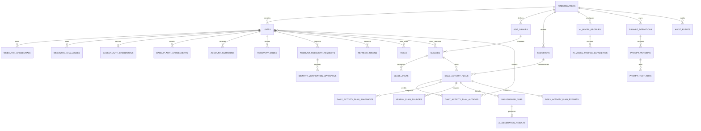

# Child Manager 数据模型设计

文档版本：v1.2

状态：已确认，待实现

日期：2026-07-23

适用范围：Cloud 首期单园部署及后续业务子系统扩展

## 1. 文档目的

本文定义 Child Manager 首期数据模型、实体关系、字段职责、数据库约束、园所隔离、历史快照、异步任务、数据保留和迁移原则。本文应足以指导 SQLAlchemy 2.x 模型、Alembic 迁移、Repository 和 PostgreSQL 集成测试的实现。

本文不定义 API 字段、页面表单或具体 Python 类名。用户行为和验收标准以 [`docs/PRD/lesson-management.md`](../PRD/lesson-management.md) 为准，整体服务边界以 [`docs/design/system-architecture.md`](system-architecture.md) 为准，PostgreSQL 物理列、约束、索引和迁移顺序以 [`docs/design/database-schema.md`](database-schema.md) 为准，关键取舍以 [`docs/ADR/`](../ADR/README.md) 为准。

本文描述目标模型，不表示当前 `main` 已经存在数据库或迁移。

## 2. 设计来源与旧系统取舍

### 2.1 事实来源

- [`AGENTS.md`](../../AGENTS.md)：园所隔离、迁移、安全和验证硬性规则。
- [`CONTEXT.md`](../../CONTEXT.md)：项目阶段、首期范围和实施顺序。
- [`docs/PRD/lesson-management.md`](../PRD/lesson-management.md)：业务对象、生命周期和验收标准。
- [`docs/design/system-architecture.md`](system-architecture.md)：服务、任务、存储和安全边界。
- [`templates/teacherplan/一日活动计划系统说明.md`](../../templates/teacherplan/一日活动计划系统说明.md)：教案结构和字段格式。

### 2.2 从旧系统吸收的经验

- 教案必须保存结构化内容，不能只保存不可解析的大段文本。
- 班级区域是有序集合，不应保存为逗号字符串。
- AI 输出、提示词版本和 Word 模板必须能够追溯。
- AI 新增环节需要稳定结构标记，不能依赖正文中的“新增”字样。
- UI 不得成为数据约束和权限的唯一执行点。

### 2.3 明确不继承的旧模型

- 本地单例设置表、安装实例标识和操作系统 keyring。
- SQLite 正式存储、MySQL 生产模型或未来再迁移 PostgreSQL。
- 本地单班级、单教师字段和 `teacher_name` 直接覆盖历史身份。
- 通用 `deleted_at` 软删除、教案无历史版本或只保存导出元数据。
- 图片 BLOB、桌面文件绝对路径和本地用户数据目录模型。
- 年龄段专属提示词版本；首期年龄段仅作为提示词变量。

## 3. 总体建模原则

### 3.1 PostgreSQL 是生产事实来源

生产环境使用 PostgreSQL。SQLite 仅用于快速开发和确定性测试，不能替代以下 PostgreSQL 验证：

- 学期日期范围排他约束。
- 部分唯一索引。
- JSONB、UUID 和时区行为。
- 乐观锁和并发任务抢占。
- 园所隔离、唯一约束和迁移升级。

数据库结构只能通过 Alembic 迁移修改，禁止使用 `create_all()` 建立生产结构。

### 3.2 UUIDv7 主键

- 业务实体统一使用应用层生成的 UUIDv7 主键。
- PostgreSQL 使用原生 `UUID`；SQLite 测试映射为规范 UUID 字符串。
- API、任务消息、审计和文件记录直接使用同一 UUID，不增加第二套 `public_id`。
- 纯关联表可以使用组合主键，不强制增加无业务价值的 UUID。
- 外部输入的 UUID 必须按资源所属园所再次鉴权，UUID 不构成授权能力。

### 3.3 园所隔离

除系统级角色代码、迁移元数据外，所有业务表必须包含 `kindergarten_id`。即使可通过父表推导，也保留该列以支持 Repository 强制过滤、组合外键和未来分区。

规则如下：

- 每个 Repository 方法必须显式接收 `kindergarten_id`。
- 所有园所内唯一约束均以 `kindergarten_id` 开头。
- 子表使用 `(kindergarten_id, parent_id)` 组合外键指向父表的对应组合唯一键，防止跨园关联。
- API 中的 `kindergarten_id` 来自服务端身份上下文，不能信任请求体或 URL 中的园所值。
- 关联表、任务、导出和审计同样受园所隔离约束。

### 3.4 时间与日期

- 时间点使用带时区 `TIMESTAMPTZ`，以 UTC 写入。
- 纯业务日期使用 `DATE`，例如活动日期和学期起止日期。
- 页面、自然周、工作日和季节按 `Asia/Shanghai` 计算。
- 所有可变业务实体包含 `created_at`、`updated_at`；按职责增加明确的 `created_by`、`updated_by`。
- 不使用数据库服务器本地时区解释业务日期。

### 3.5 字符串、枚举和规范化

- 数据库 Enum 只用于几乎不可能扩展的基础设施状态；业务角色、年龄段和能力标签使用表或稳定字符串代码。
- 稳定状态代码使用英文 `snake_case`，用户文案不存入状态字段。
- 名称保存展示值和必要的规范化值；唯一性使用规范化列。
- 用户输入正文使用 `TEXT`，短名称和代码使用有明确上限的 `VARCHAR`。
- 错误摘要有长度上限，不保存堆栈、密钥或完整供应商响应。

### 3.6 停用、归档与不可变历史

- 用户使用 `status` 状态机，班级、年龄段、学期、班级区域和 AI 模型档案使用 `is_active`
  或对应业务状态停用，不提供物理删除。
- 教案只使用 `archived_at` 与 `archived_by`，不增加 `deleted_at`。
- 审计事件、教案快照和已发布提示词版本不可更新、不可删除。
- 草稿和测试结果仅按本文明确规则修改或清理，不引入通用软删除框架。

## 4. 模型总览

### 4.1 首期表清单

| 领域 | 表 |
| --- | --- |
| 园所与身份 | `kindergartens`、`users`、`webauthn_credentials`、`webauthn_challenges`、`backup_auth_credentials`、`backup_auth_enrollments`、`bootstrap_initializations`、`account_invitations`、`recovery_codes`、`account_recovery_requests`、`identity_verification_approvals`、`roles`、`user_roles`、`refresh_tokens` |
| 教学设置 | `age_groups`、`classes`、`class_teachers`、`semesters`、`class_areas` |
| AI 设置 | `ai_model_profiles`、`ai_model_profile_capabilities` |
| 提示词 | `prompt_definitions`、`prompt_versions`、`prompt_test_runs` |
| 教案 | `daily_activity_plans`、`daily_activity_plan_authors`、`daily_activity_plan_snapshots`、`lesson_plan_sources` |
| 后台任务 | `background_jobs`、`ai_generation_results` |
| Word 导出 | `daily_activity_plan_exports` |
| 系统支撑 | `workday_cache`、`audit_events` |

首期不创建幼儿、年级组、检查、批注、审批、照片、对象存储或未来子系统业务表。

### 4.2 核心关系图



图中未展开所有审计操作者、组合外键和可选关系；数据库约束以本文表定义为准。

## 5. 园所与身份模型

### 5.1 `kindergartens`

| 字段 | 类型 | 约束与用途 |
| --- | --- | --- |
| `id` | UUID | UUIDv7 主键 |
| `name` | VARCHAR(200) | 非空，园所展示名称 |
| `timezone` | VARCHAR(64) | 非空，首期固定 `Asia/Shanghai` |
| `is_active` | BOOLEAN | 非空，默认 true |
| `created_at` | TIMESTAMPTZ | 非空 |
| `updated_at` | TIMESTAMPTZ | 非空 |

首期部署只能初始化一条有效园所记录，但不通过数据库单例约束阻止未来多园数据迁移。

### 5.2 `users`

| 字段 | 类型 | 约束与用途 |
| --- | --- | --- |
| `id` | UUID | UUIDv7 主键 |
| `kindergarten_id` | UUID | 园所外键 |
| `username` | VARCHAR(120) | 展示值，非空 |
| `username_normalized` | VARCHAR(120) | NFKC、trim、lower 后的账号查找值，不是认证秘密 |
| `phone_e164` | VARCHAR(32) | 可空，首期大陆手机号保存为 `+86...` |
| `display_name` | VARCHAR(120) | 非空，不要求唯一 |
| `webauthn_user_handle` | BYTEA | 非空，服务端随机 32 字节且全局唯一，不含 PII |
| `status` | VARCHAR(32) | `pending_registration/pending_verification/active/suspended` |
| `backup_auth_version` | INTEGER | 非空，默认 1；仅用于撤销旧备用认证状态 |
| `activated_at` | TIMESTAMPTZ | 可空；首次人工核验激活时间 |
| `last_login_at` | TIMESTAMPTZ | 可空 |
| `created_by` | UUID | 可空；首位管理员初始化时为空 |
| `updated_by` | UUID | 可空 |
| `created_at` | TIMESTAMPTZ | 非空 |
| `updated_at` | TIMESTAMPTZ | 非空 |

约束与索引：

- 唯一 `(kindergarten_id, username_normalized)`。
- `phone_e164 IS NOT NULL` 时唯一 `(kindergarten_id, phone_e164)`。
- 全局唯一 `webauthn_user_handle`，长度固定 32 字节。
- 园所与账号状态索引 `(kindergarten_id, status)`。
- 停用账号继续占用用户名和手机号。

`created_by`、`updated_by` 必须指向同园用户。禁止级联删除用户。账号状态只允许：

```text
pending_registration -> pending_verification -> active -> suspended
pending_verification -> pending_registration   # 注册凭据被管理员撤销后重新邀请
active -> pending_registration                  # 管理员撤销教师最后一个凭据并重新邀请
suspended -> active                             # 仍有有效凭据且管理员重新启用
suspended -> pending_registration               # 无有效凭据时重新启用并邀请
```

注册成功不等于激活；只有满足对应带外核验后才能从 `pending_verification` 进入 `active`。
`users` 不包含 `password_hash`、`password_changed_at`、TOTP 种子或其他认证秘密。M2
删除的旧密码兼容列不恢复；M3A 新备用摘要只存在于独立 `backup_auth_credentials`。

### 5.3 `webauthn_credentials`

| 字段 | 类型 | 约束与用途 |
| --- | --- | --- |
| `id` | UUID | UUIDv7 主键 |
| `kindergarten_id` | UUID | 园所外键 |
| `user_id` | UUID | 同园账号外键 |
| `credential_id` | BYTEA | 认证器生成的 Credential ID |
| `public_key_cose` | BYTEA | 验证 assertion 的 COSE 公钥 |
| `sign_count` | BIGINT | 非空，最近成功 assertion 的签名计数 |
| `transports` | JSONB | 字符串数组；只保存 WebAuthn 标准 transport 值 |
| `aaguid` | UUID | 可空，认证器 AAGUID |
| `backup_eligible` | BOOLEAN | 注册时 BE 标志 |
| `backup_state` | BOOLEAN | 最近 ceremony 的 BS 标志 |
| `attestation_format` | VARCHAR(32) | 可空；首期请求 `none`，仅保存实际最小结果 |
| `label` | VARCHAR(120) | 用户可修改的设备名称，NFKC/trim 后非空 |
| `created_via` | VARCHAR(32) | `bootstrap/invitation/self_add/recovery/migration` |
| `last_used_at` | TIMESTAMPTZ | 可空 |
| `revoked_at` | TIMESTAMPTZ | 可空 |
| `revoke_reason` | VARCHAR(64) | 可空，稳定代码 |
| `created_at`、`updated_at` | TIMESTAMPTZ | 非空 |

约束与不变量：

- 唯一 `(kindergarten_id, credential_id)`；`credential_id` 与公钥不是 PII 展示字段。
- 组合外键 `(kindergarten_id, user_id)` 指向 `users`。
- 只保存公钥、凭据 ID 和 W3C 推荐的最小验证元数据；认证器私钥、生物特征和本地 PIN
  永不离开认证器，也不得进入本表。
- 注册固定 `residentKey=required`、`userVerification=required`；新增本人凭据时排除该用户
  既有有效 Credential ID。
- 非零签名计数倒退或重复属于高风险异常，拒绝 assertion 并记录审计；始终为 0 的同步
  通行密钥不能只因计数为 0 被拒绝，仍必须通过全部其他验证。
- 撤销凭据不可物理删除。自助撤销不能移除本人最后一个有效凭据；管理员撤销教师最后一个
  有效凭据时必须在同一事务撤销会话并把账号转为 `pending_registration`。

### 5.4 `webauthn_challenges`

| 字段 | 类型 | 约束与用途 |
| --- | --- | --- |
| `id` | UUID | UUIDv7 ceremony 标识 |
| `kindergarten_id` | UUID | 园所外键；由单园实例或授权材料确定 |
| `user_id` | UUID | 可空；可发现凭据认证开始时尚未识别账号 |
| `purpose` | VARCHAR(40) | `bootstrap_registration/invitation_registration/self_add/recovery_registration/authentication/step_up` |
| `challenge_hash` | VARCHAR(128) | 服务端随机至少 32 字节 challenge 的强哈希 |
| `authorization_context_id` | UUID | 可空；绑定初始化、邀请、恢复请求或当前 session/family |
| `expected_rp_id` | VARCHAR(253) | 签发时冻结的 RP ID |
| `expected_origin` | VARCHAR(2048) | 签发时冻结的精确 HTTPS Origin；开发仅允许 `localhost` 例外 |
| `expires_at` | TIMESTAMPTZ | 非空，签发后最长 5 分钟 |
| `consumed_at` | TIMESTAMPTZ | 可空；成功或最终失败验证后消费 |
| `failed_attempts` | SMALLINT | 非空，默认 0 |
| `created_at`、`updated_at` | TIMESTAMPTZ | 非空 |

challenge 必须高熵、短时、单次并绑定 purpose。完成 ceremony 时在行锁内核对未过期、未消费、
authorization context 仍有效，再验证 `type/challenge/origin/rpIdHash/UP/UV/signature`；成功后
和凭据/会话状态变更在同一事务消费。不同 purpose 的 challenge 不可互换。过期或已消费记录
保留 30 天用于脱敏诊断后清理。

### 5.4A `backup_auth_credentials`

每个账号最多一行当前备用认证材料；待确认状态只存在于 enrollment，不建立第二个 pending
事实来源。

| 字段 | 类型 | 约束与用途 |
| --- | --- | --- |
| `id` | UUID | UUIDv7 主键 |
| `kindergarten_id` | UUID | 园所外键 |
| `user_id` | UUID | 同园账号外键 |
| `status` | VARCHAR(16) | `enabled/revoked` |
| `password_hash` | TEXT | Argon2id PHC 摘要；不保存密码 |
| `password_changed_at` | TIMESTAMPTZ | 最近生效时间 |
| `totp_ciphertext` | BYTEA | AES-256-GCM 密文 |
| `totp_nonce` | BYTEA | 12 字节随机 nonce |
| `totp_key_id` | VARCHAR(64) | 数据库外主密钥标识 |
| `totp_envelope_version` | SMALLINT | AAD/信封格式版本 |
| `totp_algorithm` | VARCHAR(16) | 固定 `SHA1` |
| `totp_digits` | SMALLINT | 固定 6 |
| `totp_period_seconds` | SMALLINT | 固定 30 |
| `last_accepted_counter` | BIGINT | 可空；最近成功 TOTP 时间步 |
| `enabled_at`、`revoked_at` | TIMESTAMPTZ | 状态时间 |
| `created_at`、`updated_at` | TIMESTAMPTZ | 非空 |

唯一 `(kindergarten_id, user_id)`；组合外键指向同园用户。`enabled` 要求密码摘要、完整 TOTP
信封和 `enabled_at` 同时存在；`revoked` 必须清除摘要与信封。TOTP AAD 绑定园所、用户、
本记录 ID 和 envelope version。Repository 只以
`last_accepted_counter IS NULL OR last_accepted_counter < candidate` 的条件原子推进计数器，
更新不到一行即视为重放。

### 5.4B `backup_auth_enrollments`

| 字段 | 类型 | 约束与用途 |
| --- | --- | --- |
| `id` | UUID | UUIDv7 主键及公开 opaque enrollment ID |
| `kindergarten_id` | UUID | 园所外键 |
| `user_id` | UUID | 同园账号外键 |
| `session_token_id` | UUID | 发起时的当前 `refresh_tokens.id`；管理员首次可为受限设置会话 |
| `totp_ciphertext`、`totp_nonce` | BYTEA | 待确认种子 AEAD 信封 |
| `totp_key_id` | VARCHAR(64) | 数据库外主密钥标识 |
| `totp_envelope_version` | SMALLINT | 信封版本 |
| `expires_at` | TIMESTAMPTZ | 发起后 10 分钟 |
| `consumed_at` | TIMESTAMPTZ | 成功后非空 |
| `invalidated_at` | TIMESTAMPTZ | 被新绑定或会话变化作废时非空 |
| `invalidation_reason` | VARCHAR(32) | 可空，`superseded/session_changed` |
| `created_at`、`updated_at` | TIMESTAMPTZ | 非空 |

`consumed_at` 与 `invalidated_at` 互斥；部分唯一约束只允许一个两者均为空的未终结
enrollment，新绑定先原子作废旧行再插入，动态过期不进入索引谓词。密码只在 verify 请求中
出现，不写入本表。验证必须匹配园所、用户、当前未撤销且未被替换的 refresh token、未过期、
未消费且未作废；refresh token 轮换、撤销或过期会令 enrollment 失效。enrollment 信封 AAD
绑定园所、用户、enrollment ID 和版本；成功后以新 nonce 重加密并把 AAD 改绑 credential ID。
密码策略与首个 TOTP 同时通过后，在一个事务中启用当前凭据、消费 enrollment、增加备用
因素版本并撤销旧备用会话和专用证明。管理员首次绑定还须把当前受限会话转换或重新签发为
普通 WebAuthn 会话。

### 5.5 `bootstrap_initializations`

| 字段 | 类型 | 约束与用途 |
| --- | --- | --- |
| `id` | UUID | UUIDv7 主键 |
| `kindergarten_id` | UUID | 新建园所外键 |
| `user_id` | UUID | 待注册首位管理员 |
| `token_hash` | VARCHAR(128) | 唯一，只保存初始化凭据摘要 |
| `purpose` | VARCHAR(24) | `empty_system/migration_admin` |
| `owner_reference` | VARCHAR(160) | 预登记园所负责人脱敏引用；不得保存证件或完整核验材料 |
| `operator_reference` | VARCHAR(160) | 预登记独立运维/安全责任人脱敏引用 |
| `expires_at` | TIMESTAMPTZ | 非空，默认签发后 15 分钟 |
| `consumed_at` | TIMESTAMPTZ | 可空；首个凭据注册成功时写入 |
| `credential_id` | UUID | 可空，成功注册的凭据记录 |
| `activated_at` | TIMESTAMPTZ | 可空；所需人工核验完成时间 |
| `created_at`、`updated_at` | TIMESTAMPTZ | 非空 |

空系统最多存在一个初始化链路；创建园所、角色种子、用户、管理员角色和本行必须单事务完成。
CLI 只生成原始凭据并在终端单独展示一次，不生成 WebAuthn 密钥、不把秘密放入 URL。注册后
账号保持 `pending_verification`，园所负责人和部署责任人两项不同责任核验完成后才激活。
两项引用由 `init-admin start` 交互采集并保存在本行，值必须非空且不同；不得经 argv、环境、
日志或审计传递。它们同时作为最后管理员恢复 CLI 的唯一预登记匹配基线。
`migration_admin` 只允许在迁移窗口、当前不存在 WebAuthn `active` 管理员且目标是既有管理员时
签发；它不是常规恢复后门。

### 5.6 `account_invitations`

| 字段 | 类型 | 约束与用途 |
| --- | --- | --- |
| `id` | UUID | UUIDv7 主键 |
| `kindergarten_id` | UUID | 园所外键 |
| `user_id` | UUID | 目标账号 |
| `issued_by` | UUID | 同园有效管理员 |
| `token_hash` | VARCHAR(128) | 唯一，只保存至少 128 位随机令牌的摘要 |
| `expires_at` | TIMESTAMPTZ | 非空，默认且最长签发后 24 小时 |
| `consumed_at` | TIMESTAMPTZ | 可空 |
| `revoked_at` | TIMESTAMPTZ | 可空 |
| `revoke_reason` | VARCHAR(64) | 可空 |
| `registered_credential_id` | UUID | 可空，消费时创建的凭据 |
| `created_at`、`updated_at` | TIMESTAMPTZ | 非空 |

签发只在响应中展示一次原始令牌。重新签发必须在同一事务撤销该账号其他未消费邀请；只有
未过期、未撤销、未消费邀请可以生成 `invitation_registration` challenge。完成注册时保存凭据、
消费邀请并把账号转为 `pending_verification`，但不签发会话。状态 `pending/expired/revoked/
consumed` 由时间和字段派生，不另存可漂移状态列。

### 5.7 `recovery_codes`

| 字段 | 类型 | 约束与用途 |
| --- | --- | --- |
| `id` | UUID | UUIDv7 主键 |
| `kindergarten_id` | UUID | 园所外键 |
| `user_id` | UUID | 同园账号 |
| `code_hash` | VARCHAR(128) | 唯一，只保存至少 128 位随机码摘要 |
| `issued_at` | TIMESTAMPTZ | 非空 |
| `consumed_at` | TIMESTAMPTZ | 可空；恢复完成时写入 |
| `revoked_at` | TIMESTAMPTZ | 可空；主动轮换或安全事件写入 |
| `replaced_by_id` | UUID | 可空，同园自引用新恢复码 |
| `created_at`、`updated_at` | TIMESTAMPTZ | 非空 |

每个账号至多一个 `consumed_at IS NULL AND revoked_at IS NULL` 的有效恢复码。激活后的首次
成功通行密钥认证、主动轮换和恢复完成都在事务中签发新码并作废旧码；原始值只在该次用户
响应展示一次，管理员激活响应和 CLI 不接触原始码。主动轮换要求最近
5 分钟 WebAuthn 重新验证。恢复码校验使用固定时间比较和限流，任何日志或审计只记录结果和
记录 ID，不记录原始码或摘要。

### 5.8 `account_recovery_requests`

| 字段 | 类型 | 约束与用途 |
| --- | --- | --- |
| `id` | UUID | UUIDv7 主键 |
| `kindergarten_id` | UUID | 园所外键 |
| `user_id` | UUID | 同园账号 |
| `recovery_code_id` | UUID | 校验通过的当前恢复码；对外不暴露 |
| `state` | VARCHAR(32) | `pending_verification/approved/registration_pending/completed/rejected/expired` |
| `approval_expires_at` | TIMESTAMPTZ | 人工核验完成前的请求期限，默认 24 小时 |
| `registration_token_hash` | VARCHAR(128) | 可空，审批后生成的 15 分钟单次登记凭据摘要 |
| `registration_expires_at` | TIMESTAMPTZ | 可空 |
| `completed_at` | TIMESTAMPTZ | 可空 |
| `created_at`、`updated_at` | TIMESTAMPTZ | 非空 |

提交账号标识和恢复码的公开接口始终返回相同 202；只有有效组合才创建本行。恢复码在请求期间
被逻辑保留但到成功完成才消费，且同一账号同一恢复码最多一个未终结请求。审批通过后才生成
短时登记凭据。普通账号由有效管理员通过 Web/API 审批；若目标是最后一名有效管理员，
Web/API 必须返回 `409 identity.last_admin_recovery_requires_cli`，且不得写批准、推进请求或
生成登记凭据。部署控制台只能以
`init-admin recover-last-admin --recovery-request-id <uuid>` 处理该请求；CLI 交互匹配
`bootstrap_initializations` 中的两项预登记责任人引用，确认系统不存在其他有效管理员后，在
一个事务中写入两项不可变批准、推进请求并生成 15 分钟单次登记凭据。CLI 不接收恢复码、
credential JSON、预登记引用参数或相应环境变量。完成新凭据注册的单一事务必须：保存新凭据、
撤销旧密码/TOTP、全部旧通行密钥和 Refresh family、
撤销未使用邀请、消费旧恢复码、签发新恢复码、标记请求完成并写审计；恢复不签发登录会话。

### 5.9 `identity_verification_approvals`

| 字段 | 类型 | 约束与用途 |
| --- | --- | --- |
| `id` | UUID | UUIDv7 主键 |
| `kindergarten_id` | UUID | 园所外键 |
| `subject_user_id` | UUID | 被核验账号 |
| `context_type` | VARCHAR(24) | `bootstrap/invitation/recovery` |
| `context_id` | UUID | 对应初始化、邀请或恢复请求 ID |
| `verifier_type` | VARCHAR(32) | `admin/kindergarten_owner/deployment_operator/security_operator` |
| `verifier_user_id` | UUID | 可空；管理员核验时为同园用户 |
| `verifier_reference` | VARCHAR(160) | 外部责任人的预登记脱敏标识或证据引用，不保存证件内容 |
| `decision` | VARCHAR(16) | `approved/rejected` |
| `decided_at` | TIMESTAMPTZ | 非空 |
| `created_at`、`updated_at` | TIMESTAMPTZ | 非空 |

普通邀请激活和普通恢复需要一项有效管理员批准；首位管理员初始化需要园所负责人和部署责任人
两项批准；最后管理员恢复需要园所负责人和独立运维/安全责任人两项批准。两项责任必须映射到
不同自然人，由部署控制台在写入前匹配初始化记录中的预登记引用，并与恢复请求推进及登记凭据
签发处于同一事务。批准记录一经写入不可更新或删除；任一步失败不得留下部分批准。本表只保存
最小证明引用，不保存证件照片、完整通话记录或其他高敏感核验材料。

### 5.10 `roles`

系统级只读角色字典，不包含 `kindergarten_id`：

| 字段 | 类型 | 约束与用途 |
| --- | --- | --- |
| `id` | UUID | UUIDv7 主键 |
| `code` | VARCHAR(64) | 全局唯一稳定代码 |
| `name` | VARCHAR(120) | 中文显示名称 |
| `is_system` | BOOLEAN | 首期为 true |

首期只种子化：

- `admin`
- `teacher`

未来可以增加 `grade_leader`、`academic_director`、`principal`，但首期不创建年级组或检查流程。

### 5.11 `user_roles`

| 字段 | 类型 | 约束与用途 |
| --- | --- | --- |
| `kindergarten_id` | UUID | 园所外键 |
| `user_id` | UUID | 用户外键 |
| `role_id` | UUID | 角色外键 |
| `assigned_by` | UUID | 同园操作者 |
| `assigned_at` | TIMESTAMPTZ | 非空 |
| `created_at`、`updated_at` | TIMESTAMPTZ | 非空 |

组合主键 `(kindergarten_id, user_id, role_id)`。同一个用户可以同时拥有管理员和教师角色。不允许移除最后一个有效管理员的 `admin` 角色，该规则在应用事务中校验并测试。

### 5.12 `refresh_tokens`

| 字段 | 类型 | 约束与用途 |
| --- | --- | --- |
| `id` | UUID | UUIDv7 主键，同时可作为 JWT `jti` |
| `kindergarten_id` | UUID | 园所外键 |
| `user_id` | UUID | 用户外键 |
| `token_family_id` | UUID | 一次登录会话的轮换族标识 |
| `token_hash` | VARCHAR(128) | 唯一，只保存强哈希 |
| `issued_at` | TIMESTAMPTZ | 非空 |
| `expires_at` | TIMESTAMPTZ | 非空，所属轮换族首次签发后 7 天的固定绝对到期时间 |
| `last_used_at` | TIMESTAMPTZ | 可空 |
| `authentication_method` | VARCHAR(24) | `webauthn/password_totp/restricted_enrollment` |
| `webauthn_verified_at` | TIMESTAMPTZ | 可空，最近 WebAuthn 认证/重新验证 |
| `backup_verified_at` | TIMESTAMPTZ | 可空，备用会话建立时间 |
| `backup_reauthenticated_at` | TIMESTAMPTZ | 可空，最近密码+TOTP 专用再验证 |
| `backup_auth_version` | INTEGER | 备用会话创建时的备用因素版本 |
| `revoked_at` | TIMESTAMPTZ | 可空 |
| `revoke_reason` | VARCHAR(64) | 可空，稳定代码 |
| `replaced_by_id` | UUID | 可空，指向同族新令牌 |
| `client_label` | VARCHAR(160) | 可空，截断且脱敏的设备提示 |
| `created_at` | TIMESTAMPTZ | 非空 |
| `updated_at` | TIMESTAMPTZ | 非空 |

索引：

- 唯一 `token_hash`。
- `(kindergarten_id, user_id, revoked_at, expires_at)`。
- `(token_family_id, revoked_at)`。

刷新时旧令牌被撤销并关联新令牌；新令牌沿用旧令牌的 `expires_at`，不得因轮换延长 family
首次签发后 7 天的绝对期限。已撤销令牌重放时，在同一事务中撤销整个 family 的已有记录。
只有 `password_totp/restricted_enrollment` family 必须匹配用户当前 `backup_auth_version`；
WebAuthn family 不因备用因素版本变化失效。
退出、本人/管理员会话撤销、账号停用、备用材料变化、管理员撤销最后凭据和恢复完成会撤销相应或全部
有效刷新令牌。Access Token 必须包含 `sid=token_family_id`，API 每次请求都校验该 family
仍有未过期且未撤销的当前记录，使会话撤销在下一请求生效。首期不增加
`family_expires_at` 或 `family_revoked_at`：同族固定期限由每条记录一致的 `expires_at`
表达，family 撤销由同族记录的 `revoked_at` 表达。过期且已撤销记录保留 90 天后可物理清理。

## 6. 教学设置模型

### 6.1 `age_groups`

| 字段 | 类型 | 约束与用途 |
| --- | --- | --- |
| `id` | UUID | UUIDv7 主键 |
| `kindergarten_id` | UUID | 园所外键 |
| `code` | VARCHAR(64) | 园所内稳定代码 |
| `name` | VARCHAR(120) | 展示名称 |
| `sort_order` | INTEGER | 非负排序 |
| `is_active` | BOOLEAN | 非空 |
| `created_at`、`updated_at` | TIMESTAMPTZ | 非空 |

唯一 `(kindergarten_id, code)` 和 `(kindergarten_id, name)`。每所园初始化 `toddler`、`small`、`middle`、`large` 对应托班、小班、中班、大班。首期页面不提供自定义入口。

### 6.2 `classes`

| 字段 | 类型 | 约束与用途 |
| --- | --- | --- |
| `id` | UUID | UUIDv7 主键 |
| `kindergarten_id` | UUID | 园所外键 |
| `name` | VARCHAR(120) | 非空 |
| `name_normalized` | VARCHAR(120) | trim、连续空白归一化 |
| `age_group_id` | UUID | 同园年龄段外键 |
| `is_active` | BOOLEAN | 非空 |
| `created_by`、`updated_by` | UUID | 同园用户 |
| `created_at`、`updated_at` | TIMESTAMPTZ | 非空 |

唯一 `(kindergarten_id, name_normalized)`。停用班级仍保留教师关联、教案和导出历史。

### 6.3 `class_teachers`

| 字段 | 类型 | 约束与用途 |
| --- | --- | --- |
| `kindergarten_id` | UUID | 园所外键 |
| `class_id` | UUID | 同园班级外键 |
| `user_id` | UUID | 同园用户外键 |
| `is_lead_teacher` | BOOLEAN | 是否主班教师 |
| `assigned_by` | UUID | 同园操作者 |
| `assigned_at` | TIMESTAMPTZ | 非空 |
| `created_at`、`updated_at` | TIMESTAMPTZ | 非空 |

组合主键 `(kindergarten_id, class_id, user_id)`。每个班级最多一名主班教师，PostgreSQL 使用 `WHERE is_lead_teacher` 的部分唯一索引。关联用户必须具有 `teacher` 角色，该跨表规则首期由应用服务事务校验并测试，不引入触发器。

解除关联不会删除或改写历史教案；之后该教师失去该班新请求的访问权限。

### 6.4 `semesters`

| 字段 | 类型 | 约束与用途 |
| --- | --- | --- |
| `id` | UUID | UUIDv7 主键 |
| `kindergarten_id` | UUID | 园所外键 |
| `name` | VARCHAR(160) | 非空 |
| `start_date` | DATE | 非空 |
| `end_date` | DATE | 非空 |
| `is_current` | BOOLEAN | 非空 |
| `is_active` | BOOLEAN | 非空 |
| `created_by`、`updated_by` | UUID | 同园用户 |
| `created_at`、`updated_at` | TIMESTAMPTZ | 非空 |

约束：

- `CHECK (start_date <= end_date)`。
- 同园最多一个 `is_current = true` 的学期，使用部分唯一索引。
- 同园有效学期日期范围不得重叠，PostgreSQL 使用基于 `daterange(start_date, end_date, '[]')` 的排他约束。
- SQLite 由应用层执行同样校验；PostgreSQL 集成测试验证数据库约束。

历史学期只停用，不物理删除。教案日期超出当前学期仍允许创建并给出软提示。

### 6.5 `class_areas`

| 字段 | 类型 | 约束与用途 |
| --- | --- | --- |
| `id` | UUID | UUIDv7 主键 |
| `kindergarten_id` | UUID | 园所外键 |
| `class_id` | UUID | 同园班级外键 |
| `area_type` | VARCHAR(16) | `indoor` 或 `outdoor` |
| `name` | VARCHAR(120) | 展示名称 |
| `name_normalized` | VARCHAR(120) | trim、连续空白归一化 |
| `sort_order` | INTEGER | 非负排序 |
| `is_active` | BOOLEAN | 非空 |
| `created_by`、`updated_by` | UUID | 同园用户 |
| `created_at`、`updated_at` | TIMESTAMPTZ | 非空 |

唯一 `(kindergarten_id, class_id, area_type, name_normalized)`。同类有效区域的排序由 `(class_id, area_type, sort_order)` 索引支持，不要求排序值绝对连续。停用区域继续占用规范化名称，避免历史名称被赋予不同语义。

## 7. AI 模型档案

### 7.1 `ai_model_profiles`

| 字段 | 类型 | 约束与用途 |
| --- | --- | --- |
| `id` | UUID | UUIDv7 主键 |
| `kindergarten_id` | UUID | 园所外键 |
| `name` | VARCHAR(120) | 档案名称 |
| `name_normalized` | VARCHAR(120) | 园所内唯一 |
| `api_base_url` | VARCHAR(500) | OpenAI 兼容地址 |
| `model_name` | VARCHAR(200) | 非空 |
| `api_key_ciphertext` | BYTEA | 可空，认证加密后的密文 |
| `api_key_encryption_version` | SMALLINT | 可空，密文格式版本 |
| `api_key_key_id` | VARCHAR(64) | 可空，主密钥版本标识 |
| `api_key_last_four` | VARCHAR(8) | 可空，仅用于脱敏展示 |
| `max_concurrency` | INTEGER | 大于 0，默认 2 |
| `rate_limit_per_minute` | INTEGER | 可空，大于 0 |
| `is_default` | BOOLEAN | 是否园所默认档案 |
| `is_active` | BOOLEAN | 非空 |
| `risk_confirmed_by` | UUID | 首次启用时的管理员 |
| `risk_confirmed_at` | TIMESTAMPTZ | 首次启用时间 |
| `created_by`、`updated_by` | UUID | 同园管理员 |
| `created_at`、`updated_at` | TIMESTAMPTZ | 非空 |

约束：

- 唯一 `(kindergarten_id, name_normalized)`。
- 同园最多一个有效默认档案，使用部分唯一索引。
- 密文字段必须同时为空或同时满足版本与 key ID 要求。
- 主加密密钥不进入数据库；密文不包含可直接使用的明文 Key。
- 停用档案不能用于新任务，但历史任务仍可引用。

### 7.2 `ai_model_profile_capabilities`

| 字段 | 类型 | 约束与用途 |
| --- | --- | --- |
| `kindergarten_id` | UUID | 园所外键 |
| `model_profile_id` | UUID | 同园模型档案外键 |
| `capability_code` | VARCHAR(64) | 稳定能力代码 |
| `created_at`、`updated_at` | TIMESTAMPTZ | 非空 |

组合主键 `(kindergarten_id, model_profile_id, capability_code)`。首期使用 `text`、`vision`、`structured_output`；不使用 PostgreSQL 数组，以保持查询清晰和 SQLite 测试兼容。

## 8. 提示词模型

### 8.1 `prompt_definitions`

每所园所种子化 7 个已确认任务定义及系统默认版本。

| 字段 | 类型 | 约束与用途 |
| --- | --- | --- |
| `id` | UUID | UUIDv7 主键 |
| `kindergarten_id` | UUID | 园所外键 |
| `code` | VARCHAR(160) | 稳定任务标识 |
| `name` | VARCHAR(160) | 中文名称 |
| `variable_whitelist` | JSONB | 代码定义变量清单的快照 |
| `required_capabilities` | JSONB | 所需能力代码快照 |
| `result_schema_code` | VARCHAR(160) | 代码固定的输出 Schema 标识 |
| `result_schema_version` | INTEGER | 当前输出 Schema 版本 |
| `model_profile_id` | UUID | 可空；为空使用园所默认档案 |
| `active_custom_version_id` | UUID | 可空，当前已发布自定义版本 |
| `is_active` | BOOLEAN | 非空 |
| `created_at`、`updated_at` | TIMESTAMPTZ | 非空 |

唯一 `(kindergarten_id, code)`。`variable_whitelist`、能力和 Schema 字段用于审计与兼容检查，管理员不能任意修改。

### 8.2 `prompt_versions`

| 字段 | 类型 | 约束与用途 |
| --- | --- | --- |
| `id` | UUID | UUIDv7 主键 |
| `kindergarten_id` | UUID | 园所外键 |
| `prompt_definition_id` | UUID | 同园定义外键 |
| `version_number` | INTEGER | 定义内单调递增 |
| `source_type` | VARCHAR(16) | `system` 或 `custom` |
| `lifecycle_state` | VARCHAR(16) | `draft` 或 `published` |
| `content` | TEXT | 非空提示词正文 |
| `content_sha256` | CHAR(64) | 正文哈希 |
| `based_on_version_id` | UUID | 可空，草稿或恢复来源 |
| `created_by` | UUID | 系统种子可空，自定义必须有管理员 |
| `created_at` | TIMESTAMPTZ | 非空 |
| `published_by` | UUID | 发布版本必须有管理员，系统默认除外 |
| `published_at` | TIMESTAMPTZ | 发布版本非空 |
| `updated_at` | TIMESTAMPTZ | 非空；发布版本创建后不再变化 |

约束：

- 唯一 `(kindergarten_id, prompt_definition_id, version_number)`。
- 每个提示词定义最多一个 `custom + draft`，使用部分唯一索引。
- `published` 版本不可更新或删除。
- 系统版本只读，由幂等种子过程创建。
- 恢复历史版本时复制正文生成新的已发布自定义版本，不重新激活旧行。

发布事务必须锁定定义行、生成下一个版本号、写入发布版本并更新 `active_custom_version_id`。禁用自定义覆盖时清空该指针，回退系统默认。

### 8.3 `prompt_test_runs`

| 字段 | 类型 | 约束与用途 |
| --- | --- | --- |
| `id` | UUID | UUIDv7 主键 |
| `kindergarten_id` | UUID | 园所外键 |
| `prompt_definition_id` | UUID | 同园定义外键 |
| `prompt_version_id` | UUID | 同园版本外键 |
| `model_profile_id` | UUID | 同园档案外键 |
| `input_summary` | JSONB | 脱敏示例变量摘要 |
| `result_schema_code` | VARCHAR(160) | Schema 标识 |
| `result_schema_version` | INTEGER | Schema 版本 |
| `output_content` | JSONB | 测试结构化结果，可清理 |
| `status` | VARCHAR(32) | 稳定状态代码 |
| `elapsed_ms` | INTEGER | 非负 |
| `error_code` | VARCHAR(64) | 可空 |
| `error_summary` | VARCHAR(1000) | 可空、脱敏 |
| `created_by` | UUID | 管理员 |
| `created_at` | TIMESTAMPTZ | 非空 |
| `updated_at` | TIMESTAMPTZ | 非空 |

每个提示词定义只保留最近 20 条测试记录。创建第 21 条时在同一服务流程中物理清理最旧正文记录；管理员清空时删除测试运行，但另写不可删除的审计事件。

## 9. 一日活动计划模型

### 9.1 关系表头与 JSONB 正文

教案采用“关系表头 + 经固定 Schema 校验的 JSONB 正文”：

- 筛选、权限、唯一性、审计和关联字段使用普通列或关系表。
- 六大栏目及其嵌套条目存入一个 `content JSONB`。
- API 和 Worker 只能通过当前 Pydantic Schema 写入，不允许保存任意 JSON。
- 正文使用显式 `content_schema_version`，未知版本禁止编辑、生成和导出。

### 9.2 `daily_activity_plans`

| 字段 | 类型 | 约束与用途 |
| --- | --- | --- |
| `id` | UUID | UUIDv7 主键 |
| `kindergarten_id` | UUID | 园所外键 |
| `class_id` | UUID | 同园班级外键 |
| `semester_id` | UUID | 同园学期外键 |
| `plan_date` | DATE | 活动日期，创建后不可修改 |
| `kindergarten_name_snapshot` | VARCHAR(200) | 创建/保存时的展示快照 |
| `class_name_snapshot` | VARCHAR(120) | 班级名称快照 |
| `age_group_name_snapshot` | VARCHAR(120) | 年龄段名称快照 |
| `semester_name_snapshot` | VARCHAR(160) | 学期名称快照 |
| `semester_start_date_snapshot` | DATE | 学期起始快照 |
| `semester_end_date_snapshot` | DATE | 学期结束快照 |
| `teaching_week_number` | INTEGER | 可空；当前学期内大于 0，学期外为空 |
| `teaching_week_text` | VARCHAR(64) | 可空；当前学期内例如 `第（一）周`，学期外为空 |
| `activity_date_text` | VARCHAR(64) | 例如 `周（四）3月4日` |
| `season_code` | VARCHAR(16) | `spring/summer/autumn/winter` |
| `content` | JSONB | 当前完整结构化正文 |
| `content_schema_version` | INTEGER | 大于 0 |
| `version` | INTEGER | 乐观锁版本，大于 0 |
| `archived_at` | TIMESTAMPTZ | 可空 |
| `archived_by` | UUID | 可空，同园用户 |
| `created_by` | UUID | 同园用户 |
| `updated_by` | UUID | 同园用户 |
| `created_at`、`updated_at` | TIMESTAMPTZ | 非空 |

核心约束：

- 唯一 `(kindergarten_id, class_id, plan_date)`，归档记录仍占用唯一键。
- 创建后禁止修改 `kindergarten_id`、`class_id` 和 `plan_date`；通过 Repository 和测试保证。
- `archived_at` 与 `archived_by` 同时为空或同时非空。
- 更新使用 `WHERE id = :id AND kindergarten_id = :kg AND version = :expected_version`，成功后 `version + 1`。

常用索引：

- `(kindergarten_id, class_id, plan_date DESC)`。
- `(kindergarten_id, archived_at, plan_date DESC)`。
- `(kindergarten_id, created_by, plan_date DESC)` 仅在查询计划证明需要时增加；作者筛选优先使用作者关联表。

### 9.3 `content` 结构边界

顶层至少包含：

```text
morning_activity
morning_talk
group_activity
indoor_area_game
afternoon_outdoor_game
daily_reflection
```

具体字段、编号、换行和字数限制以 PRD 与模板说明为准。集体活动过程中的 AI 新增环节必须使用结构化布尔标记，例如 `is_ai_added = true`；教师编辑正文不自动取消标记，只有显式操作才改为 false。

数据库只检查 `content` 为 JSON object 和 Schema 版本为正数，完整业务 Schema 由代码校验，避免在 SQL 中重复一套难以演进的嵌套规则。

### 9.4 `daily_activity_plan_authors`

| 字段 | 类型 | 约束与用途 |
| --- | --- | --- |
| `kindergarten_id` | UUID | 园所外键 |
| `plan_id` | UUID | 同园教案外键 |
| `user_id` | UUID | 同园用户外键 |
| `display_name_snapshot` | VARCHAR(120) | 导出姓名快照 |
| `sort_order` | INTEGER | 非负，Word 展示顺序 |
| `added_by` | UUID | 同园操作者 |
| `created_at` | TIMESTAMPTZ | 非空 |
| `updated_at` | TIMESTAMPTZ | 非空 |

组合主键 `(kindergarten_id, plan_id, user_id)`；唯一 `(kindergarten_id, plan_id, sort_order)`。新增作者必须是当前班级关联教师；解除关联后立即撤销访问权，但保留既有署名快照，历史署名不授予权限。管理员只有同时是该班教师时才能成为作者或编辑正文。

修改作者属于教案内容变更，必须经过乐观锁，并按手动保存规则创建快照。

### 9.5 `daily_activity_plan_snapshots`

| 字段 | 类型 | 约束与用途 |
| --- | --- | --- |
| `id` | UUID | UUIDv7 主键 |
| `kindergarten_id` | UUID | 园所外键 |
| `plan_id` | UUID | 同园教案外键 |
| `plan_version` | INTEGER | 产生快照时的版本 |
| `reason_code` | VARCHAR(32) | 创建原因 |
| `context_snapshot` | JSONB | 园所、班级、学期、年龄段、作者顺序等完整展示上下文 |
| `content` | JSONB | 完整结构化正文 |
| `content_schema_version` | INTEGER | 对应 Schema 版本 |
| `content_sha256` | CHAR(64) | 规范化正文与上下文哈希 |
| `created_by` | UUID | 同园操作者 |
| `created_at` | TIMESTAMPTZ | 非空 |
| `updated_at` | TIMESTAMPTZ | 非空；创建后不再变化 |

`reason_code` 至少支持：

- `manual_save`
- `ai_adopted`
- `archive`
- `unarchive`
- `before_restore`
- `restored`

自动保存不创建快照。快照插入后不可更新或删除，长期保留。恢复历史版本时先写 `before_restore`，再把选定快照复制为新的当前版本并写 `restored`；不移动或覆盖旧快照。

### 9.6 `lesson_plan_sources`

保存集体活动原始教案的提取结果，不保存上传文件：

| 字段 | 类型 | 约束与用途 |
| --- | --- | --- |
| `id` | UUID | UUIDv7 主键 |
| `kindergarten_id` | UUID | 园所外键 |
| `plan_id` | UUID | 同园教案外键 |
| `source_type` | VARCHAR(16) | `pasted_text` 或 `docx` |
| `original_filename` | VARCHAR(255) | 粘贴文本时可空，清理路径信息 |
| `source_sha256` | CHAR(64) | 原始文本或文件哈希 |
| `extracted_text` | TEXT | 原始/提取文本 |
| `uploaded_by` | UUID | 同园教师 |
| `created_at` | TIMESTAMPTZ | 非空 |
| `updated_at` | TIMESTAMPTZ | 非空 |

`.docx` 文件完成提取后立即删除。新的来源记录不覆盖旧记录，以便追溯某次 AI 任务实际使用的来源；首期不提供删除入口。

## 10. JSONB Schema 演进

- `daily_activity_plans`、快照、AI 结果和提示词测试结果均保存 Schema 标识或版本。
- 应用只写当前版本；读取旧版本时使用显式、逐级、可测试的纯转换函数。
- 普通读取可以在内存中转换，但不能静默回写数据库。
- 大规模稳定升级通过独立 Alembic 数据迁移完成，迁移前必须备份。
- 未识别版本必须停止编辑、AI 生成和导出，返回稳定错误码并保留原数据。
- 转换测试必须包含旧版本固定样本，验证字段、换行和 AI 新增标记没有丢失。

## 11. 后台任务与 AI 结果

### 11.1 `background_jobs`

PostgreSQL 中的任务记录是权威状态，Redis 只投递 `job_id`。

| 字段 | 类型 | 约束与用途 |
| --- | --- | --- |
| `id` | UUID | UUIDv7 主键 |
| `kindergarten_id` | UUID | 园所外键 |
| `parent_job_id` | UUID | 可空，一键生成父任务；组合自外键 `(kindergarten_id, parent_job_id) -> background_jobs(kindergarten_id, id)`，删除策略为 `RESTRICT` |
| `retry_of_job_id` | UUID | 可空，显式重试谱系；独立组合自外键 `(kindergarten_id, retry_of_job_id) -> background_jobs(kindergarten_id, id)`，删除策略为 `RESTRICT` |
| `job_type` | VARCHAR(64) | 稳定任务类型 |
| `status` | VARCHAR(32) | 权威状态 |
| `plan_id` | UUID | 首期教案任务可空外键 |
| `target_section` | VARCHAR(64) | 栏目任务可空 |
| `requested_resource_version` | INTEGER | 创建时教案版本，可空 |
| `idempotency_key` | VARCHAR(200) | 园所内唯一 |
| `attempt_count` | INTEGER | 模型实际调用次数，默认 0 |
| `max_attempts` | INTEGER | AI 首期固定 3 |
| `requested_by` | UUID | 同园用户 |
| `trace_id` | UUID | 跨服务关联标识 |
| `lease_owner` | VARCHAR(160) | 可空，Worker 实例 |
| `lease_expires_at` | TIMESTAMPTZ | 可空 |
| `last_heartbeat_at` | TIMESTAMPTZ | 可空 |
| `queued_at`、`started_at` | TIMESTAMPTZ | 可空 |
| `finished_at` | TIMESTAMPTZ | 可空 |
| `error_code` | VARCHAR(64) | 可空 |
| `error_summary` | VARCHAR(1000) | 可空、脱敏 |
| `created_at`、`updated_at` | TIMESTAMPTZ | 非空 |

状态至少覆盖：

```text
pending_dispatch
queued
running
retrying
awaiting_confirmation
succeeded
failed
adopted
rejected
expired
```

约束与索引：

- 唯一 `(kindergarten_id, idempotency_key)`。
- `(status, lease_expires_at)` 支持恢复扫描。
- `(kindergarten_id, parent_job_id, created_at)` 支持一次读取所有栏目状态。
- `(kindergarten_id, plan_id, created_at DESC)` 支持教案任务历史。
- 完成状态必须有 `finished_at`；租约字段必须成组出现。

任务元数据至少保留 1 年。未来子系统优先复用通用任务头，并通过自己的结果表建立强外键；不把任意业务正文塞入任务表。

### 11.2 `ai_generation_results`

| 字段 | 类型 | 约束与用途 |
| --- | --- | --- |
| `id` | UUID | UUIDv7 主键 |
| `kindergarten_id` | UUID | 园所外键 |
| `job_id` | UUID | 同园任务唯一外键 |
| `plan_id` | UUID | 同园教案外键 |
| `target_section` | VARCHAR(64) | 目标栏目 |
| `model_profile_id` | UUID | 同园模型档案 |
| `model_name_snapshot` | VARCHAR(200) | 实际模型名 |
| `prompt_definition_id` | UUID | 同园提示词定义 |
| `prompt_version_id` | UUID | 实际提示词版本 |
| `input_context` | JSONB | 本次实际使用的脱敏业务输入快照，包括区域列表 |
| `input_sha256` | CHAR(64) | 规范化输入哈希 |
| `result_schema_code` | VARCHAR(160) | 结果 Schema |
| `result_schema_version` | INTEGER | 结果版本 |
| `output_content` | JSONB | 可清理的结构化预览 |
| `output_sha256` | CHAR(64) | 可空，结果清理后保留 |
| `expires_at` | TIMESTAMPTZ | 等待确认结果的过期时间 |
| `adopted_at` | TIMESTAMPTZ | 可空 |
| `adopted_by` | UUID | 可空 |
| `rejected_at` | TIMESTAMPTZ | 可空 |
| `content_cleared_at` | TIMESTAMPTZ | 可空 |
| `created_at` | TIMESTAMPTZ | 非空 |
| `updated_at` | TIMESTAMPTZ | 非空 |

每个任务最多一条结果，唯一 `(kindergarten_id, job_id)`。`output_content` 不是教案事实；采用时 API 再次检查权限和教案版本，并在同一事务中创建快照、写入正文、标记任务与结果。

保留策略：

- 等待确认、被放弃或最终失败的完整结果最多保留 30 天。
- 已采用后可立即清除完整 `output_content` 和不再需要的详细输入，只保留哈希、模型、提示词、Schema、采用人和时间。
- 清理不得删除教案正文、历史快照、任务元数据或审计事件。
- 完整正文不得复制到日志、Redis 消息或审计 payload。

## 12. Word 导出模型

### 12.1 `daily_activity_plan_exports`

| 字段 | 类型 | 约束与用途 |
| --- | --- | --- |
| `id` | UUID | UUIDv7 主键，同时可参与内部存储键 |
| `kindergarten_id` | UUID | 园所外键 |
| `plan_id` | UUID | 同园教案外键 |
| `plan_version` | INTEGER | 发起导出时的当前版本 |
| `snapshot_id` | UUID | 可空；导出使用的不可变快照引用 |
| `job_id` | UUID | 同园后台任务唯一外键 |
| `status` | VARCHAR(32) | `pending/succeeded/failed` |
| `display_filename` | VARCHAR(255) | 教师可见文件名 |
| `storage_key` | VARCHAR(500) | 服务器内部唯一键，不是绝对路径 |
| `file_size` | BIGINT | 成功时非空 |
| `file_sha256` | CHAR(64) | 成功时非空 |
| `template_code` | VARCHAR(120) | 固定模板标识 |
| `template_filename` | VARCHAR(255) | 模板文件名 |
| `template_sha256` | CHAR(64) | 模板哈希 |
| `exported_by` | UUID | 同园操作者 |
| `exported_at` | TIMESTAMPTZ | 成功时非空 |
| `error_code` | VARCHAR(64) | 失败时可空 |
| `error_summary` | VARCHAR(1000) | 失败时可空、脱敏 |
| `file_missing_at` | TIMESTAMPTZ | 后续发现副本缺失的时间 |
| `created_at`、`updated_at` | TIMESTAMPTZ | 非空 |

约束：

- 唯一 `(kindergarten_id, storage_key)` 和 `(kindergarten_id, job_id)`。
- `succeeded` 必须具备文件大小、文件哈希和导出时间。
- 失败记录不得伪装成成功导出，也不得留下可下载的半成品存储键。
- 服务器文件缺失时设置 `file_missing_at`，保留记录并向用户报错，不能静默重建旧文件。

导出记录与服务器副本首期长期保留，不设置自动到期，不提供删除入口。归档、恢复或修改教案不删除历史导出；30 天备份保留期不等于导出只保留 30 天。

## 13. 工作日缓存

### 13.1 `workday_cache`

| 字段 | 类型 | 约束与用途 |
| --- | --- | --- |
| `id` | UUID | UUIDv7 主键 |
| `kindergarten_id` | UUID | 园所外键 |
| `calendar_date` | DATE | 查询日期 |
| `result_code` | VARCHAR(16) | `workday/non_workday/unknown` |
| `source_code` | VARCHAR(32) | `local/online/combined/unavailable` |
| `source_version` | VARCHAR(120) | 库或 API 数据版本，可空 |
| `detail` | JSONB | 不含密钥的最小来源元数据 |
| `expires_at` | TIMESTAMPTZ | 缓存过期时间 |
| `checked_at` | TIMESTAMPTZ | 非空 |
| `created_at`、`updated_at` | TIMESTAMPTZ | 非空 |

唯一 `(kindergarten_id, calendar_date)`。两种来源均不可用时保存 `result_code=unknown`、`source_code=unavailable`。未知结果可以短期缓存以防故障放大，但有效期应短于已确认的工作日结果。该表不是教案事实；教案历史展示依赖其创建时保存的日期文本，而不是重新解释旧缓存。

## 14. 审计模型

### 14.1 `audit_events`

| 字段 | 类型 | 约束与用途 |
| --- | --- | --- |
| `id` | UUID | UUIDv7 主键 |
| `kindergarten_id` | UUID | 园所外键 |
| `event_code` | VARCHAR(120) | 稳定事件代码 |
| `actor_user_id` | UUID | 可空，系统任务允许为空 |
| `actor_role_codes` | JSONB | 操作时角色代码快照 |
| `resource_type` | VARCHAR(80) | 稳定资源类型 |
| `resource_id` | UUID | 可空，不使用通用外键 |
| `request_id` | UUID | 可空 |
| `trace_id` | UUID | 可空 |
| `job_id` | UUID | 可空 |
| `outcome` | VARCHAR(16) | `success/failure` |
| `metadata` | JSONB | 事件专用白名单元数据 |
| `occurred_at` | TIMESTAMPTZ | 非空 |
| `created_at`、`updated_at` | TIMESTAMPTZ | 非空；两者创建后保持相同 |

审计表只允许插入，不允许应用账号更新或删除。`metadata` 由每个事件的固定 Schema 构建，不接受任意请求体，不保存密码、令牌、API Key、完整教案、完整 AI 输入输出或上传正文。
备用认证安全事件统一使用 `resource_type=user`、`resource_id=被通知用户`；本人安全事件
端点按当前园所和该资源 ID 投影最近 20 条白名单事件，只返回稳定代码、时间、认证方式和
脱敏设备提示。该投影不产生新记录或已读状态。

索引：

- `(kindergarten_id, occurred_at DESC)`。
- `(kindergarten_id, event_code, occurred_at DESC)`。
- `(kindergarten_id, resource_type, resource_id, occurred_at DESC)`。
- `(kindergarten_id, actor_user_id, occurred_at DESC)`。

审计至少保留 1 年。首期容量不要求分区；数据量达到查询或维护阈值后再通过新设计引入按月分区或归档存储。

## 15. 数据快照边界

### 15.1 教案展示快照

创建教案时保存园所、班级、学期、年龄段、作者姓名与顺序等展示上下文。后续修改基础资料不自动改写已有教案或历史导出。

教师调整作者时更新当前作者关联和姓名快照，并按手动保存规则创建教案快照。恢复历史版本时恢复当时的正文与展示上下文，但不修改基础设置表。

### 15.2 AI 输入快照

班级区域不整体复制到教案表。每次 AI 任务读取当前启用区域，把实际使用的区域、季节、教师上下文和必要上游字段保存在 `ai_generation_results.input_context`。采用后的区域名称进入教案正文，因此基础区域停用或改名不影响已有内容。

### 15.3 快照不是重复日志

- 教案快照保存可恢复的完整业务状态。
- 审计只保存谁在何时做了什么及必要元数据。
- 诊断日志保存脱敏技术信息。
- AI 结果保存短期预览与调用追溯。

四者职责不同，不得为了查询方便相互复制完整正文。

## 16. 外键与删除行为

### 16.1 数据库删除规则

- 核心业务外键默认 `ON DELETE RESTRICT`。
- 关联表不因用户或班级停用而删除。
- 仅明确的生命周期从属对象可以级联，例如尚未发布提示词定义的临时草稿；首期实现仍优先显式删除以写审计。
- 不允许删除已被教案、快照、任务、提示词版本、导出或审计引用的用户和设置记录。
- 业务停用不等于数据库删除，Repository 默认过滤停用记录，但历史读取必须能显示其快照和引用。

### 16.2 跨行事务不变量

以下规则难以用可移植的单行 `CHECK` 表达，由应用服务在事务中锁定相关记录后校验，并使用 PostgreSQL 集成测试证明：

- 每个有效班级在使用 AI 区域生成功能前至少有一个室内区域和一个户外区域。
- 每份教案至少有一名编写者，且所有作者都是该班当前关联教师。
- `is_current` 学期必须同时有效。
- 默认 AI 模型档案必须有效、已配置密钥、完成外部数据风险确认并满足任务能力。
- `active_custom_version_id` 必须指向同一提示词定义的已发布自定义版本。
- 班级教师关联只能指向具有 `teacher` 角色的用户。
- 用户和角色变更后必须始终保留至少一个有效管理员。
- 首位管理员初始化、邀请激活和最后管理员恢复必须满足各自要求的不同责任人核验组合。
- 每个账号至多一个有效恢复码、一个未终结恢复请求和一个未消费邀请；重新签发/轮换必须
  在事务中先撤销旧记录。
- 每个账号至多一套 `enabled` 备用因素；管理员必须启用，教师可选。密码与 TOTP 必须一起
  启用或撤销，不允许半配置。
- 活跃账号必须至少有一个未撤销 WebAuthn 凭据；管理员撤销教师最后一个凭据时必须同步
  撤销会话并将账号转为 `pending_registration`。

## 17. 索引原则

除各表已列索引外，实施时遵循：

- 所有外键列建立索引，组合外键按常用过滤顺序建立组合索引。
- 园所业务查询索引以 `kindergarten_id` 为第一列。
- 只为已确认查询建立 JSONB GIN 索引；首期正文不支持全文搜索，不给整个 `content` 默认建立 GIN。
- 部分唯一索引用于当前学期、默认模型档案、主班教师和单草稿。
- 列表排序索引包含日期或 `created_at DESC`。
- 上线前使用真实规模种子数据检查查询计划，不凭假设堆叠索引。

## 18. 事务与并发不变量

以下操作必须在单一数据库事务内完成：

- 创建用户及角色分配。
- 修改最后一个管理员相关角色或状态的安全校验。
- 设置当前学期或默认模型档案时切换旧记录。
- 手动保存教案：乐观锁更新、作者更新、快照和审计。
- 归档、恢复归档和历史恢复。
- 发布或恢复提示词版本。
- 采用 AI 结果：检查权限与版本、创建快照、更新正文、标记结果和审计。
- 完成 Word 导出元数据；文件写入采用临时文件、原子改名和失败补偿，不能让数据库成功记录指向半成品。
- 刷新令牌轮换与重放检测。
- WebAuthn challenge 消费与注册凭据保存或认证会话签发。
- 密码与 TOTP 同意图验证、TOTP counter 原子消费和备用会话签发。
- 备用 enrollment 消费、新材料启用、旧材料/备用会话/专用证明撤销、备用因素版本增加，
  以及管理员受限会话转换或重新签发为普通 WebAuthn 会话。
- 邀请注册：保存首个凭据、消费邀请并把账号转为 `pending_verification`。
- 人工核验激活：写核验批准、账号状态和首次离线恢复码。
- 凭据撤销与相应会话撤销；最后凭据和最后管理员保护必须在锁内校验。
- 恢复完成：新凭据、旧密码/TOTP/凭据/会话/邀请/恢复码撤销、新恢复码和审计一次提交。

跨 PostgreSQL 与 Redis、文件系统的操作不假装成分布式原子事务，按系统架构中的权威状态、恢复扫描和幂等补偿处理。

## 19. 数据保留与清理

| 数据 | 保留策略 |
| --- | --- |
| 用户、班级、学期、区域、模型档案 | 停用后长期保留，不物理删除 |
| 教案当前记录 | 长期保留；只归档 |
| 教案历史快照 | 长期保留，不可删除 |
| 集体活动来源文本 | 长期保留，上传文件提取后立即删除 |
| AI 结构化预览 | 最多 30 天；采用后可立即清除完整副本 |
| 后台任务脱敏元数据 | 至少 1 年 |
| 提示词发布历史 | 长期保留，不可删除 |
| 提示词测试运行 | 每个提示词最近 20 条，可由管理员清空 |
| Word 导出记录与副本 | 首期长期保留，不自动清理 |
| 刷新令牌记录 | 过期且撤销后保留 90 天 |
| WebAuthn challenge | 过期或消费后保留 30 天，只保留摘要和最小诊断字段 |
| WebAuthn 凭据 | 撤销后长期保留最小公钥元数据和审计关联，不物理删除 |
| 备用认证凭据 | 当前启用记录保留；撤销时清除摘要与 TOTP 信封，保留最小状态和审计关联 |
| 备用 enrollment | 过期或消费后保留 30 天，只保留密文和最小诊断字段后清理 |
| 初始化与邀请 | 终结后至少保留 1 年；原始秘密从不落库 |
| 恢复码与恢复请求 | 历史摘要和请求至少保留 1 年；原始恢复码从不落库 |
| 人工核验批准 | 至少保留 1 年，只保存脱敏责任人与证据引用 |
| 审计事件 | 至少 1 年 |
| 工作日缓存 | 按 `expires_at` 更新或清理 |

清理任务必须按园所执行、幂等、可观测，并记录清理数量与结果；诊断记录不能包含被清理正文。

## 20. Alembic 迁移顺序建议

初始实现按以下依赖顺序推进；当前已固定的迁移编号不得因后续增量重排：

1. PostgreSQL 扩展、园所、用户、WebAuthn/初始化/邀请/恢复、角色和刷新令牌。
2. 年龄段、班级、教师关联、学期和班级区域。
3. AI 模型档案及能力。
4. 提示词定义、版本和测试运行。
5. 一日活动计划、作者、快照和来源文本。
6. 后台任务和 AI 结果。
7. Word 导出、工作日缓存和审计。
8. PostgreSQL 专用排他约束、部分索引和最终外键验证；能在前序迁移安全建立的约束无需刻意延后。

已确认实施链补充：

- M3 保持 `0004_settings.py`，范围固定 T036–T045。
- M3A 使用 `0005_password_totp_backup_login.py`，其 `down_revision` 固定为
  `0004_settings`；创建两张备用认证表并扩展 `users`/`refresh_tokens` 会话保证字段。

迁移要求：

- 升级必须可在空库执行，也必须覆盖已有合法数据升级路径。
- 迁移失败不得启动 API 或 Worker。
- 数据迁移与结构迁移在风险较高时拆分。
- UUIDv7 由应用或迁移脚本显式生成，不依赖未声明的数据库扩展函数。
- PostgreSQL 约束名称稳定且可诊断。
- 除明确支持的回滚外，不承诺破坏性数据迁移自动降级；必须提供备份恢复说明。

现有密码实现必须使用 expand → enroll → contract 三阶段迁移：

1. **Expand**：新增 `status`、`webauthn_user_handle` 和身份新表；旧 `password_hash`、
   `password_changed_at` 暂时保留但应用立即停止读写，删除 `/auth/login`、改密和重置密码路由，
   并撤销全部既有 Refresh family。原 `is_active=true` 账号转为 `pending_registration`，原停用
   账号转为 `suspended`。
2. **Enroll**：仅在尚无 WebAuthn `active` 管理员的迁移窗口，允许本机 CLI 为一个既有管理员
   签发 `migration_admin` 短时单次登记凭据；其 HTTPS 注册和带外核验完成后，由该管理员邀请
   其他账号。该入口在出现首个有效管理员后永久关闭。
3. **Contract**：门禁确认密码端点为 404/不存在、所有需登录账号已有通行密钥、旧会话均已
   撤销且密码字段零读写后，物理删除 `password_hash`、`password_changed_at` 和 `is_active`。
   本阶段 downgrade 只能重建空列，不能恢复秘密或重新启用密码认证；需要恢复迁移前数据时
   使用备份并保持应用停机，随后仍重新执行 WebAuthn 迁移。

上述 contract 历史只删除旧 `users.password_hash` 和旧单因素密码路由。M3A 不回滚该历史，
而是在独立表中建立必须与 TOTP 同时成立的新摘要。`0005` downgrade 删除 M3A 表和字段，
不得恢复旧密码列或旧 `/auth/login`。

## 21. 测试与验收

### 21.1 单元测试

- 用户名 NFKC、大小写和手机号 E.164 规范化；随机 user handle 不包含账号标识。
- challenge 高熵/过期/purpose 绑定，WebAuthn Base64URL 编解码与 UV/计数器判定。
- 密码策略/Argon2id 参数与渐进重摘要、TOTP 时间窗口/counter、AES-GCM AAD 与标签失败。
- 初始化、邀请、恢复码和登记凭据的状态机与固定时间摘要比较。
- 学期周次、日期文本和季节计算。
- 教案 Pydantic Schema 与 JSON 版本转换。
- 提示词变量白名单和版本生命周期。
- AI 结果清理与导出保留策略。

### 21.2 Repository 与 PostgreSQL 集成测试

- 每个读取、写入、唯一性检查均不能跨 `kindergarten_id`。
- 跨园组合外键必须失败。
- 教案、用户名、手机号、主班教师、当前学期、默认模型和单草稿唯一约束。
- 学期日期范围重叠必须失败。
- 乐观锁只能让一个并发更新成功。
- 任务租约、恢复扫描和幂等键在并发下不重复执行结果。
- 提示词发布版本和教案快照不可变。
- Credential ID、有效恢复码、未终结恢复请求、邀请和 challenge 消费的唯一/并发约束。
- 备用 enrollment 单活动约束、TOTP counter 并发消费和同园复合外键。
- 邀请消费与首个凭据保存、恢复完成全量撤销、Refresh 轮换/重放在并发下只有一个提交成功。

### 21.3 迁移测试

- 空 PostgreSQL 升级到最新版本。
- 每个支持的前一版本升级到最新版本。
- expand/enroll/contract 分阶段升级覆盖含现有密码用户和 Refresh 数据的数据库；旧密码端点在
  expand 后即不可达，contract 后不存在 `password_hash/password_changed_at/is_active`。
- contract downgrade 只重建空兼容列且应用仍拒绝旧单因素密码认证；备份恢复路径单独演练。
- `0004_settings -> 0005_password_totp_backup_login` 升降级不重编号现有迁移，降级不恢复
  旧密码路由。
- 种子过程重复运行不产生重复角色、年龄段或系统提示词。
- SQLite 测试明确跳过或替代 PostgreSQL 专用约束，不得声称等价覆盖。

### 21.4 安全测试

- 数据库明文、URL、日志、任务消息和审计中不存在密码、密码摘要、TOTP、种子、二维码、
  初始化/邀请/恢复原始秘密、会话令牌或 API Key。
- WebAuthn 注册/认证拒绝错误 challenge、purpose、Origin、RP ID、UV、签名、凭据归属和重放。
- 备用认证拒绝未知账号差异、任一单因素、TOTP 过期/重放、AEAD 标签失败、专用证明越权。
- 邀请、恢复和最后管理员流程拒绝缺失/重复人工核验及同一自然人兼任双人核验。
- 刷新令牌重放撤销整个 family。
- 停用用户和解除班级关联后不能访问新请求。
- 管理员只有同时具有教师角色和班级关联时才能编辑正文或调用 AI。
- 导出下载按园所、班级和角色授权。

## 22. 后续扩展边界

### 22.1 年级组长和园级检查

首期角色表允许未来增加：

- `grade_leader`
- `academic_director`
- `principal`

后续实现时再增加 `grade_groups`、班级归属、检查记录、批注和权限范围。检查记录应关联具体教案版本或快照，不能给当前教案增加“待审、已审”等状态，也不能改变“保存 → 归档”的首期流程。

### 22.2 照片与视觉子系统

首期不创建照片表、对象存储接口、适配器、配置、页面或服务。新增照片业务前必须先设计私有存储、授权、短时签名地址、访问审计、保留期限和彻底删除。

### 22.3 多园 SaaS

`kindergarten_id` 和组合约束只提供数据隔离基础，不等同于完整 SaaS。未来仍需新增园所生命周期、平台角色、资源配额、跨园运维和更强隔离设计。

## 23. 尚待后续详细设计的内容

以下内容不阻塞本数据模型，但必须在相应设计中冻结后才能实现完整功能：

- API 请求、响应、错误码和分页契约。
- WebAuthn 服务端库的锁定版本、支持算法集合和浏览器支持矩阵；不得改变本文已冻结的
  challenge、RP/Origin、UV、邀请、恢复和会话语义。
- AI 密文算法、封装格式和主密钥轮换操作流程。
- Dramatiq 租约时长、扫描周期和 Worker 并发参数。
- 功能完成后的访问网络、生产拓扑、备份工具和告警实现（见 ADR-0009）。
- 页面信息架构和设置表单交互。

这些细节不得改变本文的园所隔离、外键、历史不可变、任务权威状态和数据保留结论。
