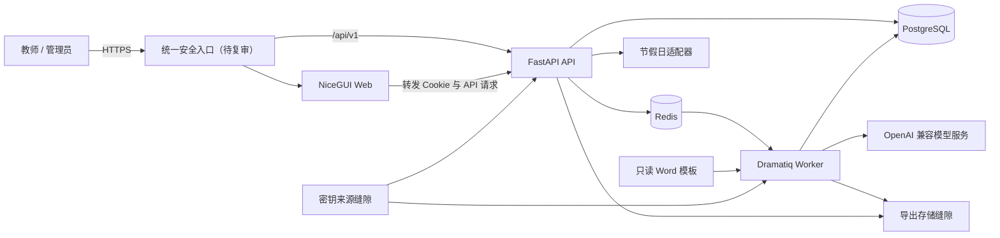
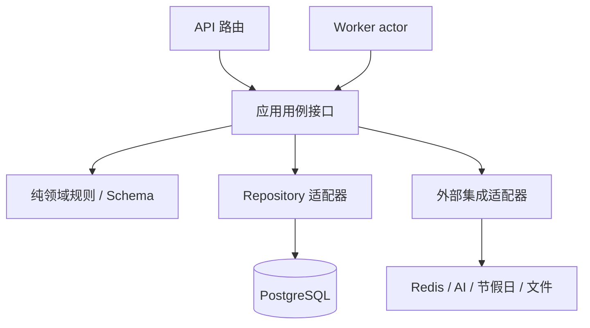
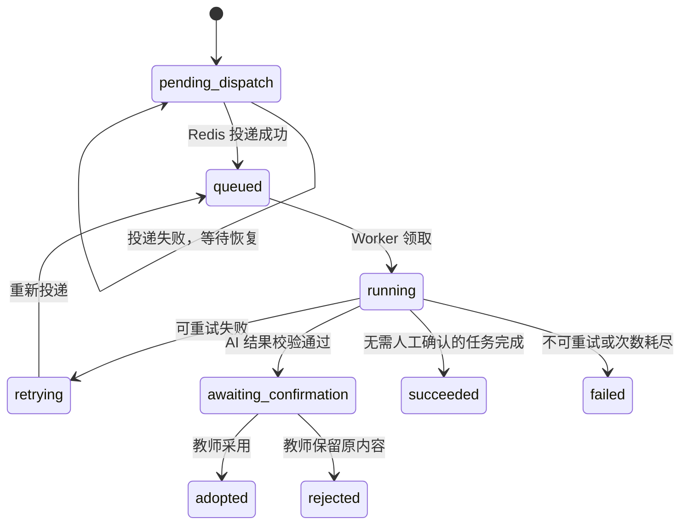

# Child Manager 系统架构设计

文档版本：v1.1

状态：功能架构已确认，生产部署已延后

日期：2026-07-12

适用范围：Cloud 首期单园部署及后续业务子系统扩展

## 1. 文档目的

本文定义 Child Manager 的目标系统架构、服务边界、依赖方向、后台任务可靠性和安全结果。Codex 与 Trae 的实现可以在类名和内部组织上存在差异，但必须遵守本文的外部边界、数据所有权和运行时约束。根据 ADR-0009，生产访问网络、反向代理、部署拓扑、密钥托管实现和备份运维延后到全部功能完成后复审。

本文描述的是目标设计，不表示当前 `main` 已经存在业务实现。当前实现状态以 [`CONTEXT.md`](../../CONTEXT.md) 为准；一日活动计划的用户行为和验收标准以 [`docs/PRD/lesson-management.md`](../PRD/lesson-management.md) 为准，核心表与数据约束见 [`docs/design/data-model.md`](data-model.md)。

关键取舍的背景、备选方案和后果见 [`docs/ADR/`](../ADR/README.md)。

## 2. 设计依据

事实来源按以下职责理解：

- [`AGENTS.md`](../../AGENTS.md)：开发、安全、数据隔离和验证规则。
- [`CONTEXT.md`](../../CONTEXT.md)：项目阶段、已确认决策和实施顺序。
- [`README.md`](../../README.md)：产品范围与技术基线。
- [`docs/PRD/lesson-management.md`](../PRD/lesson-management.md)：首期业务行为和验收标准。
- [`templates/teacherplan/teacherplan.docx`](../../templates/teacherplan/teacherplan.docx)：Word 导出的实际版式。
- [`templates/teacherplan/一日活动计划系统说明.md`](../../templates/teacherplan/一日活动计划系统说明.md)：字段含义和填写格式。

### 2.1 旧仓库经验对照

旧仓库 `ywyz/kindergartenManager` 只是经验与反例来源，不是本项目的需求或代码基线。本次审阅了其 `memory-bank/architecture.md`、`memory-bank/tech-stack.md`、`memory-bank/daily-plan/design.md`、`docs/DEVELOPER.md` 以及教案 Service、Repository 和 AI Client 实现。

| 旧仓库经验 | 本项目结论 |
| --- | --- |
| UI、Service、Repository、Integration 分层能减少业务规则散落 | 保留单向依赖，但 Web 必须跨进程调用 API，不得像旧 UI 那样直接调用 Service 或 Repository |
| Repository 查询显式带 `tenant_id` 能防止部分越界 | 升级为所有读写、唯一性校验都显式带 `kindergarten_id`，班级权限由 API 另行校验；不继承按 `user_id + plan_date` 建模的教案所有权 |
| AI 调用集中处理超时、重试和结构化解析 | 保留外部集成缝隙，但业务只读取已发布提示词，不在 AI Client 中散落可运营默认提示词 |
| 节假日 API 失败返回不确定结果并不阻断主流程 | 保留降级语义，改为本地库主判定、在线来源补充、未知只软提示 |
| 固定 Word 表格需要单元格映射、中文字体和红字回归 | 保留并加强模板哈希、只读原件和原子输出；禁止旧实现中“模板缺失时从零重建”的降级 |
| 单进程、SQLite/MySQL 切换、固定默认身份和浏览器存储令牌降低了本地部署门槛 | 不继承；本项目是 Cloud-only、PostgreSQL 生产语义、独立 Web/API/Worker 运行单元和 HttpOnly Cookie 会话 |

## 3. 架构目标

系统优先满足以下目标：

1. 教师在 AI 或外部节假日服务不可用时仍能手工完成、保存和导出教案。
2. NiceGUI Web、FastAPI API 与 Worker 职责清晰，可独立运行和测试；生产拓扑延后决定。
3. 首期保持单园部署的运维简单度，同时在数据访问层强制保留 `kindergarten_id` 隔离边界。
4. AI、提示词、Word 和未来对象存储以稳定适配器接入，业务模块不依赖具体供应商。
5. 异步任务可重试、可恢复、可审计，重复消息不得覆盖人工内容或产生重复业务结果。
6. 后续游戏观察、一对一倾听等子系统可以复用身份、设置、AI、提示词、任务、审计和文件能力。

本文不以微服务数量、通用插件系统或运行时热插拔为目标。首期是模块化单体后端的多个运行进程，不拆分独立业务数据库。

## 4. 架构总览

### 4.1 逻辑视图



### 4.2 运行单元

| 运行单元 | 核心职责 | 禁止事项 |
| --- | --- | --- |
| 统一安全入口（待复审） | HTTPS、同源路由和安全响应头 | 功能完成前不固化公网、私有网络或反向代理实现 |
| NiceGUI Web | 页面、交互、表单状态、用户反馈、API 调用 | 不连接数据库，不导入 ORM/Repository，不决定权限 |
| FastAPI API | 认证授权、输入校验、事务、业务编排、任务创建、文件鉴权下载 | 不执行耗时 AI 调用，不把关键规则留给 Web |
| Dramatiq Worker | AI、Word 导出等后台任务，结果校验和幂等落库 | 不接受公网请求，不绕过业务权限生成任意园所内容 |
| PostgreSQL | 业务数据、任务权威状态、审计、导出元数据 | 不保存 AI Key 明文或解密主密钥 |
| Redis | Dramatiq 消息投递和短期运行协调 | 不作为业务结果或任务最终状态的唯一存储 |

图中的导出存储和密钥来源是程序缝隙，不表示已选定生产持久化卷、Docker Secrets 或云密钥服务。开发适配器只为测试提供可控文件目录和测试密钥，不可复用为生产默认。

## 5. 代码组织与依赖方向

### 5.1 建议目录

实现分支采用 monorepo，建议从以下最小结构开始：

```text
apps/
├── web/                 # NiceGUI 进程入口与页面
├── api/                 # FastAPI 进程入口、路由与装配
└── worker/              # Dramatiq 进程入口与 actors
packages/
├── contracts/           # 稳定的请求、响应、任务契约和枚举
└── backend/             # API 与 Worker 复用的后端业务实现
    ├── identity/
    ├── settings/
    ├── prompts/
    ├── lesson_plans/
    ├── jobs/
    ├── exports/
    ├── audit/
    └── integrations/
templates/
└── teacherplan/
```

目录可以随实现细化，但不得通过共享包让 Web 访问后端业务实现。`packages/contracts` 只能包含跨进程所需的稳定数据模型、枚举和错误契约；ORM、Repository、业务服务和供应商客户端只能位于后端实现中。

### 5.2 后端模块内部方向

每个后端业务模块将复杂度收敛在少量用例接口后。API 路由与 Worker actor 是传输适配器，只负责解析契约、建立服务端身份上下文并调用应用用例；它们不编排 Repository、事务或外部客户端。



- 领域规则是纯计算，不导入 FastAPI、NiceGUI、SQLAlchemy、Dramatiq 或供应商 SDK。
- 应用用例拥有权限校验、事务边界、幂等和审计时机，返回结构化结果或稳定错误。
- Repository 是数据访问缝隙；所有园所范围方法的接口必须要求 `kindergarten_id`，不提供无隔离参数的便捷变体。
- 只在真正会变化的缝隙定义适配器：生产与测试已经构成两个实现的 AI、节假日、队列、导出存储和密钥来源缝隙可以抽象；不为每个类机械创建接口、工厂或依赖容器。

### 5.3 模块边界

- `identity`：账号、角色、密码、会话和班级访问权限。
- `settings`：园所、学期、班级、教师关联、区域与 AI 模型档案。
- `prompts`：管理员专用的提示词草稿、发布、历史、回滚和测试运行。
- `lesson_plans`：一日活动计划、快照、归档、恢复和乐观锁。
- `jobs`：任务状态机、投递、查询、重试与恢复扫描。
- `exports`：固定模板映射、Word 生成、存储和下载授权。
- `audit`：关键操作的不可变审计元数据。
- `integrations`：OpenAI 兼容接口、节假日服务、加密、文件存储及未来对象存储适配器。

后续业务子系统优先作为新的后端模块与 Web 页面接入，复用上述系统能力；只有出现独立扩缩容、独立数据生命周期或团队自治等真实需求时才拆成新服务。

### 5.4 深模块接口

下表定义调用者和测试必须知道的最小接口。具体类名、函数名和参数 Schema 由后续详细设计确定，不在架构文档中扩大公开面。

| 模块 | 主要调用者 | 接口承诺 | 隐藏的实现复杂度 |
| --- | --- | --- | --- |
| `identity` | API 认证与管理用例 | 从会话建立可信身份上下文，并回答园所、角色和班级能力 | Argon2id、令牌轮换/撤销、重放检测、最后管理员不变量 |
| `lesson_plans` | API 教案用例 | 创建或打开班级日期教案，按版本保存、归档、恢复、恢复历史并采用 AI 结果 | 班级权限、唯一约束、乐观锁、快照时机、作者顺序和审计 |
| `prompts` + AI 生成 | API 管理用例与 Worker | 解析已发布提示词和符合能力的模型档案，产生经 Schema 校验的栏目预览 | 版本/回滚、变量白名单、数据最小化、限流、重试分类和供应商错误映射 |
| `jobs` | API、Worker 和恢复扫描器 | 创建、投递、租约领取、续租、完成或失败一个幂等任务，并返回 PostgreSQL 权威状态 | 数据库/Redis 双写窗口、重复投递、租约过期、尝试次数与父子任务汇总 |
| `exports` | API 导出/下载用例与 Worker | 从不可变教案上下文生成并保存一份可鉴权下载的 Word 结果 | 模板映射、中文样式、新增环节红字、临时文件/原子改名、哈希与失败补偿 |
| `calendar` | 教案与 AI 上下文用例 | 对固定日期返回学期、周次、星期、季节和工作日结论及软提示 | `Asia/Shanghai`、自然周计算、本地库/在线源冲突、缓存和不确定语义 |

应用测试与调用者通过同一接口验证可观测结果，不穿过接口断言 Repository 调用次数或内部类结构。

## 6. 请求、认证与授权

### 6.1 同源访问

最终访问入口必须在同一 HTTPS 来源下提供：

- `/` 及页面资源转发至 NiceGUI Web。
- `/api/v1/*` 转发至 FastAPI API，用于同源认证、受控下载和必要 API 请求。
- PostgreSQL、Redis、Worker 与管理端口不得直接暴露给用户访问网络。

生产环境如何实现该入口延后决定；功能开发阶段可在受控本地环境中提供等价同源入口以验证 Cookie、CSRF 和路由行为。

正常页面业务交互由 NiceGUI Web 调用 API。Web 不缓存业务权限结论，API 对每个请求重新验证账号状态、角色、园所和班级关联。

信任从 API 开始，而不是从 Web 开始：

- 浏览器输入、查询参数、Cookie 和上传文件均为不可信输入。
- Web 是页面与 API 调用方，不是受信任后台；Web 传入的角色、`kindergarten_id`、`class_id` 和“已验证”标记都不能作为授权依据。
- API 只从服务端会话构建身份上下文，并对每个用例重新校验账号、园所、角色与班级关联。
- Worker 不接收浏览器身份或任意业务正文；它仅用 `job_id` 重读 PostgreSQL 权威上下文，并验证任务租约和资源版本。

### 6.2 会话链路

1. Web 将登录输入转发给 API。
2. API 验证 Argon2id 密码，签发短期 access token 与可撤销 refresh token。
3. Web 将 API 返回的 Cookie 属性原样交付浏览器。
4. Cookie 默认必须启用 `Secure`、`HttpOnly` 和合适的 `SameSite`，令牌不得进入 JavaScript、`localStorage`、日志或 NiceGUI 持久化存储。
5. Web 服务端调用 API 时转发当前请求的认证 Cookie。
6. API 负责令牌轮换、撤销、账号停用和权限判断。

改变状态的请求应同时采用 `SameSite` Cookie、来源校验和 CSRF 防护。最终访问入口与应用仅信任明确配置的代理头，避免伪造客户端地址或协议。

为了在 ADR-0009 延后 HTTPS 入口的功能阶段完成真实浏览器登录冒烟，允许一个严格受限的开发例外：

- 只有显式开发配置可将 Cookie `Secure` 设为 `false`，默认值始终为 `true`。
- 该配置只允许绑定 `127.0.0.1`、`::1` 或 `localhost`；与 `0.0.0.0`、`::` 或任何非回环地址组合时必须拒绝启动。
- 例外只改变 `Secure`，`HttpOnly`、`SameSite`、来源校验、CSRF、令牌撤销和服务端授权仍然强制。
- 自动化测试必须证明默认/未来生产配置不能关闭 `Secure`，且开发例外不能在非回环地址启动。

### 6.3 园所与班级隔离

- 身份上下文中的 `kindergarten_id` 来自服务端会话，不接受客户端自行指定为权限依据。
- 所有园所范围 Repository 查询、写入和唯一性校验必须显式包含 `kindergarten_id`。
- 教师访问教案时还必须验证当前有效的教师—班级关联。
- 管理员可以查看、导出、归档和恢复全园教案；编辑正文或调用 AI 仍需具备对应班级教师身份。
- 数据库唯一约束是业务隔离的最后防线，不代替 API 授权检查。

## 7. API 与契约

### 7.1 API 原则

- 首期 API 前缀固定为 `/api/v1`。
- 接口围绕业务用例设计，不暴露通用任意表 CRUD。
- 错误响应包含稳定机器错误码、中文用户消息和请求 ID，不返回堆栈或敏感配置。
- 更新可变资源时携带版本号；版本不匹配返回冲突，禁止静默覆盖。
- 列表接口必须分页并设置服务端最大页大小。
- 路由层不接收 SQLAlchemy 模型，也不返回 ORM 对象；稳定请求、响应、任务和错误模型才能进入 `packages/contracts`。
- 对同一用例的重试请求只有在服务端定义了幂等键语义时才允许客户端自动重试；不将所有 POST 默认视为幂等。

### 7.2 跨进程任务契约

Redis 消息只携带执行所需的最小标识，例如：

```text
job_id
job_type
kindergarten_id
resource_id
resource_version
requested_by
trace_id
```

消息不得携带 API Key、令牌、完整教案正文或上传文件内容。Worker 根据 `job_id` 从 PostgreSQL 重新读取权威任务与业务上下文，并在执行前再次验证任务仍可执行。`kindergarten_id`、`resource_id` 和版本只是冗余路由/诊断信息，不能替代按 `job_id` 读取的权威值。

契约发生不兼容变更时增加明确版本，不允许 API 与 Worker 静默解释不同字段语义。

## 8. 数据架构

### 8.1 数据所有权

PostgreSQL 是业务数据的唯一权威存储。API 与 Worker 可以通过同一后端 Repository 访问数据库；NiceGUI Web 不能访问数据库。API 负责同步事务，Worker 负责其后台任务结果的独立短事务。完整 PostgreSQL 表、列、组合园所外键、检查约束、索引和 Alembic 顺序见 [`database-schema.md`](database-schema.md)。

所有园所范围业务表至少包含：

- `kindergarten_id`
- `created_at`
- `updated_at`
- 按职责需要的 `created_by`、`updated_by`

时间点以 UTC 存储；活动日期、自然周、季节、节假日和页面展示按 `Asia/Shanghai` 计算。数据库结构只通过 Alembic 迁移修改。

### 8.2 一致性边界

- 一日活动计划由 `(kindergarten_id, class_id, plan_date)` 唯一约束保证唯一，包括已归档记录。
- 自动保存与手动保存使用版本号乐观锁。
- 历史快照与对应业务变更在同一数据库事务中提交。
- 采用 AI 预览结果时再次检查计划版本；版本已变化则要求教师重新确认。
- 导出记录以服务器内部唯一存储键区分，每次导出均保留独立记录和文件。

### 8.3 事务所有权

- API 应用用例拥有同步写事务；路由和 Repository 都不得私自 `commit()`。
- Worker 对每次租约领取、尝试计数、结果落库和最终状态更新使用有限短事务，不在调用外部 AI 或生成 Word 时长时间持有数据库事务。
- 人工保存、归档、恢复和 AI 结果采用的快照、当前内容、版本号与审计在同一 PostgreSQL 事务中完成。
- 跨 PostgreSQL、Redis 和文件存储的操作不伪装成分布式事务；以 PostgreSQL 状态、幂等键、可重试扫描和孤儿文件清理实现收敛。

### 8.4 SQLite 使用边界

SQLite 只用于快速开发和确定性自动化测试。迁移、唯一约束、并发更新、事务与 Repository 隔离的关键路径必须在 PostgreSQL 上执行集成测试，不能以 SQLite 结果替代生产兼容性验证。

## 9. 后台任务架构

### 9.1 选型与用途

首期采用 Dramatiq 2.x 和 Redis。后台任务包括：

- 栏目级 AI 生成和重新生成。
- 集体活动原始教案的 AI 拆分/补全，以及在拆分结果采用后独立生成的新增环节。
- 固定 Word 模板导出。
- 必要的任务恢复扫描。

一键生成固定拆为晨间活动、晨间谈话、室内区域游戏和下午户外游戏四个栏目子任务；不包含集体活动或反思。反思在前五个上游栏目完整后由教师显式发起。单个栏目失败不得回滚其他栏目结果。

### 9.2 状态机

PostgreSQL 中的 `background_job` 是任务状态唯一权威，至少支持：



Word 导出不进入 `awaiting_confirmation`，成功后直接记录文件与导出记录。状态名称可以在实现中调整，但不得合并掉“待确认”与“已采用”，也不得把 Redis 状态当作最终事实。

### 9.3 投递、幂等与恢复

1. API 在数据库事务中创建业务请求和 `pending_dispatch` 任务。
2. 事务提交后向 Redis 投递 `job_id`；成功后尝试标记为 `queued`。如果消息已发出但状态更新失败，Worker 仍可按 `job_id` 幂等领取 `pending_dispatch`，恢复扫描重复投递也不会产生第二个结果。
3. Worker 使用任务 ID 和业务幂等键抢占执行权，重复投递只返回已有结果或安全退出。
4. 恢复扫描器定期重新投递长期处于 `pending_dispatch` 的任务，并检查超时 `running` 任务。
5. Worker 心跳或租约用于区分仍在执行与进程异常退出；恢复时仍须依赖幂等约束。
6. 重试不得重复创建快照、覆盖已采用内容或生成重复导出记录。

幂等键由服务端按业务意图构造，至少区分园所、任务类型、目标资源、栏目、请求版本和用户明确发起的新一次重试。不得用可变显示文本或完整教案正文作为幂等键。

首期不引入独立事务消息中间件。API 进程启动钩子或单实例调度进程可以承担恢复扫描，但必须通过数据库锁保证同一批任务只由一个扫描者处理。

### 9.4 AI 重试与反馈

AI 首次失败后最多自动重试两次。网络错误、超时、HTTP 429、HTTP 5xx、JSON 解析和 Schema 校验失败可以重试；认证、余额、权限、模型不存在和配置错误立即失败。

Dramatiq 的消息重新投递属于基础设施恢复，业务调用次数仍以数据库记录为准，不能因 Worker 重启突破最多三次模型调用限制。Web 显示：

- 执行中：“AI 正在生成，请稍候”。
- 自动重试：“生成失败，正在重试”。
- 最终失败：保留原内容并允许只重试失败栏目。

### 9.5 状态获取

首期采用短轮询，不引入 WebSocket 或 SSE 任务推送：

- 创建任务后每 1–2 秒查询一次任务状态。
- 完成、失败、页面离开或超时后立即停止轮询。
- 查询接口支持按父任务一次返回多个栏目子任务，避免逐项请求。
- 页面重载后可根据任务 ID 恢复状态，不依赖浏览器内存中的计时器。
- API 可以返回建议的下一次轮询间隔，并对异常高频查询限流。

未来增加 SSE 时复用同一任务状态和查询模型，不改变 Worker 或业务状态机。

## 10. AI 与提示词架构

### 10.1 AI 适配器

业务代码只依赖统一 AI 服务接口。模型档案保存 OpenAI 兼容的 `API_BASE_URL`、加密 `API_KEY`、`MODEL_NAME`、能力标签、并发上限（默认 2）和限流配置，不硬编码 OpenAI、DeepSeek、通义等供应商。

适配器负责：

- 组装兼容请求与超时。
- 按模型档案执行并发和速率限制。
- 将供应商错误归类为统一错误类型。
- 解析响应并交给任务级 Pydantic Schema 校验。
- 生成脱敏调用指标，不记录 API Key 或完整敏感正文。

AI 缝隙对业务暴露的是“按已解析任务上下文生成结构化结果”，而不是通用的 `chat(messages)` 传送门。提示词渲染、模型能力校验、数据最小化和结果 Schema 属于模块实现，不要求每个调用者重复组装。

### 10.2 提示词服务

提示词是管理员专用的独立系统能力，不属于一日活动计划模块私有配置。业务任务按稳定标识读取已发布版本，并记录提示词版本、模型档案和结果状态。

提示词发布版本不可原地修改；回滚通过再次发布历史内容形成新版本。系统默认提示词在首次业务使用前可用并保持只读，管理员可以创建自定义草稿、测试并发布。占位符只允许白名单纯替换词法 `\{\{[ \t]*([a-z][a-z0-9_]*)[ \t]*\}\}`；渲染不得执行表达式、过滤器、循环、函数或嵌套访问，复杂值使用稳定 JSON 序列化。测试运行与正式生成使用同一渲染、能力校验和 AI 适配器，但测试结果不写入教案。

### 10.3 结果采用边界

Worker 只生成并保存结构化预览，不直接覆盖计划当前内容。教师明确采用时由 API：

1. 检查权限与计划版本。
2. 校验预览仍属于当前计划和栏目，且目标栏目基线及该次实际输入未变化；无关栏目变化不使预览失效。
3. 在事务中创建快照并写入采用后的结构化内容。
4. 标记任务为已采用并记录审计事件。

教师选择保留原内容时只更新任务结论，不修改计划正文。

## 11. Word 与文件架构

### 11.1 导出流程

Word 导出作为 Dramatiq 后台任务执行：

1. API 校验权限、教案完整性提示和当前版本，创建导出任务。
2. Worker 从数据库读取该版本的结构化快照。
3. Worker 复制只读模板，在副本上按固定单元格与段落映射写入内容。
4. Worker 校验表格结构、必需字段和红字范围。
5. Worker 使用内部 UUID 存储键写入同目录临时文件，完成刷盘与哈希校验后原子改名为最终文件。
6. Worker 在短数据库事务中写入文件大小、哈希、模板哈希和成功状态；失败时记录脱敏摘要并清理临时文件。
7. 如果文件已改名但数据库事务失败，记录可重试补偿或由清理器删除孤儿文件；不得留下指向半成品的成功记录。
8. API 通过鉴权下载接口流式返回文件；服务器不暴露真实文件路径。

模板对 Worker 只读。API 和 Worker 通过同一导出存储缝隙读写内部存储键，Web 不访问底层文件系统或未来存储服务。教师可见文件名采用 `一日活动计划_班级_日期.docx`，内部存储键保证重复导出不覆盖。如果模板缺失或哈希不符，导出必须失败，不得从零重建一份“近似”文档。

### 11.2 上传 `.docx`

集体活动原始 `.docx` 由 API 限制文件类型和大小，存入不可执行的临时目录；完成文本提取后立即删除文件，只保留原始文本、原文件名、上传时间和哈希。解析失败或进程异常时由定期清理任务删除过期临时文件。

首期不部署对象存储。未来照片子系统启用私有 S3 兼容对象存储时，通过新的存储适配器接入，不改变现有导出记录对内部存储键的抽象。

## 12. 节假日与日期服务

- 日期计算集中在后端领域服务，不由 Web 或 AI 自行推断。
- 学期开始日期所在自然周固定为第一周，此后每个周一递增。
- 本地节假日库为主要来源，在线 API 只作补充或校验，结果写入带有效期的缓存。
- 两个来源都不可用时返回 `result=unknown`、`source=unavailable`，而不是伪造工作日结论。
- 非工作日、学期外和无法确认均为软提示，不阻止保存、生成或导出。
- 系统不调用天气服务；AI 上下文只包含日期推断季节和教师填写信息。

## 13. 配置、密钥与安全

### 13.1 配置分级

- 开发和测试的非敏感配置可使用环境变量，例如数据库地址、Redis 地址和日志级别。
- 数据库口令、令牌签名密钥、AI Key 解密主密钥不得进入代码库、数据库、镜像、普通环境变量或日志；生产托管实现延后决定。
- AI API Key 使用经认证加密后保存于 PostgreSQL，页面只显示脱敏值。
- 密钥读取封装为适配器，未来可替换为云密钥管理服务而不改变业务模块。

功能开发期间只定义密钥来源接口和测试适配器。生产适配器、文件权限、轮换操作和带外恢复必须等 ADR-0009 复审后再实现。

### 13.2 安全边界

- 功能开发阶段不开放生产公网端口，也不实施 Tailscale 等私有网络。
- API 和 Worker 使用最小权限数据库账号；迁移使用独立、权限更高且只在发布时运行的账号。
- 开发与测试进程遵循最小权限，只允许必要的数据库、队列、模板和临时目录访问；生产运行用户、容器和文件系统策略延后设计。
- 上传、AI 输入、日志、审计和导出遵循数据最小化原则。
- 不在 Redis 消息、异常跟踪或审计正文中保存密钥、令牌、完整教案或未来照片。
- 管理员首次启用模型档案时确认外部数据处理风险并记录审计。

## 14. 可观测性与审计

Web、API 和 Worker 使用结构化日志，并贯穿：

- `request_id`：一次同步请求。
- `trace_id`：一次用户操作跨越多个服务的关联标识。
- `job_id`：后台任务及重试。
- `kindergarten_id`：仅记录园所标识，不记录园所敏感正文。

日志记录技术诊断，审计记录关键业务行为，两者不得混为一张无限增长的表。审计至少覆盖登录、账号与权限变更、模型档案启停、提示词发布/回滚、AI 结果、归档/恢复和导出。

每个运行单元提供存活检查；API 的就绪检查验证数据库与必要配置，Worker 的健康状态结合进程、Redis 连接和最近心跳判断。外部 AI 或在线节假日服务不可用不能令 API 整体失去就绪状态。

## 15. 生产部署延后边界

### 15.1 当前阶段

首期全部功能完成前，不创建或验收生产 Caddyfile、生产 Compose 服务、公网 DNS、证书、端口映射、Tailscale 配置、云主机目录或发布自动化。

本地开发和自动化测试可以使用 PostgreSQL、Redis 和临时导出目录，但相关启动方式只服务于可重复测试，不声称代表生产拓扑。

### 15.2 功能完成后的复审

功能验收后先完成威胁建模，再冻结访问网络、生产运行单元、发布流程、密钥托管、持久化卷、备份介质、保留期、RPO/RTO 与恢复演练。这些结论必须由新 ADR 确认，不沿用本文旧的 Caddy 公网入口假设。

## 16. 性能与扩展

首期容量基线为 100 个账号、30 个并发会话和至少 100 个排队任务。目标：普通非 AI 请求 95% 在 2 秒内完成，保存请求 95% 在 1 秒内完成，任务创建在 2 秒内返回。

扩展顺序：

1. 优化查询、索引、连接池和任务并发配置。
2. 增加 Worker 进程或副本；使用数据库抢占与幂等约束保证安全。
3. 必要时增加 API 或 Web 副本，并把任何进程内共享状态迁至 Redis/PostgreSQL。
4. 出现真实实时需求后，在现有任务查询模型上增加 SSE。
5. 照片子系统启动前部署私有对象存储及完整访问治理。
6. 只有达到明确拆分条件时才将某个业务模块独立成服务。

首期不为假设中的大规模 SaaS 引入 Kubernetes、服务网格、Kafka、事件溯源或分布式事务。

## 17. 故障与降级

| 故障 | 系统行为 |
| --- | --- |
| AI 服务不可用 | 手工编辑、保存、归档和已有导出下载继续可用；生成任务失败并保留原内容 |
| Redis 短时不可用 | API 保留 `pending_dispatch` 任务；恢复扫描在 Redis 恢复后重新投递 |
| Worker 异常退出 | 超时任务经租约和恢复扫描重新投递；幂等控制避免重复结果 |
| 在线节假日 API 不可用 | 使用本地库；两者都失败时给出软提示 |
| Word 导出失败 | 教案正文不受影响，记录失败摘要并允许重新导出 |
| 导出卷不可用 | 禁止标记导出成功；已有正文和 AI 任务不受影响 |
| PostgreSQL 不可用 | 拒绝写入并明确提示，不在 Web 或 Redis 中制造临时业务真相 |
| 浏览器轮询中断 | 页面重载后从 PostgreSQL 权威状态恢复，不重复创建任务 |

## 18. 测试与架构验证

实现必须提供以下架构级验证：

- 静态导入规则证明 `apps/web` 不导入 ORM、Repository 或 `packages/backend`，纯领域规则不导入框架、数据库、队列或供应商客户端。
- 模块行为测试通过第 5.4 节的用例接口验证可观测结果，不穿过接口断言内部类、私有函数或 Repository 调用顺序。
- API 权限测试覆盖角色、班级关联和 `kindergarten_id` 隔离。
- PostgreSQL 集成测试覆盖迁移、唯一约束、乐观锁和并发任务抢占。
- 事务测试证明 Repository 不自行提交，应用用例失败时当前内容、快照、版本号和审计同时回滚。
- Worker 测试覆盖重复投递、进程中断恢复、最多三次 AI 调用和结果采用幂等性。
- 任务投递测试覆盖“数据库已提交但 Redis 失败”和“Redis 已接收但 `queued` 回写失败”两个窗口。
- 契约测试保证 API 与 Worker 对任务版本和状态解释一致。
- AI 测试只使用替身，覆盖结构错误、重试、最终失败和数据最小化。
- Word 回归测试覆盖模板哈希、表格结构、字段位置、换行、字体、新增环节红字范围、原子改名和失败后无半成品成功记录。
- 当前不执行生产部署冒烟、备份恢复演练或 RPO/RTO 验收；它们在功能完成后由新的生产部署设计定义。

实现分支最低质量命令仍以 `AGENTS.md` 为准。

## 19. 关键架构决策摘要

| 决策 | 已确认方案 | 主要理由 |
| --- | --- | --- |
| 产品形态 | Cloud-only，首期单园部署 | 不承担本地同步复杂度，保留未来多园数据边界 |
| Web/API | NiceGUI Web 与 FastAPI API 独立进程 | 强制 UI 与业务、数据边界分离 |
| 后台任务 | Dramatiq 2.x + Redis | 满足首期异步任务并保持部署简单 |
| 任务权威状态 | PostgreSQL | Redis 丢失后可恢复，支持审计和幂等 |
| 任务状态反馈 | 1–2 秒短轮询 | 实现简单、断线恢复明确，保留未来 SSE 扩展 |
| 生产访问入口 | 功能完成后复审 | 避免提前固化未经威胁建模的公网或私有网络方案 |
| 认证传递 | 同源 HttpOnly Cookie，Web 服务端转发 | 浏览器脚本不接触令牌，API 统一授权 |
| 生产密钥托管 | 功能完成后复审 | 当前仅固定密钥不入库、镜像、普通配置或日志的安全结果 |
| 生产数据库 | PostgreSQL | 支持约束、并发、迁移和长期 Cloud 部署 |
| 导出存储 | 稳定存储键缝隙 + 开发文件适配器 | 功能期验证原子写入与鉴权下载，生产卷方案延后至 M9 |

## 20. 实施顺序

1. 建立 monorepo 骨架、契约包、配置、日志与本地开发测试依赖的健康检查。
2. 建立 PostgreSQL、Alembic、园所隔离 Repository 与首位管理员初始化。
3. 实现登录、Cookie 会话、角色和教师—班级权限。
4. 实现首期必要设置、AI Key 加密封装与可测试的密钥读取边界。
5. 实现提示词、AI 模型档案与测试运行。
6. 实现完全不依赖 AI 的教案创建、保存、快照、归档和恢复闭环。
7. 引入 Dramatiq、任务状态、恢复扫描、短轮询和栏目级 AI 生成。
8. 实现后台 Word 导出、私有文件下载和导出历史。
9. 完成功能、权限、数据隔离、审计和性能验收。
10. 全部功能完成后，启动独立的生产部署与访问网络复审。

每一步都应形成可运行的纵向能力，不提前创建后续照片子系统的空页面、空表或对象存储服务。

## 21. 仍需后续设计的内容

本文已冻结服务边界和关键技术选型，以下内容应在相应实现设计中继续细化：

- API 与 Worker 实现阶段对 [`data-model.md`](data-model.md) 中数据表、索引、外键、任务租约和幂等键的迁移级细化。
- API 端点、错误码、分页和契约 Schema。
- JWT/会话时长、刷新令牌撤销表和 CSRF 令牌细节。
- 功能完成后的访问网络、反向代理、生产拓扑和主机目录规划。
- AI 加密算法、密文封装版本和主密钥轮换流程。
- 功能完成后的备份工具、异地存储介质、恢复演练频率和告警渠道。
- 各业务模块的详细设计与页面信息架构。

这些细节不得改变本文已确认的安全结果、数据隔离、任务可靠性和用户行为。
