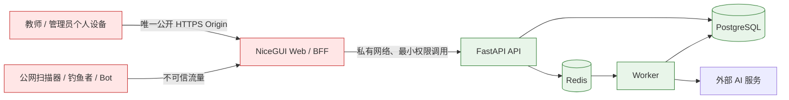

# Child Manager 首期安全威胁模型

文档版本：v1.0

状态：已确认

日期：2026-07-22

适用范围：首期单园 Cloud 系统的公网入口、身份认证、账号恢复、个人设备与教案导出

关联决策：[ADR-0010](../ADR/ADR-0010-restricted-public-entry-passkey-authentication-and-recovery.md)

## 1. 目的与边界

本文回答首期系统面对谁、保护什么、攻击从哪里进入，以及哪些风险由技术控制降低、哪些风险只能由组织流程承担。它冻结安全结果和验收证据，不选择反向代理品牌、云厂商、容器拓扑、证书签发方式、生产密钥托管、备份介质或 RPO/RTO；这些生产实现仍受 [ADR-0009](../ADR/ADR-0009-defer-production-deployment-until-feature-complete.md) 约束。

已确认的前提：

- 产品继续采用浏览器/服务器（B/S）形态，权威数据集中保存在服务端。
- 用户从教师或管理员的个人设备访问，首期不假设设备统一受管。
- 采用受限公网入口；NiceGUI Web/BFF 是唯一公网应用入口。
- FastAPI API、Worker、Redis、PostgreSQL 以及运维端口默认拒绝公网入站。
- WebAuthn 通行密钥是唯一常规登录方式；密码、短信/邮件验证码和微信小程序 MFA 不构成常规登录或弱化后的兜底路径。
- 不开放公众注册。管理员创建账号并发放单次邀请。
- 空系统只通过部署控制台的一次性初始化建立园所和待激活首位管理员；不存在公网初始化端点、默认管理员或初始密码。
- 账号紧急恢复同时需要离线恢复码和人工核验；任一项单独成立都不能建立登录会话。

## 2. 保护资产

| 资产 | 主要安全目标 |
| --- | --- |
| 用户身份、角色、园所及班级关联 | 防止账号接管、越权和跨园访问 |
| WebAuthn 凭据公钥、用户句柄和认证挑战 | 防止错误绑定、重放、账号枚举和认证绕过 |
| 会话 Cookie 与 Refresh Token family | 防止窃取、重放和停用后继续访问 |
| 邀请令牌、恢复码和人工核验记录 | 防止凭单一泄露材料接管账号 |
| 教案正文、历史、导出文件和审计记录 | 保密、完整、可追责和按授权访问 |
| AI Key、签名密钥及其他服务端秘密 | 不进入浏览器、代码库、数据库明文、日志或导出 |
| 系统可用性 | 限制扫描、资源耗尽和自动化滥用的影响 |

## 3. 信任边界与数据流

边界规则：

- 个人设备、浏览器输入、Cookie、上传内容、代理头和公网来源都不可信。
- Web/BFF 负责页面与协议转发，但不拥有角色、园所或班级授权结论。
- API 从服务端会话建立身份上下文，并在每次请求重新验证账号状态和业务权限。
- Worker 只按任务 ID 重读 PostgreSQL 权威上下文，不接收浏览器声明的身份或权限。
- “API 不暴露公网”同时禁止独立公网地址、端口和由公网入口直通 API 的旁路；浏览器业务请求必须先到 Web/BFF。

## 4. 威胁分级

本文使用“可能性 × 影响”的定性分级：

- `高`：在公网环境中容易自动化发生，或一旦发生会导致账号、全园数据或系统控制权丢失。
- `中`：需要特定前提、用户配合或设备控制，但可能泄露敏感数据或造成持续中断。
- `低`：发生条件较苛刻、影响有限，且已有独立控制可以及时发现和恢复。

残余风险不是“无需处理”。它表示在现有产品边界内不能完全消除，必须通过监控、响应或组织制度继续承担。

## 5. 重点威胁与控制

### 5.1 公网扫描与自动化攻击

**场景**：攻击者持续扫描域名和 IP，枚举账号、滥发 WebAuthn challenge、猜测邀请或恢复材料、探测已知漏洞、伪造代理头、上传恶意文件或耗尽连接、CPU、数据库与队列资源。

**固有风险**：高。

**强制控制**：

- 公网只开放一个受管 HTTPS Origin，并只转发到 NiceGUI Web/BFF；其他运行单元和运维端口执行网络层默认拒绝。
- 对登录 challenge、邀请验证、恢复、会话刷新、上传和导出分别设置来源、账号及全局限流；失败响应不得泄露账号、邀请或凭据是否存在。
- WebAuthn challenge 必须高熵、短时、单次使用并绑定预期 ceremony；重放、过期、Origin/RP ID 不匹配一律拒绝。
- 只信任显式配置的代理链；浏览器提交的 `Forwarded`、`X-Forwarded-*` 等头不得决定客户端地址或协议。
- 启用 TLS、安全响应头、严格内容安全策略（CSP）、请求体/上传上限、超时、依赖补丁和结构化安全事件告警。
- 健康检查、错误响应和日志只暴露必要信息，不返回版本清单、堆栈、内部地址、秘密或完整正文。

**验收证据**：端口与防火墙扫描、API 旁路拒绝、代理头伪造、限流矩阵、challenge 重放/过期、依赖与安全头检查。

**残余风险**：大流量拒绝服务、上游网络故障和未知漏洞仍需由托管平台容量、防护与应急响应降低，应用自身不能完全消除。

### 5.2 钓鱼和账号接管

**场景**：攻击者伪造登录页、诱导用户输入可转发的验证码，或窃取会话后执行管理员操作。

**固有风险**：高。

**强制控制**：

- 常规登录只接受 WebAuthn 通行密钥，不提供密码、OTP、邮件链接或微信小程序 MFA 作为可降级的登录替代。
- WebAuthn 注册和认证固定 RP ID，并对允许的 HTTPS Origin 做精确白名单校验；注册和认证均要求用户验证（User Verification）。
- 服务端验证 challenge、ceremony type、Origin、RP ID hash、用户在场/用户验证标志、签名与凭据归属，认证失败返回不可枚举的通用结果。
- 用户可以绑定多个通行密钥；新增、删除通行密钥和高风险管理员操作必须使用仍有效的通行密钥重新验证。
- 会话继续使用 `Secure`、`HttpOnly`、合适 `SameSite` 的 Cookie，并保留 CSRF、Origin 校验、短期 Access Token、Refresh Token family 轮换/撤销和账号停用后立即失权。
- 绑定新通行密钥、恢复账号、变更角色和撤销凭据均产生独立通知与审计事件。

**验收证据**：伪造 Origin/RP ID、challenge 重放、缺少 UV、未知凭据、账号枚举、Cookie 窃取后的会话撤销和敏感操作重新验证测试。

**残余风险**：通行密钥降低凭据钓鱼风险，但不能消除被攻陷浏览器、恶意扩展、会话 Cookie 窃取或用户已登录后的操作诱导。

### 5.3 邀请链接泄露

**场景**：单次邀请被聊天转发、截图、浏览器同步、访问日志、Referer 或恶意软件取得，攻击者抢先为目标账号绑定自己的通行密钥。

**固有风险**：高。

**强制控制**：

- 首位管理员只能由一次性部署控制台流程创建并经园所负责人、部署责任人带外核验；首位管理员激活后初始化入口永久关闭。
- 邀请令牌至少包含 128 位随机熵，只保存不可逆摘要，绑定目标账号、园所、预期角色、签发管理员和过期时间。
- 邀请最多有效 24 小时、只能成功使用一次、可由管理员立即撤销；重新签发必须令旧邀请失效。
- 邀请秘密不得进入应用日志、分析系统、审计元数据或 Referer；落地后应尽快交换为服务端短时 ceremony 状态。
- 邀请只允许注册首个通行密钥，不直接建立业务会话。账号在签发管理员或另一名有效管理员完成人工核验并确认激活前不得访问业务数据。
- 使用、过期、撤销、抢先使用和激活结果均通知签发管理员并记录最小化审计元数据。

**验收证据**：过期、重放、撤销、篡改账号/角色、令牌日志扫描以及“持有链接但未完成人工确认不能登录”的测试。

**残余风险**：若管理员在人工核验环节失误或其会话已被接管，攻击者仍可能被错误激活；该风险依赖人员培训与审计复核。

### 5.4 通行密钥丢失

**场景**：用户更换、损坏或重置设备，所有已绑定通行密钥均不可用。

**固有风险**：中。

**强制控制**：

- 每个账号必须支持绑定多个通行密钥，并在用户只有一个通行密钥时持续提示增加备用认证器。
- 首次激活后生成至少 128 位随机熵的单次离线恢复码，只向用户展示一次；服务端只保存不可逆摘要并对校验限流。
- 用户仍有有效通行密钥时，可重新验证后新增凭据或轮换恢复码，不进入紧急恢复。
- 所有通行密钥均丢失时，恢复必须同时满足有效离线恢复码和第 5.5 节人工核验；恢复码本身不能建立会话。
- 恢复成功后撤销全部旧通行密钥、会话、未使用邀请和旧恢复码，绑定新通行密钥并签发新恢复码。

**验收证据**：多凭据生命周期、恢复码只显示一次/摘要存储/限流/单次使用、恢复后全量撤销和通知测试。

**残余风险**：用户同时遗失所有通行密钥和恢复码时不能自助恢复，必须进入更慢的最后管理员或人工身份处置流程。

### 5.5 最后管理员恢复

**场景**：唯一或最后一名有效管理员失去全部通行密钥，系统内已不存在可以完成普通账号核验和激活的管理员。

**固有风险**：高。

**强制控制**：

- 系统继续禁止停用、降权或删除最后一名有效管理员，并在正式使用前提示建立至少两名由不同人员持有的管理员账号。
- 最后管理员恢复只允许在离线恢复码有效的前提下启动；不得内置默认管理员、万能恢复密码、维护后门或仅凭数据库改值恢复。
- 人工核验采用双人复核：预先登记的园所负责人和独立运维/安全责任人分别确认申请人身份、园所归属、账号及恢复原因。两种角色不得由同一自然人兼任本次核验。
- 普通恢复由有效管理员通过 Web/API 审批；最后管理员 Web/API 审批必须稳定返回
  `409 identity.last_admin_recovery_requires_cli`，不能写批准、推进请求或签发登记凭据。
- 部署控制台只接受
  `init-admin recover-last-admin --recovery-request-id <uuid>`。两项预登记引用必须交互匹配
  首次初始化记录，不得通过 argv、环境变量、日志或审计输入/输出；CLI 不接收恢复码或
  credential JSON，也不创建通行密钥。
- CLI 仅在请求有效、目标确为最后管理员、无其他有效管理员且两项责任属于不同自然人时，
  原子写入两项不可变批准并签发 15 分钟单次浏览器登记凭据；任一条件失败时不得留下部分批准。
- 核验只授权“撤销旧凭据并绑定新通行密钥”，不直接导出数据、不提升角色、不跳过后续登录。
- 恢复完成后进入安全冷静期；向所有已登记管理员和园所负责人发送通知，并审计申请、核验人、时间、结果与撤销范围。审计不得保存证件影像或完整核验材料。

**验收证据**：最后管理员不变量、Web/API 稳定冲突、CLI 只接受请求 ID、双人批准原子性、
预登记引用不进入 argv/环境/日志/审计、无恢复码拒绝、单人批准拒绝、恢复权限边界、全量
撤销、通知和审计测试；生产上线前还必须完成纸面或隔离环境演练。

**残余风险**：人工核验存在社会工程和串通风险。必须以职责分离、预登记联系方式、冷静期和事后审计降低，不能通过增加在线万能凭据解决。

### 5.6 个人设备失窃或感染恶意软件

**场景**：攻击者取得已登录设备、窃取浏览器会话、控制浏览器进程或诱导用户批准操作。

**固有风险**：高。

**强制控制**：

- WebAuthn ceremony 要求用户验证，服务端不接收或保存设备生物特征；同步型与设备绑定型通行密钥均不得改变服务端校验要求。
- 会话设置绝对有效期和空闲超时；敏感账号、凭据、角色及恢复操作要求新近通行密钥验证。
- 用户和管理员可以查看并撤销会话与通行密钥；报告失窃或感染后立即撤销相关凭据和全部会话。
- 公网页面尽量减少第三方脚本，使用 CSP、依赖锁定和安全更新降低脚本注入及供应链风险。
- 不把 API Key、Refresh Token 明文、完整教案缓存或授权结论写入浏览器可读持久存储。

**验收证据**：空闲/绝对超时、远程撤销、停用后下一请求失权、敏感操作重新验证、CSP 和浏览器存储扫描。

**残余风险**：完全控制用户终端的恶意软件可能读取页面内容、操纵已登录会话或截获用户导出；该风险超出纯 Web 应用可完全防御的边界。

### 5.7 合法用户导出后外传

**场景**：拥有导出权限的教师或管理员将 Word 文件复制到个人网盘、聊天工具、U 盘或其他未经批准的位置。

**固有风险**：高。

**强制控制**：

- API 在每次创建导出和下载时重新验证园所、班级、角色及资源状态；Web 隐藏按钮不构成控制。
- 导出文件只通过短时、已认证、不可公开转发的下载流程提供，不创建匿名永久链接或公开对象地址。
- 创建导出、下载、重复下载、失败与拒绝均记录操作者、园所、资源、时间、结果和请求 ID，不记录完整正文。
- 导出前显示敏感信息和授权用途提示；首期不提供全园批量导出、公开分享或自动发送到个人第三方存储。
- 发现误导出或离职账号时撤销后续下载与会话，并按事件响应流程调查已有审计记录。

**验收证据**：跨园/跨班/未授权下载拒绝、短时下载失效、匿名访问拒绝、审计完整性和无公开对象地址测试。

**残余风险**：合法用户取得文件后，系统无法阻止其截图、复制或再次传播。该风险由最小权限、审计、园所制度、人员教育和事件追责共同承担，不虚假声明可由 DRM 或页面控制完全消除。

## 6. 跨场景安全不变量

- 默认拒绝：未明确允许的网络入口、角色能力、账号状态和恢复路径全部拒绝。
- 无弱兜底：密码、OTP、邀请链接、恢复码、微信小程序或人工操作均不能单独成为常规登录替代。
- 重新验证：绑定/删除通行密钥、角色变更、恢复和其他高风险操作需要新近 WebAuthn 用户验证。
- 全量撤销：账号停用、确认接管和紧急恢复必须撤销既有会话、凭据和待处理邀请。
- 可追责但最小化：记录安全事件的主体、动作、目标、结果和关联 ID，不记录秘密、完整正文或不必要身份材料。
- 失败安全：Redis、通知渠道或外部服务故障不能令邀请、恢复或授权默认成功。

## 7. 生产前验证门禁

在创建生产入口前，至少需要以下独立证据：

1. 公网仅能到达 Web/BFF，API、Worker、Redis、PostgreSQL 和运维端口的外部探测均失败。
2. WebAuthn 注册/认证覆盖正确、过期、重放、错误 Origin、错误 RP ID、缺少 UV、未知凭据和账号枚举矩阵。
3. 邀请覆盖签发、人工确认、过期、撤销、重放、泄露后抢先使用和日志无令牌。
4. 普通恢复与最后管理员恢复覆盖双条件、双人复核、冷静期、通知、审计和全量撤销。
5. 个人设备失窃演练证明会话及通行密钥可以远程撤销，且下一请求立即失权。
6. 导出证明每次授权、短时鉴权下载和审计成立，并明确记录下载后外传是组织残余风险。
7. 扫描、限流、CSP、Cookie、CSRF、Origin、代理头、上传和依赖漏洞检查全部通过。

## 8. 参考标准

- [W3C Web Authentication: An API for accessing Public Key Credentials - Level 3](https://www.w3.org/TR/webauthn-3/)：RP ID、Origin、challenge、用户在场与用户验证的协议边界。
- [NIST SP 800-63B-4](https://pages.nist.gov/800-63-4/sp800-63b.html)：钓鱼抗性、多个认证器、恢复码、账号恢复、通知以及凭据丢失/失窃处置。
