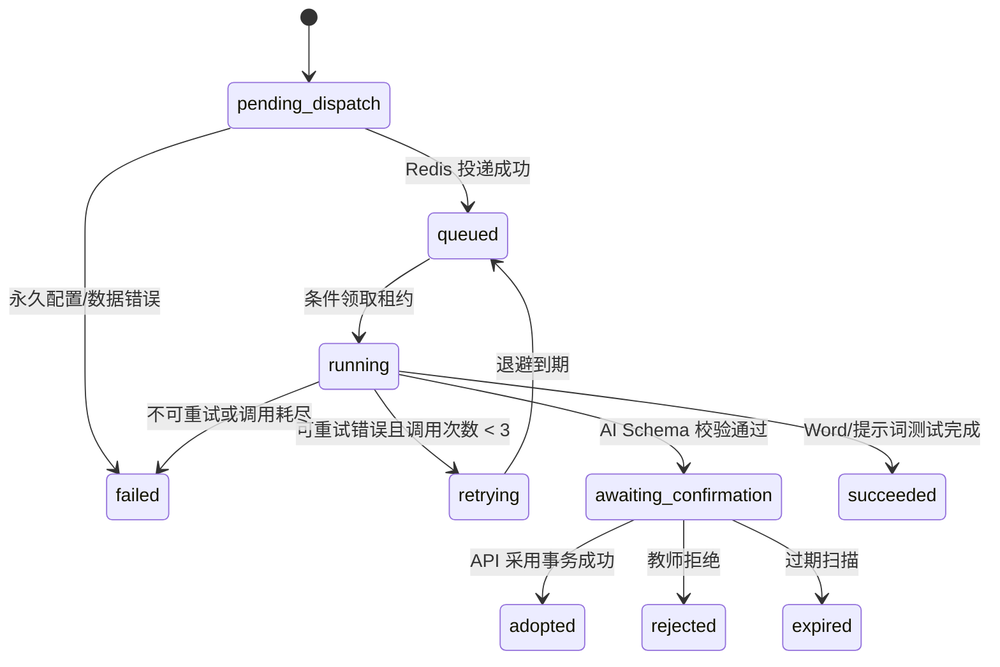

# 后台任务状态机与 AI 采用契约

**API base**: `/api/v1`

**Authority**: PostgreSQL `background_jobs`

**Broker role**: Redis/Dramatiq 只投递 `job_id`，不保存最终业务事实

## 1. 任务类型

| `job_type` | 结果 | 是否等待教师确认 |
| --- | --- | --- |
| `ai.batch` | 一键四子任务的聚合状态，不调用模型 | 否；不改变子预览生命周期 |
| `ai.morning_activity` | 晨间活动预览 | 是 |
| `ai.morning_talk` | 晨间谈话预览 | 是 |
| `ai.group_activity_split` | 集体活动拆分预览 | 是 |
| `ai.group_activity_add_step` | 单个新增环节预览 | 是 |
| `ai.indoor_area_game` | 室内区域游戏预览 | 是 |
| `ai.afternoon_outdoor_game` | 下午户外游戏预览 | 是 |
| `ai.daily_reflection` | 三字段反思预览 | 是 |
| `prompt.test` | 提示词测试结果 | 否；通过后台任务执行 |
| `word.export` | Word 导出文件与记录 | 否 |

一键生成创建一个父任务和恰好四个 AI 子任务：晨间、晨谈、室内、户外。父任务不调用
模型、不投递、不持有执行状态；API 展示状态由子任务实时派生。区域缺失的子任务可在
`attempt_count=0` 时失败，其他子任务继续。

## 2. 状态定义

| 状态 | 含义 | 允许离开到 |
| --- | --- | --- |
| `pending_dispatch` | DB 已受理，等待或正在尝试投递 | `queued`, `failed` |
| `queued` | 已可由 Worker 领取 | `running`, `failed` |
| `running` | Worker 持有有效租约并执行 | `retrying`, `awaiting_confirmation`, `succeeded`, `failed` |
| `retrying` | 已记录可重试失败，等待退避 | `queued`, `failed` |
| `awaiting_confirmation` | AI 结构化预览可供教师决定 | `adopted`, `rejected`, `expired` |
| `succeeded` | 无需教师确认的任务完成 | 终态 |
| `failed` | 最终失败或不可重试失败 | 终态；用户显式重试创建新任务 |
| `adopted` | 预览已由教师采用 | 终态 |
| `rejected` | 教师明确保留原内容 | 终态 |
| `expired` | 预览超出保留/确认期限 | 终态 |

`awaiting_confirmation` 是 AI 子任务的“模型执行已完成”状态，但不是其业务终态；
`adopted/rejected/expired/failed` 才结束子任务的业务生命周期。`prompt.test` 和
`word.export` 不等待教师确认，其 `succeeded/failed` 为业务终态。`ai.batch` 不使用本节执行
状态机，响应状态按第 9 节派生。

`word.export` 领取后只读取创建导出事务中冻结的上下文/正文快照；不得按 `plan_id` 重读
后来可能变化的当前教案，也不得用导出动作制造教案历史快照。创建门禁只检查晨间、晨谈、
集体、室内和户外五栏；反思为空不触发确认，但导出仍保留反思三行固定位置。

`failed` 的显式重试不是状态回退：它只接受存在 `ai_generation_results` 的 failed 执行型
AI 栏目任务；`ai.batch`、`prompt.test`、`word.export` 和其他状态返回
`409 job.retry_not_allowed`。客户端生成新的 `Idempotency-Key`，API 在同一事务创建新根任务
和 pending AI 结果，以同园自外键 `retry_of_job_id` 关联原任务，并精确复制原结果冻结的栏目
基线、输入、模型、提示词和 Schema；不得读取重试时 current plan/settings 重建。`parent_job_id`
只用于 `ai.batch` 父子关系，不得复用为重试关系。基础设施消息重投也不是业务重试，不得
增加 `attempt_count`。

## 3. 受理、投递与租约

1. API 重新鉴权、验证业务前置条件和 `Idempotency-Key`。
2. 同一事务插入执行任务的 `pending_dispatch` 权威记录及其结果/运行占位；`ai.batch` 父任务
   只保存非执行聚合身份，四个子任务保存 `pending_dispatch`；提交成功即返回 `202`。
3. 提交后投递最小消息 `{job_id}`。Redis 失败时保持 `pending_dispatch`，不得向用户改报
   “未受理”。
4. 单实例或数据库锁保护的扫描器每 15 秒重投待投递任务；重复消息安全。
5. Worker 以条件更新或行锁领取，写入 120 秒租约；每 30 秒刷新业务心跳。
6. 扫描器每 30 秒处理过期租约。恢复不得突破 `attempt_count <= max_attempts`，也不得产生
   第二条唯一结果。
7. Worker 首期 4 线程；领取 AI 任务前还需取得模型档案并发槽，默认上限 2、可配置。

Worker 在真正发送 AI 或提示词测试请求前，按 `requested_by` 重验账号启用状态、当前角色/
班级权限、教案未归档以及模型档案启用与能力。提示词测试先比较档案当前与冻结的
`call_config_revision`；地址、模型名、能力或密钥变化会递增 revision，不一致时以
`prompt.configuration_changed` 不可重试失败且外部调用数保持 0。一致时才读取当前档案密钥，
并重新校验当前 API 地址安全。任务受理时的权限不能替代执行时复核。

Redis/Dramatiq 不可用不是 503 条件。只有在权威任务事务能够提交之前，PostgreSQL 不可用时
才返回 `503 database.unavailable`，完成请求必需的服务端本地配置或固定资源不可用时才返回
`503 configuration.unavailable`；此时不得留下
父任务、子任务、`prompt_test_runs` 或其他部分占位记录。
这不等于整体 ready 失败：只有 PostgreSQL 或所有核心请求共同依赖的全局安全配置使 ready
返回 503；模型、Redis、日历、模板和导出存储等功能专属边界只报告 degraded。

## 4. 模型调用与重试分类

- 连接超时 10 秒，读取超时 120 秒。
- 可重试：连接/读取超时、临时网络错误、HTTP 429、HTTP 5xx、结果结构校验失败。
- 不可自动重试：认证、余额、权限、模型不存在、档案/提示词/能力配置错误。
- 总模型调用最多 3 次；第一次失败后约 5 秒、第二次失败后约 30 秒并加入抖动。
- 429 优先使用合法 `Retry-After`，单次等待上限 60 秒。
- 每次真正发出模型请求前原子递增 `attempt_count`；Worker 崩溃后不得重新把同一调用记成
  第一次而突破上限。

## 5. 幂等契约

AI 生成、一键生成、提示词测试、显式重试和 Word 导出请求必须携带最大 200 字符的
`Idempotency-Key`。

后台任务保存 `idempotency_scope = HTTP_METHOD + normalized route template`，例如
`POST /api/v1/plans/{plan_id}/ai/generations`。规范化路由模板不含实际 UUID、query string 或
显示文本。幂等唯一作用域为
`kindergarten_id + requested_by + idempotency_scope + key`。

请求摘要的 canonical payload 必须另含已解析并规范化的实际 path 参数、有语义 query 参数和
canonical JSON body；UUID 使用标准小写文本，query 按名称/值稳定排序，JSON 对象按 key
排序并去除无意义空白。不得只对 body 做摘要。因而同 key/body 用于不同 `plan_id`、prompt
code 或 `job_id` 时必须冲突，不能返回另一资源的任务。

外部受理的根任务或 `ai.batch` 父任务必须同时保存 scope、key 与请求摘要；三个字段只允许
全非空或全空。四个 batch 子任务是同一请求内的内部记录，三字段全空，并由
`kindergarten_id + parent_job_id + target_section` 唯一约束防止重复，不为它们伪造客户端
幂等 key。幂等唯一索引只覆盖 key 非空的任务。

- Key 与规范化请求摘要都相同：返回原任务和原 HTTP 受理语义，不重复调用、快照或导出。
- Key 相同但请求摘要不同：`409 request.idempotency_conflict`。
- 用户明确再次生成/重试/导出：使用新 Key。
- 投递、轮询、页面刷新或客户端超时不得要求新 Key。

提示词测试创建任务时同步插入 `prompt_test_runs(status=pending)`，其中保存经固定输入 Schema
校验的不可变 `input_context/input_sha256`、提示词正文/哈希、结果 Schema 和只含
`profile_id/base_url/model_name/capabilities/call_config_revision` 的模型非密钥调用快照；不保存密钥副本。Worker
只以 `job_id` 读取冻结上下文并更新同一记录，公开 `input_summary` 只返回排序变量名和
`all_values_redacted=true`。幂等命中先于 retention：重复请求始终返回原任务，运行记录仍
存在时一并返回；已被最近 20 条策略清理时关联运行为空，不得重建或再次调用模型。

## 6. AI 预览有效性

每条 `ai_generation_results` 保存：

- `target_section_baseline_sha256`：生成时目标栏目规范化内容。
- `input_context` 与 `input_sha256`：本任务白名单内实际输入的规范化快照。
- 模型、模型名、提示词定义/版本和结果 Schema。
- 结构化 `output_content` 与 `output_sha256`。

API 在受理事务内创建 result 占位并冻结上述基线、输入、模型、提示词与 Schema，输出先为空；
显式反思的预保存事务也必须创建该占位并冻结五个上游栏目，不能只创建 job。Worker 只按
`job_id` 读取该输入并幂等填入输出。Redis 延迟期间不重读当前教案/设置，采用时再将当前
可变输入与冻结哈希比较。

采用时 API 在同一事务中：

1. 从会话重新取得园所、账号、角色和当前班级关系。
2. 验证任务属于同园同教案、为 `awaiting_confirmation` 且未过期。
3. 用请求中的客户端当前 `expected_version` 做教案 CAS；若提交窗口发生并发更新，返回
   `409 lesson_plan.version_conflict`。
4. 重新计算目标栏目哈希和该任务白名单内的实际输入哈希。
5. 任一相关哈希不同返回 `409 ai.preview_stale`，不修改正文或任务状态。
6. 合并结果、创建一条 `ai_adopted` 快照、递增版本、标记任务/结果 adopted 并写审计。

生成时的全局 `requested_resource_version` 只用于追踪。无关栏目的编辑或采用即使令全局版本
变化，也不使当前预览失效；客户端刷新取得最新 `expected_version` 后可以采用。

## 7. 各任务输入快照

| 任务 | 哈希输入 |
| --- | --- |
| 晨间/晨谈 | 日期、星期、可空周次、季节、班级、年龄段、教师教学上下文 |
| 室内 | 晨间公共输入 + 当前启用室内区域 |
| 户外 | 晨间公共输入 + 当前启用户外区域 |
| 集体拆分 | 已确认来源文本、年龄段、教师教学上下文 |
| 集体新增环节 | 当前集体活动、年龄段、教师教学上下文 |
| 反思 | 日期、班级、年龄段、五个上游栏目的已保存当前正文 |

教师上下文不含账号、手机号或身份信息。反思输入不包含现有反思，避免重新生成时自我引用。
五栏完整性只按固定业务 Schema 判定，不要求任何栏由 AI 生成，也不要求集体活动存在
`is_ai_added` 环节；缺少新增环节可以提示，但不得阻止纯手工完整教案生成反思。

`teacher_context` 是任务级不可变请求快照，采用时复用它并重新读取其他可变服务端输入；
页面为后续生成修改上下文不会追溯使旧预览失效。需要新上下文时创建新的生成任务。

创建反思任务的 API 用例先以客户端当前 `expected_version` 保存页面提交的完整
`PlanContentV1`，该更新递增版本但不创建教案快照。保存、五栏完整性检查和
`pending_dispatch` 任务及唯一 pending 结果占位插入属于同一数据库事务；占位冻结保存后的
五栏输入/哈希、旧反思目标基线、模型、提示词和 Schema。任一步失败都回滚。保存失败或
版本冲突不得留下 `background_jobs`/结果占位，也不得消耗 Idempotency-Key。任务的
`current_plan` 只含五个上游栏目及必要展示上下文，明确排除保存前和保存后的当前
`daily_reflection`。

## 8. 集体活动部分成功

- 拆分和新增环节是两个任务、两个预览、两个采用事务。
- 拆分成功后 UI 显示“尚未新增适龄环节”并允许采用拆分；采用前不得创建新增环节任务。
- 只有拆分采用并保存后，教师才可创建新增任务；该任务以当时已保存的当前集体活动为输入，
  只返回 `step` 和建议插入索引。新增失败不改变已采用拆分。
- 建议索引必须处于 `0..len(input.process)`；越界按结构错误自动重试，不静默截断。
- 采用时 API 校验当前集体活动输入，合并一个 step，并设置 `is_ai_added=true`。
- 两次采用各创建一条快照；任何生成/失败/拒绝都不创建教案快照。

## 9. 父任务聚合

`ai.batch` 父记录的 `execution_status/attempt_count/max_attempts`、租约和排队/开始/结束字段
均为 NULL，dispatcher 必须忽略；API 将两个 attempt 字段投影为 `0/0`，响应包含恰好四个
`children` 摘要，不额外复制子任务正文。API 的非空 `status` 与
`has_partial_failure` 每次只由子行派生，父记录不得独立写入或缓存第二套权威状态。

- 模型执行中状态固定为 `{pending_dispatch, queued, running, retrying}`。任一子任务仍在
  该集合时，父任务按 `running > retrying > queued > pending_dispatch` 展示最高优先级状态。
- AI 子任务的模型执行已完成集合固定为
  `{awaiting_confirmation, adopted, rejected, expired, failed}`。
- 所有子任务进入模型执行已完成集合后：全部 `failed` 则父任务为 `failed`；
  否则父任务为 `succeeded`。同时存在 `failed` 和任一非 `failed` 结果时
  `has_partial_failure=true`。
- 父任务进入终态后，仍不回滚或改变子预览的采用、拒绝或过期生命周期。

## 10. Web 轮询契约

- `GET /jobs/{job_id}` 从 PostgreSQL 读取，建议 `poll_after_ms=1000..2000`。
- 页面离开、任务终态或网络离线时停止/暂停轮询；回到页面后用教案 ID 查询未完成任务。
- 中文映射：`pending_dispatch=等待投递`、`queued=排队中`、`running=AI 正在生成，请稍候`、
  `retrying=生成失败，正在重试`、`awaiting_confirmation=等待教师确认`、
  `succeeded=已完成`、`failed=最终失败`、`adopted=已采用`、`rejected=已保留原内容`、
  `expired=预览已过期`。
- 错误响应和任务 `error_summary` 均为脱敏中文摘要；完整正文、密钥、token 和内部路径不得
  进入 Redis、日志、审计或错误。
