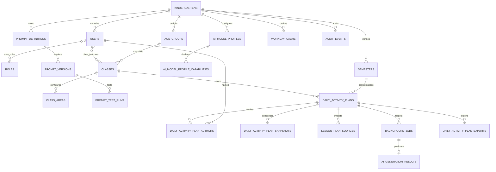

# Phase 1 数据模型：首期一日活动计划完整闭环

**Feature**: `001-daily-activity-plan`

**Date**: 2026-07-12

**Baseline**: `docs/design/data-model.md`、`docs/design/database-schema.md`

**Scope**: 24 张首期表；不增加反思表、集体活动环节表或未来子系统表

## 1. 通用规则

- 实体主键使用应用层 UUIDv7；时间点以 UTC `TIMESTAMPTZ` 保存，业务日期按
  `Asia/Shanghai` 解释。
- `kindergartens` 是园所根表，`roles` 是全局只读字典，两者不含
  `kindergarten_id`；其他园所范围表必须含 `kindergarten_id`。除不可变/只追加表按其
  生命周期约束外，业务表具有 `created_at`、`updated_at`。
- 拥有 UUID 单列主键 `id` 的园所范围表提供 `UNIQUE (kindergarten_id, id)`；
  纯关联表使用业务组合主键，不为满足该规则增加无意义 `id`。跨表关系优先使用
  包含 `kindergarten_id` 的组合外键。Repository 的公共方法必须要求 `kindergarten_id`。
- 核心外键默认 `ON DELETE RESTRICT`；停用不等于删除。已发布提示词、教案快照和审计
  事件只追加、不可更新和删除。
- JSONB 只保存由版本化 Pydantic Schema 校验的对象；数据库验证对象类型和版本，应用层
  验证嵌套字段。未知 Schema 版本保持只读，禁止编辑、AI 和导出。
- Repository 不提交事务。应用用例拥有鉴权、锁、乐观锁、快照、审计和提交/回滚边界。

## 2. 关系总览



## 3. 园所与身份

### 3.1 `kindergartens`

`id`、`name`、`timezone`、`is_active`、时间戳。首期时区固定 `Asia/Shanghai`，但不以
数据库单例约束阻止未来多园迁移。

### 3.2 `users`

关键字段：`username`、`username_normalized`、可空 `phone_e164`、`display_name`、
`password_hash`、`is_active`、`password_changed_at`、`last_login_at`、`created_by`、
`updated_by`。

- 唯一 `(kindergarten_id, username_normalized)`。
- `phone_e164 IS NOT NULL` 时唯一 `(kindergarten_id, phone_e164)`。
- 停用后继续占用用户名和手机号；不级联删除历史引用。
- 密码只保存 Argon2id 哈希；参数为 `m=19456 KiB,t=2,p=1`，成功登录时按需 rehash。

### 3.3 `roles`

全局只读字典：`id`、全局唯一 `code`、`name`、`is_system`。首期只种子
`admin`、`teacher`；不含 `kindergarten_id`。

### 3.4 `user_roles`

组合主键 `(kindergarten_id, user_id, role_id)`，含 `assigned_by`、`assigned_at` 和
时间戳。同一用户可兼有两类角色；应用事务必须锁定相关账号并阻止移除最后一个有效管理员。

### 3.5 `refresh_tokens`

关键字段：`token_family_id`、唯一 `token_hash`、`issued_at`、`expires_at`、
`last_used_at`、`revoked_at`、`revoke_reason`、`replaced_by_id`、脱敏 `client_label`。

- Refresh Token 是随机 256 位不透明值，只保存强哈希；`expires_at` 保存族首次签发后 7 天的
  固定绝对到期时间，同一 family 的后续轮换记录沿用该值，不得延长。
- 每次刷新撤销旧 token 并指向新 token；退出、改密、管理员重置、停用均撤销相应 token。
- 已撤销 token 重放时撤销整个 `token_family_id`。过期且撤销记录保留 90 天后可清理。
- 首期不增加 `family_expires_at` 或 `family_revoked_at`；固定期限由同族记录共享的
  `expires_at` 表达，family 撤销由同族记录的 `revoked_at` 表达。
- Access Token 不建表：15 分钟 HS256 JWT，签名密钥在数据库外，claims 最小化；每次请求
  仍查询账号、角色和班级关系。

## 4. 教学设置

### 4.1 `age_groups`

`code`、`name`、`sort_order`、`is_active`；园所内代码和名称唯一。每园幂等种子
`toddler/small/middle/large`，首期无自定义页面。

### 4.2 `classes`

`name`、`name_normalized`、同园 `age_group_id`、`is_active`、审计用户字段；园所内规范化
名称唯一。停用不删除教师关系或历史。

### 4.3 `class_teachers`

组合主键 `(kindergarten_id, class_id, user_id)`；含 `is_lead_teacher`、`assigned_by`、
`assigned_at`。PostgreSQL 部分唯一索引保证每班最多一名主班教师。

该表是教师访问班级的唯一当前事实来源。删除关联立即令后续 API 请求失去访问权，不改写
`daily_activity_plan_authors` 或历史快照。

### 4.4 `semesters`

`name`、`start_date`、`end_date`、`is_current`、`is_active`、审计用户字段。

- `start_date <= end_date`；同园最多一个当前学期。
- PostgreSQL `daterange(..., '[]')` 排他约束阻止有效学期范围重叠。
- 当前学期必须有效；创建教案前必须存在当前学期。
- 历史学期只停用，不删除。

### 4.5 `class_areas`

`class_id`、`area_type=indoor|outdoor`、`name`、`name_normalized`、`sort_order`、
`is_active`、审计用户字段；唯一 `(kindergarten_id,class_id,area_type,name_normalized)`。

班级允许某类或两类均为空。室内/户外 AI 请求分别读取对应类别的当前启用区域；缺少配置
只阻止目标栏目，不以触发器强制两类齐全。

## 5. AI 模型与提示词

### 5.1 `ai_model_profiles`

关键字段：`name/name_normalized`、`api_base_url`、`model_name`、
`api_key_ciphertext BYTEA`、`api_key_encryption_version`、`api_key_key_id`、
`api_key_nonce`、`api_key_last_four`、`call_config_revision BIGINT DEFAULT 1`、
`max_concurrency DEFAULT 2`、可空
`rate_limit_per_minute`、`is_default`、`is_active`、`risk_confirmed_by/at`、审计用户字段。

- 密钥字段必须全部为空或全部合法；启用要求密钥完整和风险确认。
- AES-256-GCM nonce 为随机 96 位；AAD 绑定园所 ID、档案 ID、envelope version。
- 主密钥不入库；`key_id` 支持新写入切换、旧 key 只读、分批重加密和验证后移除。
- `call_config_revision` 单调递增；`api_base_url`、`model_name`、能力集合或 API Key 发生业务
  变更时必须与档案更新在同一事务递增。仅重加密同一密钥明文、修改显示名称、限流、默认
  状态或启停状态不递增；启用状态仍由 Worker 单独实时复核。
- 同园规范化名称唯一；同园最多一个有效默认档案。
- `api_base_url` 必须通过 HTTPS、重定向、DNS 重绑定和网络范围校验后才能启用。

### 5.2 `ai_model_profile_capabilities`

组合主键 `(kindergarten_id, model_profile_id, capability_code)`；首期能力代码
`text`、`vision`、`structured_output`。任务只能选择满足提示词能力要求的启用档案。

### 5.3 `prompt_definitions`

关键字段：稳定 `code`、`name`、`variable_whitelist JSONB`、
`required_capabilities JSONB`、`result_schema_code/version`、可空 `model_profile_id`、
可空 `active_custom_version_id`、`is_active`。唯一 `(kindergarten_id, code)`。

七个代码及变量白名单以 `spec.md` FR-016/FR-019 为准；这些字段由代码种子管理，管理员
不能修改。结果 Schema 同样由版本化 contracts 拥有。提示词内容只允许
`\{\{[ \t]*([a-z][a-z0-9_]*)[ \t]*\}\}` 白名单纯替换语法；花括号内只接受 ASCII 空格或
水平 Tab，不接受换行或其他 Unicode 空白。保存前拒绝表达式、过滤器、循环、嵌套访问、
大小写/非法标识符、未知变量和未闭合占位符。数组/对象采用稳定 JSON，变量值不递归渲染。

`model_profile_id` 使用同园组合外键。`active_custom_version_id` 在
`prompt_versions` 建立后增加三列组合外键
`(kindergarten_id, id, active_custom_version_id) ->
prompt_versions(kindergarten_id, prompt_definition_id, id)`，从数据库层防止指向
同园其他提示词定义的版本；应用仍校验该版本为 `custom+published`。

### 5.4 `prompt_versions`

`prompt_definition_id`、单调 `version_number`、`source_type=system|custom`、
`lifecycle_state=draft|published`、`content`、`content_sha256`、可空
`based_on_version_id`、创建/发布人和时间。

- 每定义最多一个 `custom+draft`；发布版本不可变、不可删除。
- 发布在锁定定义行的事务内分配版本号并更新活动版本指针。
- 恢复历史复制正文形成新发布版本，不修改旧行。
- 提供 `UNIQUE (kindergarten_id, prompt_definition_id, id)`；
  `(kindergarten_id, prompt_definition_id, based_on_version_id)` 只能指向同一定义的历史版本。

### 5.5 `prompt_test_runs`

`prompt_definition_id`、`prompt_version_id`、`model_profile_id`、同园唯一 `job_id`、不可变
`input_context JSONB`、`input_sha256`、`prompt_content`、`prompt_content_sha256`、
`result_schema_code/version`、`model_call_snapshot JSONB`、派生的脱敏 `input_summary`、可清理
`output_content`、
`status=pending|succeeded|failed`、`elapsed_ms`、脱敏错误、`created_by` 和时间戳。

API 先按路径提示词代码对应的固定输入 Schema 校验 variables，再用 canonical JSON 保存
`input_context` 并计算 SHA-256；同时复制点击测试时草稿/历史版本的正文与哈希、结果 Schema，
以及只含 `profile_id/base_url/model_name/capabilities/call_config_revision` 的模型非密钥调用
快照。所有冻结字段插入后不可变，不能保存 API Key、密文或密钥版本副本。`input_summary` 固定为排序后的
`provided_variable_names` 与 `all_values_redacted=true`，公开响应只返回该摘要，不返回完整输入、
提示词正文或模型地址。API 在创建 `prompt.test` 后台任务的同一事务中插入 `pending` 运行记录；
Worker 只按 `job_id` 读取冻结上下文，先比较当前档案 revision；不一致时以
`prompt.configuration_changed` 零调用失败。revision 一致时才读取当前档案密钥，并实时重验
账号/角色、模型启用和当前地址安全策略后幂等更新成功/失败；完整上下文不得进入 Redis、
日志或审计。每定义
只保留最近 20 条；清空已完成
运行记录仍写审计，未完成运行不得删除。创建顺序必须先检查幂等命中；只有新 key 才锁定
定义并清理最旧已完成记录。若仍有 20 条未完成运行，则返回
`409 prompt.too_many_active_tests`，不创建任务或运行记录。删除完成 run 不删除对应
`background_jobs` 幂等锚点；同 key/摘要重放始终返回原 job，run 已删除时关联资源为空且
不得重建。

`(kindergarten_id, prompt_definition_id, prompt_version_id)` 必须指向同一定义的
`prompt_versions`；`model_profile_id` 和 `job_id` 分别使用同园组合外键，
`job_id` 在园所内唯一。

## 6. 教案与结构化正文

### 6.1 `daily_activity_plans`

关系字段：`class_id`、不可变 `semester_id`、不可变 `plan_date`。展示快照：园所、班级、
年龄段、学期名称和学期起止日期。派生字段：可空 `teaching_week_number/text`、
`activity_date_text`、`season_code`。状态字段：`content JSONB`、`content_schema_version`、
`version`、`archived_at/by` 和审计用户字段。

数据库核心约束：

```sql
UNIQUE (kindergarten_id, class_id, plan_date)

CHECK (
  (
    plan_date BETWEEN semester_start_date_snapshot AND semester_end_date_snapshot
    AND teaching_week_number IS NOT NULL
    AND teaching_week_number > 0
    AND teaching_week_text IS NOT NULL
  )
  OR
  (
    plan_date NOT BETWEEN semester_start_date_snapshot AND semester_end_date_snapshot
    AND teaching_week_number IS NULL
    AND teaching_week_text IS NULL
  )
)
```

归档后仍占用唯一键。所有写入使用
`WHERE kindergarten_id=:kg AND id=:id AND version=:expected_version` 原子更新并递增版本。

### 6.2 `PlanContentV1`

顶层始终存在六个对象，字段可先为空以支持渐进手工编辑；“完整”是独立业务校验：

```text
morning_activity
morning_talk
group_activity
indoor_area_game
afternoon_outdoor_game
daily_reflection
```

- 晨间活动：体能大循环、集体游戏、自主游戏、重点指导、3 项目标、3 项指导要点。
- 晨间谈话：话题、3 个问题。
- 集体活动：主题、目标、准备、重点、难点、有序过程步骤；每步含 `is_ai_added`。
- 室内/户外区域游戏：有序区域、重点指导、各 3 项目标、指导要点和支持策略。
- 反思：`highlights`、`issues`、`adjustments`。三个字段分别先执行 Unicode NFKC
  规范化，再按 Python/Unicode code point 计数；中文、标点、空白、字母和 emoji 均计入，
  三字段合计不超过 200。规范化后的值用于校验、持久化和 Word 三行输出。

反思生成门禁只检查前五个当前栏目是否满足各自固定 Schema，不检查内容来源，也不要求
集体活动存在 `is_ai_added=true` 的环节。缺少 AI 新增环节是提示状态，不是数据完整性
状态；因此纯手工完成的五栏同样可以作为反思输入。重新生成时构造的 `current_plan` 只
包含这五个栏目和必要展示上下文，明确排除当前 `daily_reflection`。

### 6.3 `daily_activity_plan_authors`

组合主键 `(kindergarten_id, plan_id, user_id)`；含 `display_name_snapshot`、唯一有序
`sort_order`、`added_by` 和时间戳。

- 新增作者时必须仍为该班当前关联教师；至少一名作者。
- 解绑后保留既有行和姓名快照，署名不授予权限，也不得自动删除；可在后续手动保存中
  显式移除，但不能重新添加未关联教师。
- 修改作者需要乐观锁并按手动保存创建快照。

### 6.4 `daily_activity_plan_snapshots`

`plan_id`、`plan_version`、`reason_code`、完整 `context_snapshot`、完整 `content`、
Schema 版本、规范化 `content_sha256`、创建人和时间。原因固定为：

```text
manual_save
ai_adopted
archive
unarchive
before_restore
restored
```

快照只插入、长期保留。自动保存及 AI 生成、重新生成、重试、失败、拒绝不创建快照；只有
教师采用 AI 结果时创建 `ai_adopted`。历史恢复先插入 `before_restore`，再复制选定快照
为当前状态并插入 `restored`，旧快照不变。

快照提供 `UNIQUE (kindergarten_id, plan_id, id)`，供导出记录使用同教案归属外键。

### 6.5 `lesson_plan_sources`

`plan_id`、`source_type=pasted_text|docx`、可空清理后 `original_filename`、
`source_sha256`、`extracted_text`、`uploaded_by` 和时间戳。每次确认新增记录，不保存
`.docx` 二进制、绝对路径或可下载附件。

## 7. 任务、预览与导出

### 7.1 `background_jobs`

关键字段：可空 `parent_job_id`、可空 `retry_of_job_id`、`job_type`、可空 `execution_status`、可空
`plan_id/target_section`、`requested_resource_version`、`idempotency_scope`、`idempotency_key`、
`request_fingerprint_sha256`、可空 `attempt_count/max_attempts`、`requested_by`、
`request_id/trace_id`、租约/心跳字段、排队/
开始/结束时间和脱敏错误。

`idempotency_scope` 是稳定的 `HTTP_METHOD + normalized route template`，例如
`POST /api/v1/plans/{plan_id}/ai/generations`，不包含实际 UUID、query string 或显示文本。
`request_fingerprint_sha256` 的 canonical payload 必须包含已解析并规范化的实际路径参数、
有业务语义的查询参数和 canonical JSON 请求体；UUID 使用标准小写文本，query 按名称和值
稳定排序，JSON 对象按 key 排序并去除无意义空白。不得只对请求 body 做摘要。
外部请求直接受理的根任务或父任务要求 `idempotency_scope/idempotency_key/
request_fingerprint_sha256` 三项全非空；`ai.batch` 内部四个子任务三项全空，不伪造第二套
客户端幂等作用域。非空记录使用部分唯一索引
`(kindergarten_id, requested_by, idempotency_scope, idempotency_key)`；同作用域 key 但
`request_fingerprint_sha256` 不同返回冲突。内部子任务另以
`(kindergarten_id, parent_job_id, target_section)` 唯一，重复投递不能复制子任务。
只有执行型 AI 任务 `max_attempts=3`；`prompt.test`/`word.export` 按各自策略保存非空上限。

`parent_job_id` 仅表示 `ai.batch` 父子归属；`retry_of_job_id` 只表示最终失败、且存在
`ai_generation_results` 的执行型 AI 栏目任务显式重试。`ai.batch`、`prompt.test`、
`word.export` 和非 failed 任务不得作为显式重试来源。新重试是 `parent_job_id=NULL` 的根任务，
并在同一事务创建新的 pending AI 结果；两者都是同园自外键，不得相互复用。与教案关联的任务提供
`UNIQUE (kindergarten_id, plan_id, id)`，供结果和导出使用同教案归属外键。

`job_type=ai.batch` 时 `execution_status/attempt_count/max_attempts`、租约/排队/开始/结束字段
均为 NULL 且不得被 dispatcher 领取；API 响应把 batch 的 `attempt_count/max_attempts` 固定
投影为 `0/0`。其他可执行任务的 `execution_status` 和 attempt 字段非空并遵循：

```text
pending_dispatch -> queued -> running
running -> retrying -> queued
running -> awaiting_confirmation       # AI 预览
running -> succeeded                   # 无需教师确认的任务
pending_dispatch | queued | running | retrying -> failed
awaiting_confirmation -> adopted | rejected | expired
```

- AI 子任务进入 `awaiting_confirmation` 即表示模型执行已完成，但业务生命周期尚未终结；
  `adopted/rejected/expired/failed` 才是该子任务的业务终态。
- `ai.batch` 父任务不调用模型、不投递、不保存第二套执行状态。API 每次查询只从恰好四个
  子任务派生非空响应 `status` 与 `has_partial_failure`。只要任一子任务仍处于执行中，父任务按
  `running > retrying > queued > pending_dispatch` 展示最高优先级状态；当所有子任务都进入
  模型执行已完成集合 `{awaiting_confirmation, adopted, rejected, expired, failed}` 后，全部失败则
  父任务为 `failed`，否则为 `succeeded`；有失败又有非失败结果时
  `has_partial_failure=true`。父任务结束不改变子预览的后续采用/拒绝/过期生命周期。
- PostgreSQL 状态为唯一权威，Redis 只传 `job_id`。
- DB 事务提交 `pending_dispatch` 即受理；投递失败保留该状态，15 秒扫描自动重投。
- Redis/Dramatiq 不可用不得返回 503；只有在权威任务事务提交前，PostgreSQL 不可用时才返回
  `database.unavailable`，当前端点必需的服务端配置或固定本地资源不可用时才返回
  `configuration.unavailable`，且不得留下部分任务。整体 ready 只把 PostgreSQL 与所有核心
  请求共同依赖的全局安全配置作为 503 条件，功能专属资源只报告 degraded。
- 任务租约 120 秒、业务心跳 30 秒、过期扫描 30 秒；首期 Worker 4 线程。
- Worker 使用条件更新/行锁领取；消息重投不能增加第二份结果或突破模型调用上限。
- Worker 发出 AI/提示词测试外部请求前按 `requested_by` 重验账号、角色/班级、归档状态和
  模型启用/能力；撤权或停用后不可调用外部服务，任务以不可重试失败收敛。

### 7.2 `ai_generation_results`

`job_id`（同园唯一）、`plan_id`、`target_section`、模型及模型名快照、提示词定义/版本、
`input_context`、`input_sha256`、新增的 `target_section_baseline_sha256`、结果 Schema、
可清理 `output_content`、`output_sha256`、过期/采用/拒绝/清理时间与操作者。

API 在每个执行型 AI 任务受理事务中先插入唯一 pending result，冻结目标栏目基线、实际输入、
模型、提示词和 Schema，`output_content/output_sha256` 为空；显式反思任务也必须在其预保存
事务中冻结五个上游栏目输入，不能只插入 job。Worker 只按 `job_id` 读取该不可变输入并幂等
填充输出，不在 Redis 延迟后重读已变化的当前教案或设置。显式重试从原 result 精确复制
`plan_id`、`target_section`、`requested_resource_version`、`target_section_baseline_sha256`、
`input_context`、`input_sha256`、模型/提示词快照和结果 Schema，只清空 output、错误、
采用/拒绝字段；不得按重试时 current plan/settings 重建。

`(kindergarten_id, plan_id, job_id)` 必须指向同一教案的 `background_jobs`；
`model_profile_id` 使用同园外键；
`(kindergarten_id, prompt_definition_id, prompt_version_id)` 必须指向同一定义的
`prompt_versions`。

预览有效性：

1. 当前目标栏目规范化哈希等于 `target_section_baseline_sha256`；
2. 重新计算的本次实际相关输入哈希等于 `input_sha256`；
3. 当前用户仍有权限，结果未过期/拒绝/采用；
4. 采用请求携带客户端最新 `expected_version`，API 以 CAS 保证事务提交时无并发覆盖。

生成时的旧全局版本只供追溯，不单独令结果失效；无关栏目变化不影响 1/2。采用事务插入
一次快照、更新目标正文和版本、标记任务/结果并写审计。重复采用返回原结果，不重复快照。

`teacher_context` 是创建单个任务时写入 `input_context` 的不可变请求快照，不是教案上的
可变字段。采用时以该快照配合当前服务端可变输入重算哈希；页面之后为下一次生成修改
上下文，不追溯改变既有任务。要让新上下文参与结果，教师必须重新生成。

`GroupActivityAddStepResultV1` 是增量而非完整集体活动：

```text
step: GroupActivityStepV1
suggested_insert_index: integer, 0 <= value <= len(input.group_activity.process)
```

API 基于采用时当前集体活动合并，并把新 step 的 `is_ai_added` 设为 true。拆分和新增环节
使用不同任务、预览和采用事务；只有拆分预览采用并保存后，才允许以当时已保存的当前集体
活动创建新增环节任务。越界索引属于 AI 结果结构错误并进入既定自动重试，不静默截断或
改成末尾。

### 7.3 `daily_activity_plan_exports`

`plan_id/version`、可空 `snapshot_id`、不可变 `context_snapshot/content_snapshot`、
`content_schema_version/content_sha256`、唯一 `job_id`、`status=pending|succeeded|failed`、
`display_filename`、唯一内部 `storage_key`、文件大小/哈希、模板标识/文件名/哈希、导出人/
时间、脱敏错误和 `file_missing_at`。

`(kindergarten_id, plan_id, snapshot_id)` 必须指向同一教案的快照；
`(kindergarten_id, plan_id, job_id)` 必须指向同一教案的 `word.export` 任务。

每次导出独立记录和副本。只有文件原子落位并完成哈希后才能标成功；失败不能留下可下载
半成品。Worker 只读导出记录中的不可变输入快照，不在执行时重读可能已变化的当前教案。
导出缺失确认只检查晨间、晨谈、集体、室内和户外五栏；`daily_reflection` 为空不触发确认，
但渲染仍保留三行固定位置并输出空内容。历史文件缺失只标记并报错，不静默重建。记录与
副本首期长期保留，无删除入口。

## 8. 系统支撑

### 8.1 `workday_cache`

`calendar_date`、`result_code=workday|non_workday|unknown`、
`source_code=local|online|combined|unavailable`、`source_version`、最小 `detail`、
`expires_at/checked_at`；唯一 `(kindergarten_id, calendar_date)`。

- 两来源不可用固定 `unknown/unavailable`，并约束 `unavailable` 只能搭配 `unknown`，缓存 5 分钟。
- 已确认工作/非工作日缓存 24 小时。
- 来源冲突时本地结论优先，保存 `combined` 与最小冲突摘要，缓存 1 小时并软提示。

### 8.2 `audit_events`

`event_code`、可空 `actor_user_id`、`actor_role_codes` 快照、`resource_type/id`、
`request_id/trace_id/job_id`、`outcome=success|failure`、事件专用白名单 `metadata`、
`occurred_at`。只插入且至少保留一年；不得保存密码、token、Cookie、API Key、完整教案或
完整 AI 输入输出。

## 9. 关键事务与状态不变量

| 用例 | 同一事务内必须完成 |
| --- | --- |
| 首次初始化 | 园所、角色种子、管理员、角色分配；任一步失败全部回滚 |
| 手动保存 | 重新鉴权、版本 CAS、正文/作者、`manual_save` 快照、审计 |
| 归档/恢复归档 | 重新鉴权、版本 CAS、快照、归档字段、审计 |
| 历史恢复 | `before_restore`、当前内容/上下文、`restored`、版本、审计 |
| 创建后台任务 | 幂等校验、`pending_dispatch` 任务、父子关系；Redis 在提交后投递 |
| 创建反思任务 | 权限/版本 CAS、无快照保存页面内容、五栏完整性、`pending_dispatch` 任务；任一步失败全回滚 |
| 采用 AI | 权限、预览有效性、版本 CAS、快照、栏目合并、任务/结果状态、审计 |
| 创建 Word 导出 | 缺失确认通过后重新鉴权、版本 CAS、无快照保存、复制不可变导出输入、导出记录、`pending_dispatch` 任务；任一步失败全回滚 |
| 发布/恢复提示词 | 定义行锁、版本号、新不可变版本、活动指针、审计 |
| 设置当前学期 | 锁定园所学期、清除旧 current、设置新 current、审计 |

跨 PostgreSQL、Redis 和文件系统不伪装成分布式事务：使用权威状态、幂等、扫描、临时文件、
原子改名与孤儿清理收敛。

## 10. 迁移顺序

1. 园所、身份、角色、refresh token、审计；启用 PostgreSQL `btree_gist`。
2. 年龄段、班级、教师关系、学期、区域。
3. 教案、作者、快照和工作日缓存。
4. 通用后台任务、幂等索引、租约与恢复扫描所需索引。
5. AI 模型、能力、提示词定义/版本/异步测试，以及引用前述实体的 AI 预览。
6. 集体活动来源、Word 导出和最终组合外键/索引。

`prompt_test_runs.job_id` 必须在 `background_jobs` 已存在后以强同园外键创建；不得先建弱
字段再依赖应用层补齐。通用任务基础放在最早的异步消费者（提示词测试）之前，US4 只增加
教案 AI 结果与 actors，不重复建设第二套队列协议。

因为当前 `main` 尚无业务迁移，初始迁移直接采用最终约束：周次双空、`unavailable`、
模型默认并发 2、栏目基线哈希与 `PlanContentV1`；不制造无数据可迁移的过渡版本。

## 11. 必测数据行为

- 同园同班同日唯一，归档后仍不能重复创建；跨园组合外键和 Repository 负向测试。
- 学期内周次双非空、学期外双空、无当前学期禁止创建。
- 单类区域缺失只阻止对应 AI 栏目。
- 解绑后作者快照保留，但该用户下一请求立即 403，且不能重新被新增为作者。
- 生成/重试/失败/拒绝快照数不变，采用一次恰好增加一条。
- 无关栏目变化不令预览失效；目标栏目或实际输入变化令采用失败且不覆盖。
- DB 已提交而 Redis 不可用仍返回 `pending_dispatch`；恢复和重复投递只产生一个结果。
- 集体拆分可先采用，之后新增 step 独立采用并只标记该 step。
- `unknown/unavailable`、冲突 `combined` 及三类 TTL 在固定时钟下可重复验证。
