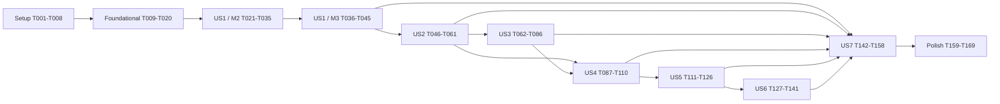

# Tasks: 首期一日活动计划完整闭环

**Input**: `spec.md`、`plan.md`、`research.md`、`data-model.md`、`contracts/`、`quickstart.md`
**Scope**: Roadmap M1–M8；M9 生产部署复审不在本任务清单内
**Tests**: 宪章和规格明确要求测试；每个用户故事必须先写可观察失败的测试，再实现最小行为

## 执行授权边界

- **2026-07-21 工作流重置**：后续任务只在 `dev` 实现，并必须由 GitHub Issue 固定引用已确认的 `docs` 提交。下文 Codex/Trae、T003 和双环境内容是已完成历史，不再定义当前分支模型。
- 本文件只是实现计划，不授权修改 canonical 文档、创建/切换分支、提交、cherry-pick、推送
  或创建 PR。
- T001–T002 只能在用户明确授权 `main` docs-only 修改后执行；未另行获得提交、推送授权时，不得声称已提交、推送或同步 `origin/main`。
- T003 已在 M0-G1～M0-G8 全部关闭后，经用户明确授权执行：`codex` 和 `trae` 从共同基线 `c1b363331c5b8d611aa4c8b0e2fb775f5e64ccc7` 创建并推送。初始建分支未 cherry-pick 旧基线；后续新的共享文档提交仍须分别获得授权后同步。禁止在两个实现分支之间自行合并。
- 未完成的代码任务只能在已授权的 `dev` 执行，绝不能落到 `main` 或 `docs`。
- 每项 RED 测试任务必须先建立可收集测试 seam：若配对实现任务所列的目标模块尚不存在，
  该 RED 任务可以且只能在配对实现任务已经列出的最终路径创建最小 import skeleton。Skeleton
  只允许声明公开类型、函数或类签名并返回确定性中性值；不得包含业务规则、导入期副作用、
  数据库/网络访问，也不得使用 `skip`、`xfail`、`NotImplementedError` 或主动抛出异常。不得
  提前创建后续故事无关的 skeleton；配对实现任务负责用最小实现替换它。
- 目标测试的 `pytest --collect-only` 必须退出 0 且 `errors=0`；实际 RED 运行必须到达任务描述
  中的业务/契约断言，摘要为 `failed>0, errors=0`。导入、配置、fixture 错误，跳过或放宽断言
  均不是有效 RED。
- RED 与配对实现范围固定为：T009–T012 → T013–T019，T021–T025 → T026–T034，
  T036–T039 → T040–T044，
  T046–T051 → T052–T060，T062–T072 → T073–T085，T087–T097 → T098–T109，
  T112–T117 → T118–T125，T127–T132 → T133–T140，T142–T149 → T150–T157。Skeleton
  只能落在右侧任务已列出的最终实现路径。T012 为使 Alembic 测试可收集和启动，可额外创建
  T015 已列出的最小 `alembic.ini` 与 `packages/backend/database/migrations/env.py` bootstrap；
  不得提前创建业务表、业务迁移或把配置错误当作 RED。

## 格式

`[ID] [P?] [Story] 描述`；`[P]` 表示文件无冲突且依赖满足后可并行；用户故事阶段必须带
`[US1]`–`[US7]`。

---

## Phase 1: Setup（Pre-M1 文档门禁与工程初始化）

**Purpose**: 先消除已确认规则在 canonical 文档中的漂移并完成 M0 共享基线，再在获授权且基线相同的 `codex` 和 `trae` 实现分支上分别建立 Python 3.14 工程与本地测试依赖。

- [x] T001 已在用户授权后同步 `AGENTS.md`、`README.md`、`CONTEXT.md`、`docs/PRD/lesson-management.md`、`docs/design/system-architecture.md`、`docs/design/data-model.md`、`docs/design/database-schema.md`、`docs/ROADMAP.md`，统一采用建快照、一键四栏、显式反思、区域按栏、`pending_dispatch`、学期外空周次、`unavailable`、栏目/输入哈希、解绑保留署名、模型默认并发 2、导出仅以前五栏判缺且空反思保留三行，以及 `\{\{[ \t]*([a-z][a-z0-9_]*)[ \t]*\}\}` 白名单纯替换；验证：旧规则检索无未解释命中，精确提示词词法和空反思导出规则均有 canonical 命中，`git diff --check` 通过。
- [x] T002 已对最终候选文档基线执行 Pre-M1 一致性审查；验证：Spec Kit 分析无未解释的
  CRITICAL/HIGH 问题，72 个 FR 与 17 个 SC 均有任务映射，文档链接、模板结构/样式/哈希
  和 graphify 专项检查通过。本记录不写入最终提交 ID，也不声称已同步 `origin/main`。
- [x] T003 已在 M0-G1～M0-G8 全部关闭并形成最终 docs-only `main` 基线后，经明确授权从
  共同基线 `c1b363331c5b8d611aa4c8b0e2fb775f5e64ccc7` 创建并推送 `codex` 和 `trae`；本地与
  远端两分支均指向该提交，初始建分支未 cherry-pick 旧基线；后续共享文档仍分别授权同步。
- [x] T004 在 `.python-version`、`pyproject.toml`、`uv.lock` 建立 Python 3.14+ 项目，创建 API、Worker、Web 三个可执行入口并冻结 T032 将实现的 `packages.backend.bootstrap init-admin` 命令名称，同时锁定核心/开发依赖；M1 不为初始化命令提供误导性的空操作；验证：`uv sync --locked && uv run python -VV && uv tree` 成功，三个 M1 入口的 `--help` 可执行，解释器为 Python 3.14+，无手工 `requirements.txt` 第二清单
- [x] T005 在 `apps/web/`、`apps/api/`、`apps/worker/`、`packages/contracts/`、`packages/backend/`、`tests/architecture/`、`tests/contract/`、`tests/unit/`、`tests/api/`、`tests/repository/`、`tests/migrations/`、`tests/worker/`、`tests/word/`、`tests/web/`、`tests/fixtures/` 创建 `plan.md` 规定的最小包骨架，并在 `packages/contracts/common.py`、`identity.py`、`settings.py`、`lesson_plans.py`、`prompts.py`、`jobs.py`、`exports.py`、`audit.py` 与 `packages/backend/ports.py` 建立稳定可导入的公共 Schema/Protocol/工厂签名 skeleton；skeleton 只提供类型和可被行为断言替换的中性返回值，不实现业务规则；验证：`uv run pytest --collect-only` 退出 0，`uv run python -c "import packages.contracts.common, packages.contracts.identity, packages.contracts.settings, packages.contracts.lesson_plans, packages.contracts.prompts, packages.contracts.jobs, packages.contracts.exports, packages.contracts.audit, packages.backend.ports"` 退出 0，且 `fdfind --type f '__init__\.py' apps packages | sort` 显示三个运行单元和两个共享包，无照片、对象存储、审批或生产部署空壳
- [x] T006 在 `.github/workflows/quality.yml` 和 `pyproject.toml` 配置锁定安装、Ruff、Pyright、Pytest、OpenAPI 校验和 Python 3.14 CI 门禁；验证：`uv run ruff format --check . && uv run ruff check . && uv run pyright && uv run pytest --collect-only` 均可执行，未配置检查不得用替代命令冒充
- [x] T007 [P] 在 `compose.dev.yaml` 与 `.gitignore` 增加仅供本地测试的 PostgreSQL/Redis、健康检查及敏感/临时/导出文件忽略规则；Compose 必须读取 [`docs/development/local-development-environments.md`](../../docs/development/local-development-environments.md) 规定的项目名、宿主机端口和可选镜像变量，以带 SHA-256 digest 的官方镜像为不可变默认值，缺失档位变量时清晰失败；验证：分别加载 Codex、Trae 档位后运行 `docker compose -f compose.dev.yaml config` 成功，两服务只绑定各自回环端口，默认镜像引用包含已核对 digest，文件中无 Caddy、DNS、证书、Tailscale、生产备份、永久镜像代理或真实秘密
- [x] T008 完成 `pyproject.toml`、`uv.lock`、`compose.dev.yaml` 的 Setup 门禁；验证：当前实现只加载自己的 Codex 或 Trae 档位，执行 `docker compose -f compose.dev.yaml up -d --wait postgres redis`，再以 `docker compose -f compose.dev.yaml ps` 与 `docker compose -f compose.dev.yaml port` 证明项目名、两个宿主机端口、数据库和卷属于本档位且只绑定回环地址；随后逐条运行 `uv sync --locked`、`uv run ruff format --check .`、`uv run ruff check .`、`uv run pyright`、`uv run pytest` 并如实记录任何失败。两套实现同时启动的互不影响检查属于共享 M1 父里程碑门禁，不让本任务依赖另一分支进度

**Checkpoint**: M0 共享基线已闭环，且用户授权的 `codex` 和 `trae` 从同一提交创建，两个实现分支均具备可重复锁定安装；尚无业务空壳。

---

## Phase 2: Foundational（阻断所有用户故事）

**Purpose**: 建立依赖方向、公共契约、配置、数据库、测试替身与三个独立运行入口。

### 先写失败测试

- [x] T009 [P] 在 `tests/architecture/test_dependency_boundaries.py`、`tests/web/test_bff_proxy.py` 编写依赖方向测试；逐项测试 BFF 方法/路径/query/body、Cookie、Origin/Referer、CSRF、Content-Type、Request ID、hop-by-hop/伪造来源头，以及认证完成/刷新各两条、退出两条过期 `Set-Cookie` 按 raw header 原样转发且不逗号折叠；验证：`uv run pytest --collect-only tests/architecture/test_dependency_boundaries.py tests/web/test_bff_proxy.py` 退出 0，再运行两文件并因依赖方向或 BFF 转发断言未满足而 RED
- [x] T010 [P] 在 `tests/contract/test_common_contracts.py`、`tests/contract/test_idempotency.py` 与 `tests/contract/test_openapi_document.py` 编写统一错误、分页、Request ID、幂等 fingerprint 及 OpenAPI 3.1 校验测试；锁定跨实际 path 冲突、两个 503 code，以及认证完成/刷新 repeated auth Cookie 与退出 repeated clear Cookie 的机器契约；验证：`uv run pytest --collect-only tests/contract/test_common_contracts.py tests/contract/test_idempotency.py tests/contract/test_openapi_document.py` 退出 0，再运行同三文件并因错误、分页、幂等、Cookie header 或 503 断言未满足而 RED
- [x] T011 [P] 在 `tests/unit/test_config.py`、`tests/unit/test_observability.py` 与 `tests/api/test_health.py` 编写敏感配置、日志脱敏、回环保护及 live/ready 测试；PostgreSQL 与全局 JWT/CSRF 安全配置故障分别返回 503 两码，Redis/AI/日历/模板/导出存储故障整体 200 且对应 check degraded；验证：`uv run pytest --collect-only tests/unit/test_config.py tests/unit/test_observability.py tests/api/test_health.py` 退出 0，再运行三文件并因回环、脱敏、分项健康或稳定错误码断言未满足而 RED
- [x] T012 [P] 在 `tests/unit/database/test_session_boundaries.py` 与 `tests/migrations/test_alembic_bootstrap.py` 编写 Repository 不自行提交、应用事务回滚和 Alembic 空库升级基础测试；验证：`uv run pytest --collect-only tests/unit/database/test_session_boundaries.py tests/migrations/test_alembic_bootstrap.py` 退出 0，再运行两文件并因事务边界或空库升级行为断言未满足而 RED

### 实现共享基础

- [x] T013 在 `packages/contracts/common.py` 实现 `ErrorResponse`、`FieldError`、两个稳定 503 code、可增长列表分页、Request ID、幂等头/scope 和含实际 path/query/body 的 canonical fingerprint 契约，并让 `tests/contract/test_openapi_document.py` 使用锁定的 OpenAPI 3.1 校验器读取 `specs/001-daily-activity-plan/contracts/openapi.yaml`；验证：`uv run pytest tests/contract/test_common_contracts.py tests/contract/test_idempotency.py tests/contract/test_openapi_document.py` 通过
- [x] T014 [P] 在 `packages/backend/config.py`、`packages/backend/observability.py`、`apps/api/middleware.py`、`apps/api/__main__.py` 实现分级配置、启动时回环绑定保护、结构化日志及 `request_id/trace_id` 传播和脱敏；验证：`uv run pytest tests/unit/test_config.py tests/unit/test_observability.py` 通过，开发环境关闭 Cookie Secure 且绑定非回环地址时 API 在启动服务器前失败，日志替身中完整密钥、身份秘密和令牌命中数为 0
- [x] T015 [P] 在 `packages/backend/database/base.py`、`packages/backend/database/session.py`、`packages/backend/database/migrations/env.py`、`alembic.ini` 建立 SQLAlchemy 2.x、PostgreSQL 事务和 Alembic 基础；验证：`uv run alembic upgrade head && uv run alembic current && uv run pytest tests/unit/database/test_session_boundaries.py tests/migrations/test_alembic_bootstrap.py` 通过
- [x] T016 [P] 在 `tests/conftest.py`、`tests/database_config.py`、`tests/fixtures/clock.py`、`tests/fixtures/calendar.py`、`tests/fixtures/ai.py`、`tests/fixtures/redis.py` 建立显式测试数据库、逐测试隔离 schema、固定时钟、日历/AI/消息替身和禁网保护；验证：缺失 `CHILD_MANAGER_TEST_DATABASE_URL` 时清晰失败，Alembic 空库升级使用临时 schema，断网运行 `uv run pytest tests/unit tests/contract --collect-only` 可收集且不发起外部请求
- [x] T017 在 `apps/api/app.py`、`apps/api/__main__.py`、`apps/api/dependencies.py` 实现 API 装配、统一异常转换及 `/health/live`、`/health/ready`；验证：`uv run pytest tests/api/test_health.py` 通过，DB/全局安全配置故障分别返回两个稳定 503 code，AI/Redis/日历/模板/导出存储只令分项 degraded 且整体 200
- [x] T018 [P] 在 `packages/contracts/jobs.py`、`apps/worker/__main__.py`、`apps/worker/broker.py`、`apps/worker/actors.py`、`apps/worker/scheduler.py` 建立仅传 `job_id` 的最小消息契约、默认 4 线程的 Dramatiq/Redis 入口和测试 broker；验证：`uv run python -m apps.worker --help` 成功并显示首期线程默认值，消息 Schema 无 API Key、token 或正文
- [x] T019 [P] 在 `apps/web/__main__.py`、`apps/web/app.py`、`apps/web/api_client.py` 建立独立 NiceGUI 入口与 BFF 客户端；按 T009 allowlist 转发请求/响应，使用 raw multi-header API 原样保留 repeated `Set-Cookie`，剥离 hop-by-hop/伪造来源头并按 socket peer 重建；验证：`uv run pytest tests/architecture/test_dependency_boundaries.py tests/web/test_bff_proxy.py` 通过，`rg -n "sqlalchemy|packages\.backend|Repository" apps/web` 无违规导入，浏览器代码无内部 API 地址
- [x] T020 完成 Foundational 门禁并更新 `graphify-out/graph.json`；验证：先运行 `uv run pytest tests/architecture tests/contract tests/web/test_bff_proxy.py tests/unit/test_config.py tests/unit/test_observability.py tests/api/test_health.py`，再逐条运行五条标准命令 `uv sync --locked`、`uv run ruff format --check .`、`uv run ruff check .`、`uv run pyright`、`uv run pytest`，最后运行 `graphify update .`；所有质量命令退出 0，图谱失败须记录原因

**Checkpoint**: 三个进程可独立启动，公共契约、事务、禁网替身和依赖方向已由测试保护。

---

## Phase 3: User Story 1 — 管理员完成安全初始化与必要设置（Priority: P1）

US1 保持一个端到端故事，但按 Roadmap 分成 M2、M3 两个顺序 checkpoint；M2 不创建设置
模型或页面，M3 不重复实现认证、会话或身份表。

### M2：认证、授权与身份审计

**Goal**: 安全初始化首位管理员，建立实时账号/角色授权、同源 Cookie 会话、CSRF、会话撤销、园所隔离和身份审计基础。

**Requirements covered**: FR-001–FR-003；FR-004、FR-057–FR-060 的身份/园所/安全部分；
FR-068–FR-070、FR-073–FR-077；SC-002 的未登录/跨园部分、SC-009 的认证秘密部分、
SC-011、SC-018。

**Independent Test**: 从空 PostgreSQL 由 CLI 生成短时单次初始化凭据，在 HTTPS/`localhost`
浏览器完成首位管理员通行密钥登记与双人核验激活；随后完成教师邀请、首个凭据登记、无用户名
认证、本人凭据管理、管理员撤销并重新邀请、恢复码轮换/恢复，以及刷新、退出和会话撤销。
Challenge、邀请、恢复码、Refresh 的过期/撤销/跨用途/并发重放，跨园、伪造来源和缺失 CSRF
全部被拒绝。此门禁不创建学期、班级或区域。

#### M2 Tests（先 RED）

- [ ] T021 [P] [US1] 在 `tests/unit/identity/test_identifiers.py`、`tests/unit/identity/test_client_ip.py`、`tests/unit/identity/test_webauthn.py`、`tests/unit/identity/test_secret_tokens.py`、`tests/unit/identity/test_auth_throttle.py` 编写用户名 NFKC+trim+lower、手机号 E.164/空值，32 字节 challenge 的 5 分钟单次消费与 purpose/context/RP ID/Origin/UV 绑定，初始化/邀请/恢复秘密仅存摘要，以及公开身份端点限流测试；客户端地址覆盖只有配置的回环 BFF peer 可提供可信内部头；验证：`uv run pytest --collect-only tests/unit/identity` 退出 0，再运行该目录并因 ceremony、秘密状态机或来源边界尚未实现而 RED
- [ ] T022 [P] [US1] 在 `tests/migrations/test_0001_identity.py`、`tests/migrations/test_password_to_passkey.py`、`tests/repository/test_identity_isolation.py` 编写 12 张身份表、同园唯一/组合外键、凭据/邀请/恢复/Refresh 并发消费、最后管理员及 expand→enroll→contract 升降级测试；验证：collect-only 退出 0，再运行三文件并因迁移、约束、旧密码端点停用或 contract 字段断言未满足而 RED
- [ ] T023 [P] [US1] 在 `tests/contract/test_auth_contract.py`、`tests/contract/test_users_contract.py` 编写 OpenAPI 契约测试，锁定注册/认证 options/verify、初始化、邀请、本人凭据、管理员撤销/重新邀请、恢复码、会话端点及浏览器可直接传给 WebAuthn API 的字段；断言旧登录/改密/重置路径和密码 Schema 不存在，认证完成/刷新各有两条 auth `Set-Cookie`、退出有两条过期 Cookie；验证：collect-only 退出 0，再运行两文件并因新契约未实现而 RED
- [ ] T024 [P] [US1] 在 `tests/api/test_init_admin_cli.py`、`tests/api/test_auth_webauthn.py`、`tests/api/test_invitations.py`、`tests/api/test_credentials.py`、`tests/api/test_recovery.py`、`tests/api/test_sessions.py`、`tests/api/test_csrf.py`、`tests/api/test_users.py` 编写首位管理员初始化/双人激活、邀请、注册/认证负向矩阵、本人及管理员凭据撤销、重新邀请、恢复码轮换/恢复、Refresh 重放、退出/会话撤销、停用和最后管理员测试；最后管理员覆盖 Web/API 稳定 409、CLI 只接受请求 ID、双人批准原子性、预登记引用不进入 argv/环境/日志/审计以及恢复完成全量撤销；验证：collect-only 退出 0，再运行这些文件并因状态机、Cookie 或 API 行为尚未实现而 RED
- [ ] T025 [P] [US1] 在 `tests/web/test_auth_smoke.py` 以浏览器虚拟认证器编写初始化登记、无用户名认证、教师邀请登记、增加/命名/撤销本人凭据、管理员撤销教师最后凭据并重新邀请、恢复和会话撤销冒烟；网络记录不得直连 API，伪造来源头无效；验证：collect-only 退出 0，再运行该文件并因 ceremony 或账号页面尚未实现而 RED

#### M2 Implementation

- [ ] T026 [P] [US1] 在 `pyproject.toml` 引入并锁定 `webauthn` 3.x，配置测试浏览器虚拟认证器与确定性 ceremony/时钟替身；验证：`uv sync --locked`、Python 3.14 导入冒烟和 `uv run pytest tests/unit/identity/test_webauthn.py tests/web/test_auth_smoke.py --collect-only` 通过，常规测试禁网且不依赖实体安全密钥
- [ ] T027 [P] [US1] 在 `packages/contracts/identity.py` 实现 OpenAPI 对应的 WebAuthn options/credential、邀请、凭据、恢复、会话和 Users 模型；在 `packages/contracts/audit.py` 定义身份事件代码与最小资源引用；验证：Auth/Users 契约测试通过且运行时 OpenAPI 与冻结契约逐路径、状态、Schema、Header 一致
- [ ] T028 [US1] 在 `packages/backend/identity/models.py`、`packages/backend/audit/models.py` 和 Alembic 迁移实现 12 张身份表、审计表、`admin/teacher` 幂等种子及 expand→enroll→contract 迁移；验证：空库升级、数据承载升级/降级、并发消费和 contract 后旧字段缺失测试通过
- [ ] T029 [P] [US1] 在 `packages/backend/identity/webauthn.py`、`packages/backend/identity/challenges.py`、`packages/backend/identity/secret_tokens.py`、`packages/backend/identity/tokens.py`、`packages/backend/identity/csrf.py` 实现浏览器可用 options、严格 verify、摘要秘密、短期 access、固定 7 天 Refresh family 轮换/重放及签名双提交 CSRF；验证：identity 单元测试和 CSRF API 测试通过
- [ ] T030 [P] [US1] 在 `packages/backend/identity/client_ip.py`、`packages/backend/identity/auth_throttle.py` 实现只信任显式回环 BFF socket peer 的内部 client-IP 解析，以及按可信来源、账号或授权材料摘要、端点全局三层独立阈值和不泄露账号存在性的公开身份端点限流，并提供 Redis 实现与确定性替身；成功生成 authentication/step-up options 不增加失败计数，只有 verify 失败或授权材料无效才计数，成功不得清空端点全局失败，且失败状态与脱敏审计独立于 ceremony 业务事务持久化；验证：对应单元/API 429 测试通过，伪造头或轮换授权材料不能分散计数，业务回滚不能抹掉失败计数
- [ ] T031 [US1] 在 `packages/backend/identity/repository.py`、`packages/backend/identity/service.py`、`packages/backend/audit/repository.py`、`packages/backend/audit/service.py` 实现同园 Repository、凭据/邀请/恢复状态机、最后管理员、会话实时撤销、重新邀请和身份白名单审计；恢复完成必须原子撤销全部旧凭据、Refresh family、未使用邀请和旧恢复码，并写不可变核验批准；验证：Repository 隔离及邀请、凭据、恢复、会话 API 测试通过
- [ ] T032 [US1] 在 `packages/backend/bootstrap/__main__.py`、`packages/backend/bootstrap/init_admin.py` 实现 `init-admin start` 生成 15 分钟单次初始化凭据、浏览器登记后 `init-admin activate --bootstrap-id` 核验双人带外批准并激活，以及 `init-admin recover-last-admin --recovery-request-id <uuid>` 只接受请求 ID、交互匹配初始化时保存的园所负责人和独立运维/安全责任人并原子写入两项批准、推进请求、签发 15 分钟单次登记凭据；CLI 不创建通行密钥、不接收恢复码或 credential JSON、不从 argv/环境读取预登记引用、不输出含秘密 URL；同时提供 `migrate-passkeys` 为旧账号发放迁移邀请；验证：初始化/最后管理员恢复 CLI 与迁移测试通过，过期/并发重放、部分批准回滚和第二次初始化不改数据
- [ ] T033 [US1] 在 `apps/api/dependencies.py`、`apps/api/routers/auth.py`、`apps/api/routers/users.py` 接入可信会话、CSRF、注册/认证 ceremony、邀请、本人/管理员凭据、恢复、会话和 Users 端点及统一中文错误；普通账号可由有效管理员核验，最后管理员恢复审批必须返回 `409 identity.last_admin_recovery_requires_cli` 且不改变请求；账号激活必须保留核验证据并校验已登记凭据/待核验状态；认证完成/刷新追加两条 auth Cookie，退出追加两条过期 Cookie，注册/恢复不建会话；验证：全部 M2 API/契约测试通过
- [ ] T034 [US1] 在 `apps/web/pages/auth.py`、`apps/web/pages/users.py`、`apps/web/components/navigation.py`、`apps/web/api_client.py` 实现中文通行密钥认证、初始化/邀请登记、凭据管理、管理员撤销/重新邀请、恢复和会话页；raw multi-header 保留认证/刷新/退出 Cookie，BFF 重建可信来源且不缓存授权；验证：浏览器虚拟认证器冒烟、BFF 和来源测试通过
- [ ] T035 [US1] 完成 M2 独立验收并更新 `graphify-out/graph.json`；验证：先运行 `uv run pytest tests/unit/identity tests/contract/test_auth_contract.py tests/contract/test_users_contract.py tests/migrations/test_0001_identity.py tests/migrations/test_password_to_passkey.py tests/repository/test_identity_isolation.py tests/api/test_init_admin_cli.py tests/api/test_auth_webauthn.py tests/api/test_invitations.py tests/api/test_credentials.py tests/api/test_recovery.py tests/api/test_sessions.py tests/api/test_csrf.py tests/api/test_users.py tests/web/test_bff_proxy.py tests/web/test_auth_smoke.py`，再运行五条标准命令和 `graphify update .`；所有质量命令、WebAuthn/邀请/恢复/Refresh 负向矩阵及运行时 OpenAPI parity 通过且无真实外网调用时，M2 才可标记 `complete`

**M2 Checkpoint**: 短时初始化凭据、通行密钥、邀请、凭据/恢复/会话管理、账号/角色、同源
Cookie、CSRF、园所隔离和身份审计可独立运行；没有密码或公众注册入口，不依赖学期、班级或区域设置。

### M3：首期必要设置

**Goal**: 在 M2 可信身份上下文上建立园所、学期、班级、年龄段、教师关系和室内/户外区域设置，并让解绑在下一请求立即撤权。

**Requirements covered**: FR-004–FR-006 的班级关系部分、FR-007–FR-008、FR-010–FR-011；FR-009 的设置前提与 FR-012 的区域配置前提；SC-002 的未关联班级/普通管理员权限部分。FR-009 的教案快照由 US2 完成，FR-012 的 AI 栏目校验由 US4 完成。

**Independent Test**: 使用 M2 管理员配置当前学期、区域不完整的班级、教师关联和主班教师；教师登录后只能访问关联班级，管理员未关联时不能维护该班区域，解绑后旧会话下一请求立即失权。

#### M3 Tests（先 RED）

- [ ] T036 [P] [US1] 在 `tests/contract/test_settings_contract.py` 编写 Settings OpenAPI 契约测试，锁定年龄段固定四项非分页、区域 GET 默认 20/最大 100 分页及区域 PUT 204；验证：`uv run pytest --collect-only tests/contract/test_settings_contract.py` 退出 0，再运行该文件并因设置契约未满足而 RED
- [ ] T037 [P] [US1] 在 `tests/unit/settings/test_rules.py`、`tests/migrations/test_0004_settings.py`、`tests/repository/test_settings_isolation.py` 编写学期重叠/唯一当前、主班教师唯一、年龄段种子、区域可空/有序/同类去重和园所隔离测试；验证：`uv run pytest --collect-only tests/unit/settings/test_rules.py tests/migrations/test_0004_settings.py tests/repository/test_settings_isolation.py` 退出 0，再运行三文件并因设置规则、迁移约束或隔离断言未满足而 RED
- [ ] T038 [P] [US1] 在 `tests/api/test_settings.py`、`tests/api/test_settings_permissions.py` 编写园所、学期、班级、教师关系、区域 API 和管理员/关联教师/未关联教师权限矩阵测试，断言年龄段固定四项非分页、区域 GET 默认 20/最大 100 分页、区域 PUT 整体保存成功返回 204；验证：`uv run pytest --collect-only tests/api/test_settings.py tests/api/test_settings_permissions.py` 退出 0，再运行两文件并因设置响应、分页/204 或权限行为断言未满足而 RED
- [ ] T039 [P] [US1] 在 `tests/web/test_settings_smoke.py` 编写园所、学期、班级/教师、区域设置、空区域班级保存和解绑立即撤权浏览器冒烟；验证：`uv run pytest --collect-only tests/web/test_settings_smoke.py` 退出 0，再运行该文件并因设置页面流程或权限更新未满足而 RED

#### M3 Implementation

- [ ] T040 [P] [US1] 在 `packages/contracts/settings.py` 实现 Settings 请求响应、固定四项年龄段非分页集合及区域 GET 分页/PUT 204 契约；验证：`uv run pytest tests/contract/test_settings_contract.py` 通过
- [ ] T041 [US1] 在 `packages/backend/settings/models.py`、`packages/backend/database/migrations/versions/0004_settings.py` 实现年龄段、班级、班级教师、学期、区域和四年龄段种子；验证：`uv run alembic upgrade head && uv run pytest tests/migrations/test_0004_settings.py` 通过 PostgreSQL 部分索引与学期排他约束
- [ ] T042 [US1] 在 `packages/backend/settings/repository.py`、`packages/backend/settings/service.py` 实现园所、学期、班级、教师关系和有序区域用例，区域允许部分配置，解绑立即撤权但不改历史署名；验证：`uv run pytest tests/unit/settings tests/repository/test_settings_isolation.py` 通过
- [ ] T043 [US1] 在 `apps/api/routers/settings.py` 与 `apps/api/app.py` 实现 Settings 路由及管理员/关联教师权限矩阵，年龄段固定四项非分页、区域 GET 使用标准分页且 PUT 整体保存成功返回 204；验证：`uv run pytest tests/api/test_settings.py tests/api/test_settings_permissions.py tests/contract/test_settings_contract.py` 通过
- [ ] T044 [US1] 在 `apps/web/pages/settings.py`、`apps/web/pages/class_areas.py`、`apps/web/api_client.py` 实现园所、学期、班级/教师和按类别区域设置交互；验证：`uv run pytest tests/web/test_settings_smoke.py` 通过，空区域班级可保存且下一请求反映解绑撤权
- [ ] T045 [US1] 完成 M3 独立验收并更新 `graphify-out/graph.json`；验证：先运行 `uv run pytest tests/unit/settings tests/contract/test_settings_contract.py tests/migrations/test_0004_settings.py tests/repository/test_settings_isolation.py tests/api/test_settings.py tests/api/test_settings_permissions.py tests/web/test_settings_smoke.py`，再逐条运行五条标准命令 `uv sync --locked`、`uv run ruff format --check .`、`uv run ruff check .`、`uv run pyright`、`uv run pytest`，最后运行 `graphify update .`；所有质量命令退出 0、设置/班级权限负向矩阵通过且无真实外网调用时，M3 才可标记 `complete`

**M3 Checkpoint**: 园所、学期、班级、教师关系、年龄段和区域设置可独立运行；不配置 AI 仍可进入教案入口。

---

## Phase 4: User Story 2 — 教师完成纯手工教案闭环（Priority: P2）

**Goal**: 在 AI、Worker 和在线工作日均不可用时完成唯一教案、六栏目编辑、保存、历史、归档和恢复。

**Requirements covered**: FR-021–FR-033；SC-001–SC-003、SC-016；SC-008 仅由 T160 跨阶段验收。

**Independent Test**: 关联教师创建同班同日教案两次得到同一 ID；创建后园所/班级/日期
不可变；学期外周次双空；自动保存不建快照，显式保存建一条；并发冲突不覆盖；归档只读且
历史可恢复。

### Tests for User Story 2（先 RED）

- [ ] T046 [P] [US2] 在 `tests/unit/lesson_plans/test_content_v1.py`、`tests/unit/lesson_plans/test_calendar.py` 编写允许手工渐进编辑的六栏目 Schema 与独立完整性判断（晨间/室内/户外完整时三项均以中文 `。` 结束，晨谈三问题均以 `？` 结束）、学期自然周、学期外周次双空、星期/季节和未知 Schema 只读测试；验证：`uv run pytest --collect-only tests/unit/lesson_plans/test_content_v1.py tests/unit/lesson_plans/test_calendar.py` 退出 0，再运行两文件并因渐进编辑/完整性、Schema 或日历规则断言未满足而 RED
- [ ] T047 [P] [US2] 在 `tests/migrations/test_0005_lesson_plans.py`、`tests/repository/test_lesson_plan_isolation.py` 编写同园同班同日唯一、归档占键、作者同园、组合外键、乐观锁、工作日缓存约束，以及 Repository 尝试改变园所/班级/日期必拒绝且原值不变的负向测试；验证：`uv run pytest --collect-only tests/migrations/test_0005_lesson_plans.py tests/repository/test_lesson_plan_isolation.py` 退出 0，再运行两文件并因约束、隔离或归属字段不可变断言未满足而 RED
- [ ] T048 [P] [US2] 在 `tests/contract/test_lesson_plan_contract.py`、`tests/contract/test_errors.py`、`tests/contract/test_pagination.py` 编写创建/打开、保存、快照、归档/恢复、历史恢复、分页、`expected_version` 和统一错误契约测试，并断言创建后的写契约不接受 `kindergarten_id/class_id/plan_date`；验证：`uv run pytest --collect-only tests/contract/test_lesson_plan_contract.py tests/contract/test_errors.py tests/contract/test_pagination.py` 退出 0，再运行三文件并因契约行为断言未满足而 RED
- [ ] T049 [P] [US2] 在 `tests/api/test_plans.py`、`tests/api/test_plan_permissions.py`、`tests/api/test_plan_transactions.py` 编写权限、无当前学期、并发、自动保存零快照、规定动作事务快照，以及伪造归属字段不能改变园所/班级/日期的测试；验证：`uv run pytest --collect-only tests/api/test_plans.py tests/api/test_plan_permissions.py tests/api/test_plan_transactions.py` 退出 0，再运行三文件并因权限、事务或不可变字段行为断言未满足而 RED
- [ ] T050 [P] [US2] 在 `tests/unit/calendar/test_workday_service.py`、`tests/repository/test_workday_cache.py` 编写本地优先及 Timor HTTPS 固定响应测试：`code=0,type.type=0/3` 为 workday、1/2 为 non_workday，非 0/缺字段/未知枚举/重定向/超时为 online unavailable；覆盖连接 2 秒/总 5 秒、24h/5min/1h TTL、`unknown/unavailable` 和冲突本地优先 `combined` 软提示；验证：`uv run pytest --collect-only tests/unit/calendar/test_workday_service.py tests/repository/test_workday_cache.py` 退出 0，再运行两文件并因映射、无重定向、超时、缓存或降级行为断言未满足而 RED
- [ ] T051 [P] [US2] 在 `tests/web/test_us2_manual_plan_smoke.py`、`tests/web/test_plan_accessibility.py` 编写日历/列表、六栏目单页、3 秒自动保存、并发、归档/恢复/历史和 WCAG 2.2 AA 冒烟；验证：`uv run pytest --collect-only tests/web/test_us2_manual_plan_smoke.py tests/web/test_plan_accessibility.py` 退出 0，再运行两文件并因页面流程或可访问行为断言未满足而 RED

### Implementation for User Story 2

- [ ] T052 [P] [US2] 在 `packages/contracts/lesson_plans.py` 实现 `PlanContentV1`、计划/作者/快照、软提示、分页和写请求响应；验证：`uv run pytest tests/contract/test_lesson_plan_contract.py tests/contract/test_errors.py tests/contract/test_pagination.py` 通过 schema 断言
- [ ] T053 [P] [US2] 在 `packages/backend/lesson_plans/schemas.py`、`packages/backend/lesson_plans/calendar.py` 实现六栏目 Schema、完整性、自然周、学期外双空、日期文本和四季纯规则；验证：`uv run pytest tests/unit/lesson_plans` 通过且领域模块无框架/数据库/网络依赖
- [ ] T054 [US2] 在 `packages/backend/lesson_plans/models.py`、`packages/backend/integrations/calendar/models.py`、`packages/backend/database/migrations/versions/0005_lesson_plans.py` 实现教案、作者、不可变快照和 `workday_cache`；验证：`uv run alembic upgrade head && uv run pytest tests/migrations/test_0005_lesson_plans.py` 通过周次双空和 `unavailable` 约束
- [ ] T055 [P] [US2] 在 `packages/backend/integrations/calendar/client.py`、`packages/backend/integrations/calendar/repository.py`、`packages/backend/integrations/calendar/service.py` 实现本地优先、固定 HTTPS `https://timor.tech/api/holiday/info/{YYYY-MM-DD}` 且不跟随重定向的在线适配器、T050 响应映射、固定超时、三类 TTL 和软降级；验证：`uv run pytest tests/unit/calendar/test_workday_service.py tests/repository/test_workday_cache.py` 使用固定响应替身禁网通过
- [ ] T056 [US2] 在 `packages/backend/lesson_plans/repository.py` 实现所有方法显式要求 `kindergarten_id` 的创建/打开、筛选、版本 CAS、作者、快照和归档访问；任何更新入口不得接收或改变园所、班级、活动日期；验证：`uv run pytest tests/repository/test_lesson_plan_isolation.py` 通过，跨园读取/写入/唯一性检查和三个归属字段变更均失败
- [ ] T057 [US2] 在 `packages/backend/lesson_plans/service.py` 实现无当前学期拒绝、创建上下文快照、自动/显式保存、归档/恢复、历史恢复和权限/事务；验证：`uv run pytest tests/api/test_plan_transactions.py` 通过，自动保存快照增量为 0，其余原因和数量准确
- [ ] T058 [US2] 在 `apps/api/routers/plans.py` 与 `apps/api/app.py` 实现查询、open、get、autosave、save、archive、unarchive、snapshots 和 restore 路由，写请求不得把园所、班级或活动日期传入更新用例；验证：`uv run pytest tests/api/test_plans.py tests/api/test_plan_permissions.py tests/api/test_plan_transactions.py tests/contract/test_lesson_plan_contract.py` 通过
- [ ] T059 [US2] 在 `apps/web/pages/plans.py`、`apps/web/components/plan_editor.py`、`apps/web/components/save_status.py`、`apps/web/api_client.py` 实现日历/列表、六栏目纵向编辑、固定上下文/软提示、3 秒自动保存、显式保存、归档和历史交互；验证：`uv run pytest tests/web/test_us2_manual_plan_smoke.py` 通过且 Web 无数据库依赖
- [ ] T060 [US2] 在 `apps/web/pages/plans.py`、`apps/web/components/plan_editor.py`、`apps/web/components/navigation.py` 完成键盘顺序、焦点、标签/错误关联、对比度、非纯颜色保存状态和触控尺寸；验证：`uv run pytest tests/web/test_plan_accessibility.py` 通过并完成 `quickstart.md` 6.3 冒烟
- [ ] T061 [US2] 完成 US2 独立验收并更新 `graphify-out/graph.json`；验证：关闭 AI、Worker 和在线工作日后运行 `uv run pytest tests/unit/lesson_plans tests/unit/calendar/test_workday_service.py tests/contract/test_lesson_plan_contract.py tests/contract/test_errors.py tests/contract/test_pagination.py tests/migrations/test_0005_lesson_plans.py tests/repository/test_lesson_plan_isolation.py tests/repository/test_workday_cache.py tests/api/test_plans.py tests/api/test_plan_permissions.py tests/api/test_plan_transactions.py tests/web/test_us2_manual_plan_smoke.py tests/web/test_plan_accessibility.py`，再逐条运行 `uv sync --locked`、`uv run ruff format --check .`、`uv run ruff check .`、`uv run pyright`、`uv run pytest`，最后运行 `graphify update .`；所有命令实际退出 0 才可完成

**Checkpoint**: 不依赖 AI 的可恢复手工教案 MVP 已完成。

---

## Phase 5: User Story 3 — 管理员配置模型与提示词（Priority: P3）

**Goal**: 完成安全模型档案、七个默认提示词、版本生命周期以及可恢复的异步提示词测试。

**Requirements covered**: FR-013–FR-020、FR-057–FR-060、FR-071–FR-072；SC-004、SC-009、SC-012、SC-015。

**Independent Test**: 使用固定 AI 替身完成“模型档案 → 风险确认 → 发布 → 异步测试 →
新草稿 → 历史恢复”；Redis 中断仍返回 `pending_dispatch`，密钥不泄露且重复请求不重复记录。

### Tests for User Story 3（先 RED）

- [ ] T062 [P] [US3] 在 `tests/contract/test_ai_prompt_contracts.py` 为模型档案、提示词生命周期、异步测试和任务查询编写 OpenAPI 契约测试，覆盖 `call_config_revision`、`prompt.configuration_changed`、prompt code fingerprint、冻结上下文不公开、`input_summary` 只含排序变量名/值已脱敏，以及 DB/配置提交前稳定 503、Redis 提交后仍 202；验证：`uv run pytest --collect-only tests/contract/test_ai_prompt_contracts.py` 退出 0，再运行该文件并因端点、revision、幂等、输入摘要或受理语义断言未满足而 RED
- [ ] T063 [P] [US3] 在 `tests/unit/test_ai_key_envelope.py`、`tests/unit/test_ai_key_rotation.py`、`tests/api/test_rotate_ai_keys_cli.py` 编写 AES-256-GCM envelope、轮换批处理与维护 CLI 测试，覆盖随机 96 位 nonce、AAD 园所/档案/版本绑定、篡改/跨档案替换拒绝、稳定游标、dry-run、重复批次幂等、单条失败保留旧密文、断点恢复、仅重加密同一密钥明文不递增 `call_config_revision`、验证数量不符禁止停用旧 key、CLI 不接收主密钥和完成报告；验证：`uv run pytest --collect-only tests/unit/test_ai_key_envelope.py tests/unit/test_ai_key_rotation.py tests/api/test_rotate_ai_keys_cli.py` 退出 0，再运行三文件并因加密、revision、轮换恢复或 CLI 行为断言未满足而 RED
- [ ] T064 [P] [US3] 在 `tests/unit/test_ai_model_url_policy.py`、`tests/unit/test_ai_client.py` 编写模型地址 SSRF 与供应商中立客户端测试，覆盖公网 HTTPS、禁止重定向、全部 A/AAAA、DNS 重绑定、loopback/link-local/multicast/元数据/私网拒绝、显式 allowlist、固定超时和脱敏错误；验证：`uv run pytest --collect-only tests/unit/test_ai_model_url_policy.py tests/unit/test_ai_client.py` 退出 0，再运行两文件并因 URL 或客户端行为断言未满足而 RED
- [ ] T065 [P] [US3] 在 `tests/migrations/test_ai_prompts_jobs_migration.py` 验证模型档案 `call_config_revision>=1`，prompt run 同园外键及非空不可变 input、提示词正文/哈希、结果 Schema、含 revision 且无密钥的 `model_call_snapshot`；batch 的 DB execution/attempt/租约字段必须为 NULL、执行型 AI max=3，幂等/父子/重试约束与七项种子幂等；验证：`uv run pytest --collect-only tests/migrations/test_ai_prompts_jobs_migration.py` 退出 0，再运行该文件并因 revision、冻结上下文、batch 专属 CHECK、幂等或种子断言未满足而 RED
- [ ] T066 [P] [US3] 在 `tests/repository/test_ai_prompt_repositories.py` 编写园所隔离、模型/草稿生命周期、调用字段或密钥业务变化原子递增 revision、非调用字段与同明文重加密不递增、prompt run 全部冻结字段不可更新且 model snapshot 含 revision/无 key/ciphertext、摘要只含排序变量名/true、幂等命中先于 retention、删除 run 保留 job 和 20 条并发测试；验证：`uv run pytest --collect-only tests/repository/test_ai_prompt_repositories.py` 退出 0，再运行该文件并因隔离、revision、冻结上下文、脱敏摘要、幂等保留或并发断言未满足而 RED
- [ ] T067 [P] [US3] 在 `tests/api/test_ai_model_profiles.py` 编写管理员权限、Key 只写脱敏、能力/密钥/风险确认启用门禁、地址/模型名/能力/Key 变化递增 `call_config_revision`、显示名/限流/默认/启停不递增、停用保留引用、默认切换和错误脱敏测试；验证：`uv run pytest --collect-only tests/api/test_ai_model_profiles.py` 退出 0，再运行该文件并因模型档案权限、revision 或安全行为断言未满足而 RED
- [ ] T068 [P] [US3] 在 `tests/unit/test_prompt_catalog.py`、`tests/unit/test_prompt_renderer.py` 编写七个稳定代码、逐任务白名单及严格 AI 结果 Schema 测试；渲染表驱动接受 `{{name}}`、`{{ name }}`、水平 Tab，拒绝换行/Unicode 空白、大小写、前导下划线、点号、下标、表达式/过滤器/循环/未知/未闭合，并覆盖字符串/空值/JSON 标量、数组保序/对象 key 排序紧凑 JSON、变量值不递归渲染及缺变量外呼前失败；同时覆盖现有固定输出约束、`teacher_context` 身份排除和 v1 资源哈希；验证：`uv run pytest --collect-only tests/unit/test_prompt_catalog.py tests/unit/test_prompt_renderer.py` 退出 0，再运行两文件并因目录、词法/渲染安全、严格结果 Schema 或冻结资源行为断言未满足而 RED
- [ ] T069 [P] [US3] 在 `tests/api/test_prompt_lifecycle.py` 编写系统版本只读、草稿/发布/历史/恢复、业务只取已发布版本，以及保存与发布复用同一解析器、对 T068 全部非法/未知/未闭合占位符均返回 422 的审计测试；验证：`uv run pytest --collect-only tests/api/test_prompt_lifecycle.py` 退出 0，再运行该文件并因提示词生命周期或解析器一致性断言未满足而 RED
- [ ] T070 [P] [US3] 在 `tests/api/test_prompt_test_jobs.py` 编写同事务 run+job，冻结 input、提示词正文/哈希、Schema、profile/base_url/model_name/capabilities/call_config_revision 且零密钥；后续请求、草稿或模型变化不修改冻结 row，响应仅脱敏摘要；覆盖 prompt code fingerprint、Redis 后 202、DB/端点配置前 503、retention/幂等和并发上限；验证：`uv run pytest --collect-only tests/api/test_prompt_test_jobs.py` 退出 0，再运行该文件并因 revision 冻结、脱敏摘要、幂等保留或受理语义断言未满足而 RED
- [ ] T071 [P] [US3] 在 `tests/worker/test_prompt_test_jobs.py` 编写重复投递、租约恢复、调用上限、Schema、幂等更新和 retention；Redis 仅传 job_id，Worker 只读 run 冻结 input/prompt/schema/model snapshot，草稿修改不改变外呼；地址/模型名/能力/Key 任一变化使 revision 不同并以 `prompt.configuration_changed` 零调用失败，严禁新 Key 与旧地址混用；revision 一致时才读当前 Key 并实时重验账号/管理员/模型启用和当前地址安全；验证：`uv run pytest --collect-only tests/worker/test_prompt_test_jobs.py` 退出 0，再运行该文件并因 revision 门禁、权威上下文、实时安全、Worker 幂等或恢复断言未满足而 RED
- [ ] T072 [P] [US3] 在 `tests/web/test_ai_prompt_settings_smoke.py` 编写模型/提示词设置、脱敏 Key、异步测试刷新恢复、`prompt.configuration_changed` 中文提示与重新测试入口及键盘/焦点/标签错误关联冒烟；验证：`uv run pytest --collect-only tests/web/test_ai_prompt_settings_smoke.py` 退出 0，再运行该文件并因配置变更恢复、页面流程或无障碍行为断言未满足而 RED

### Implementation for User Story 3

- [ ] T073 [P] [US3] 在 `packages/contracts/settings.py`、`packages/contracts/prompts.py`、`packages/contracts/jobs.py` 实现模型/提示词/任务契约，模型响应含只读 `call_config_revision`，prompt run 公开字段只含固定 `input_summary` 并支持 `prompt.configuration_changed`，batch API attempt 0/0、派生状态及稳定错误枚举；验证：`uv run pytest tests/contract/test_ai_prompt_contracts.py tests/contract/test_idempotency.py` 通过 schema、幂等和任务边界断言
- [ ] T074 [P] [US3] 在 `packages/backend/settings/models.py`、`packages/backend/prompts/models.py`、`packages/backend/jobs/models.py` 实现含单调 `call_config_revision` 的模型档案/能力、提示词/版本、带完整冻结上下文/脱敏摘要的测试运行和通用任务模型；batch DB execution/attempt/租约字段可空且由 CHECK 强制全 NULL，同园/幂等/栏目约束保持；验证：`uv run pyright packages/backend/settings/models.py packages/backend/prompts/models.py packages/backend/jobs/models.py` 退出 0，且 `uv run pytest --collect-only tests/migrations/test_ai_prompts_jobs_migration.py` 退出 0
- [ ] T075 [US3] 在 `packages/backend/prompts/system_defaults.py`、`packages/backend/prompts/catalog.py` 以旧仓库固定提交仅作措辞参考，按当前白名单、固定 `\{\{[ \t]*([a-z][a-z0-9_]*)[ \t]*\}\}` 词法和结果 Schema 重写并冻结七个 v1 默认提示词资源，供后续 `0004` 迁移复制；验证：`uv run pytest tests/unit/test_prompt_catalog.py tests/unit/test_prompt_renderer.py` 通过且 `rg -n "near_holiday|自由文本解析|account|phone" packages/backend/prompts/system_defaults.py packages/backend/prompts/catalog.py` 无未解释命中
- [ ] T076 [P] [US3] 在 `packages/backend/integrations/crypto/ai_keys.py`、`packages/backend/settings/ai_key_rotation.py`、`packages/backend/bootstrap/rotate_ai_keys.py` 实现 AES-256-GCM envelope、AAD、key ring 读写、新写入切换、旧 key 只读、稳定游标分批重加密、幂等断点恢复及维护 CLI；同一 API Key 明文仅因主密钥轮换而重加密时不得递增 `call_config_revision`；CLI 只接收目标 key id、批量大小、dry-run 和断点游标，不接收主密钥，并输出扫描/重加密/验证/失败完成报告；旧 key 仅在报告全通过后由维护者从外部 keyring 移除；验证：`uv run pytest tests/unit/test_ai_key_envelope.py tests/unit/test_ai_key_rotation.py tests/api/test_rotate_ai_keys_cli.py` 通过，dry-run 零写入、断点可恢复、任一失败/计数不符时旧 key 保持可读且无不可解密记录
- [ ] T077 [P] [US3] 在 `packages/backend/integrations/ai/url_policy.py` 实现保存时及连接前后的网络地址校验和服务端 allowlist；验证：`uv run pytest tests/unit/test_ai_model_url_policy.py` 通过
- [ ] T078 [P] [US3] 在 `packages/backend/integrations/ai/client.py`、`packages/backend/integrations/ai/errors.py`、`packages/backend/integrations/ai/limits.py` 实现供应商中立 HTTPX 客户端、统一错误分类、模型并发/限流和脱敏诊断；验证：`uv run pytest tests/unit/test_ai_client.py tests/unit/test_ai_model_url_policy.py` 在禁网替身下通过
- [ ] T079 [US3] 在 `packages/backend/database/migrations/versions/0006_ai_prompts_jobs.py` 为模型档案增加 `call_config_revision>=1`，创建带 batch NULL CHECK 的 `background_jobs`，再创建带同园 job 外键、非空 input/prompt/schema/model snapshot（含 revision）且禁止密钥字段的 `prompt_test_runs`；加入父子/重试/幂等/栏目约束并复制 T075 资源；验证：`uv run alembic upgrade head && uv run pytest tests/migrations/test_ai_prompts_jobs_migration.py` 通过
- [ ] T080 [US3] 在 `packages/backend/settings/repository.py`、`packages/backend/prompts/repository.py`、`packages/backend/jobs/repository.py` 实现同园 Repository、调用字段/Key 业务变化与 revision 原子递增、同明文重加密不递增、幂等无写返回、定义锁、retention、完整冻结 run 插入和原子计数；更新方法不得修改任何冻结字段，公开映射只生成脱敏摘要；验证：`uv run pytest tests/repository/test_ai_prompt_repositories.py` 通过，revision 无漏增/误增且 20 条并发零越界
- [ ] T081 [US3] 在 `packages/backend/settings/ai_models.py`、`packages/backend/prompts/service.py`、`packages/backend/prompts/renderer.py` 实现模型/提示词生命周期和唯一渲染器，以及“幂等检查 → 锁定义 → 清理 → 同事务冻结 input/prompt/schema/model snapshot（含 revision）/run/job”的编排；不复制 key/ciphertext，20 条未完成时全回滚；验证：`uv run pytest tests/unit/test_prompt_renderer.py tests/api/test_ai_model_profiles.py tests/api/test_prompt_lifecycle.py tests/api/test_prompt_test_jobs.py -k 'too_many_active or retention or concurrent or snapshot or idempotent or revision'` 通过
- [ ] T082 [US3] 在 `packages/backend/jobs/service.py`、`packages/backend/jobs/dispatcher.py`、`packages/backend/jobs/leases.py` 实现园所/操作者/HTTP 方法/规范化路由 scope/key + 实际 path/query/canonical JSON fingerprint、`pending_dispatch` 受理、提交后投递、租约和恢复；跨 plan/code/job 同 key 必须冲突，dispatcher 必须忽略 batch；验证：`uv run pytest tests/contract/test_idempotency.py tests/api/test_prompt_test_jobs.py tests/repository/test_ai_prompt_repositories.py` 通过
- [ ] T083 [US3] 在 `packages/backend/jobs/retry_policy.py`、`apps/worker/broker.py`、`apps/worker/actors.py`、`apps/worker/scheduler.py` 装配共享超时/退避、`prompt.test` actor 与扫描；Redis 只传 job_id，actor 只读 run 全部冻结上下文，先比较 revision，不同则以 `prompt.configuration_changed` 零调用结束，相同才取当前 Key 并复用 URL 策略实时复核；禁止从消息、页面、当前草稿/模型设置重建或混用新 Key/旧地址；验证：`uv run pytest tests/worker/test_prompt_test_jobs.py` 通过
- [ ] T084 [US3] 在 `apps/api/routers/settings.py`、`apps/api/routers/prompts.py`、`apps/api/routers/jobs.py` 实现模型档案、提示词、异步测试和任务查询的薄路由映射；数据库提交后的 Redis 故障必须透传 service 的原 `202 pending_dispatch`，不得映射为 503 或“未受理”；验证：`uv run pytest tests/api/test_ai_model_profiles.py tests/api/test_prompt_lifecycle.py tests/api/test_prompt_test_jobs.py tests/contract/test_ai_prompt_contracts.py` 通过
- [ ] T085 [US3] 在 `apps/web/pages/settings.py`、`apps/web/components/job_status.py` 实现管理员模型档案和提示词中心、异步测试轮询/恢复、配置变更零调用失败提示与重新测试入口及无障碍交互；验证：`uv run pytest tests/web/test_ai_prompt_settings_smoke.py` 通过
- [ ] T086 [US3] 完成 US3 独立验收并更新 `graphify-out/graph.json`；验证：`uv run pytest tests/contract/test_ai_prompt_contracts.py tests/contract/test_idempotency.py tests/unit/test_ai_key_envelope.py tests/unit/test_ai_key_rotation.py tests/api/test_rotate_ai_keys_cli.py tests/unit/test_ai_model_url_policy.py tests/unit/test_ai_client.py tests/unit/test_prompt_catalog.py tests/unit/test_prompt_renderer.py tests/migrations/test_ai_prompts_jobs_migration.py tests/repository/test_ai_prompt_repositories.py tests/api/test_ai_model_profiles.py tests/api/test_prompt_lifecycle.py tests/api/test_prompt_test_jobs.py tests/worker/test_prompt_test_jobs.py tests/web/test_ai_prompt_settings_smoke.py` 退出 0，再逐条运行 `uv sync --locked`、`uv run ruff format --check .`、`uv run ruff check .`、`uv run pyright`、`uv run pytest`，最后运行 `graphify update .`；真实 AI/外网调用数必须为 0

**Checkpoint**: 管理员可安全配置和测试 AI 基础，但教师手工教案仍不依赖它。

---

## Phase 6: User Story 4 — 教师按栏目使用 AI 并保留决定权（Priority: P4）

**Goal**: 实现可靠任务、一键四栏、栏目级预览/采用/拒绝/重试以及五栏完整后显式反思。

**Requirements covered**: FR-034–FR-043、FR-067、FR-072；SC-005、SC-006、SC-012、SC-013、SC-015。

**Independent Test**: 固定 AI 替身产生成功/重试/失败混合结果；无关栏目变化不使预览失效，
相关变化拒绝采用；每次采用恰好一条快照，未点击反思时任务数为 0。

### Tests for User Story 4（先 RED）

- [ ] T087 [P] [US4] 在 `tests/contract/test_plan_ai_contracts.py` 编写 batch/单栏、派生父状态、预览/采用/拒绝和重试契约；显式重试只允许 failed AI result-backed 任务，其他类型/状态为 `job.retry_not_allowed`，job_id 进入 fingerprint，提交前 DB/配置为稳定 503、提交后 Redis 仍 202；同时锁定严格 AI 结果、采用 body 仅 `expected_version` 且不接收 `teacher_context`；验证：`uv run pytest --collect-only tests/contract/test_plan_ai_contracts.py` 退出 0，再运行该文件并因严格 Schema、派生状态、重试矩阵或受理语义断言未满足而 RED
- [ ] T088 [P] [US4] 在 `tests/migrations/test_0007_ai_generation_results.py`、`tests/repository/test_ai_generation_results.py` 编写同园组合外键、每 job 唯一 pending placeholder、所有执行型 AI（含反思）受理时非空基线+不可变 input/hash/model/prompt/schema 且 output 为空、Worker 幂等填 output、采用/拒绝互斥；显式重试必须克隆原冻结字段到新 pending result，改变 current plan/settings 后新旧输入均不变；验证：`uv run pytest --collect-only tests/migrations/test_0007_ai_generation_results.py tests/repository/test_ai_generation_results.py` 退出 0，再运行两文件并因迁移、冻结/克隆输入、隔离或生命周期断言未满足而 RED
- [ ] T089 [P] [US4] 在 `tests/api/test_ai_batch_generation.py`、`tests/api/test_ai_generation_presave.py` 验证非反思生成先 autosave；受理事务为每个执行任务创建 pending result 并冻结输入；一键父任务幂等三项全非空，但数据库 execution/attempt/租约/调用/结果字段全为 NULL 且不投递，API 父任务 attempt 固定为 0/0；四 children 全空幂等三项、栏目唯一；响应含四 child 并派生父状态，DB/配置前故障零记录、Redis 后故障仍原 202；验证：`uv run pytest --collect-only tests/api/test_ai_batch_generation.py tests/api/test_ai_generation_presave.py` 退出 0，再运行两文件并因预保存、冻结输入、batch 非执行约束或受理行为断言未满足而 RED
- [ ] T090 [P] [US4] 在 `tests/worker/test_ai_job_recovery.py` 覆盖 120 秒租约、30 秒心跳/扫描、重复消息、Worker 崩溃、模型并发 2 和不重复结果；验证：`uv run pytest --collect-only tests/worker/test_ai_job_recovery.py` 退出 0，再运行该文件并因租约、并发或恢复行为断言未满足而 RED
- [ ] T091 [P] [US4] 在 `tests/worker/test_ai_retry_policy.py` 覆盖 connect/read 10/120 秒、5/30 秒抖动、429 最长 60 秒、错误分类和真实调用最多 3 次；验证：`uv run pytest --collect-only tests/worker/test_ai_retry_policy.py` 退出 0，再运行该文件并因重试分类、退避或调用上限断言未满足而 RED
- [ ] T092 [P] [US4] 在 `tests/unit/test_ai_task_schemas.py` 编写严格 AI 结果与输入最小化测试：晨间/室内/户外恰好 3 个非空 `。` 陈述，晨谈恰好 3 个非空 `？` 问题；区域结果不含 `areas`，`focus_guidance` 只能等于输入区域之一且采用从已校验输入写入 areas；反思三字段非空并按 NFKC 后 Unicode 码点计数不超过 200；add-step 索引越界按结构错误最多自动重试两次且不 clamp；身份和旧反思不进入请求；验证：`uv run pytest --collect-only tests/unit/test_ai_task_schemas.py` 退出 0，再运行该文件并因严格 Schema、区域所有权、索引边界、最小输入或计数行为断言未满足而 RED
- [ ] T093 [P] [US4] 在 `tests/api/test_ai_preview_adoption.py` 覆盖栏目/输入双哈希、创建时 `teacher_context` 不可变快照、采用时复用该快照且只重读可变服务端输入、页面为新生成修改 context 不使旧预览失效、新 context 必须重新生成、采用 body 仅 `expected_version`、无关变化可采用、相关变化 `ai.preview_stale`、版本 CAS、重新鉴权和单快照；验证：`uv run pytest --collect-only tests/api/test_ai_preview_adoption.py` 退出 0，再运行该文件并因预览有效性或采用事务行为断言未满足而 RED
- [ ] T094 [P] [US4] 在 `tests/api/test_ai_preview_lifecycle.py`、`tests/api/test_ai_audit.py` 覆盖拒绝/过期/重复采用；显式新 key 重试只允许同园 failed AI result-backed 任务，batch/prompt/export/所有其他状态拒绝，克隆后 current plan/settings 变化不改 Worker 输入，DB/配置前失败零 task/result、Redis 后失败 202；排队后撤权/归档/模型失效调用 0，审计只记原/新 ID 不复制正文；验证：`uv run pytest --collect-only tests/api/test_ai_preview_lifecycle.py tests/api/test_ai_audit.py` 退出 0，再运行两文件并因生命周期、重试克隆/受理、实时权限或审计断言未满足而 RED
- [ ] T095 [P] [US4] 在 `tests/api/test_daily_reflection_generation.py` 覆盖五栏 Schema、纯手工五栏、无 AI step 只提示，以及保存+完整性+幂等+job+唯一 pending result 同事务；成功恰好一 job/一 result、版本只增一次且零快照，结果冻结五栏输入/哈希、旧反思只进目标 baseline 不进 input；任一步失败全部回滚，并覆盖 NFKC/Unicode 码点 200 边界；验证：`uv run pytest --collect-only tests/api/test_daily_reflection_generation.py` 退出 0，再运行该文件并因反思门禁、冻结输入、事务或计数断言未满足而 RED
- [ ] T096 [P] [US4] 在 `tests/api/test_job_polling.py` 覆盖 batch 父记录无执行状态/租约且不复制正文，数据库 CHECK 拒绝父任务的任何非 NULL execution/attempt/租约/调用/结果字段；GET 每次从恰好四个子任务派生 `status/has_partial_failure`，仅改变子任务行即改变 GET 投影；子任务序列可从 running 到 queued 展示而不触犯执行状态机；并覆盖完成/部分/全失败、刷新恢复和轮询间隔；验证：`uv run pytest --collect-only tests/api/test_job_polling.py` 退出 0，再运行该文件并因派生投影或轮询断言未满足而 RED
- [ ] T097 [P] [US4] 在 `tests/web/test_plan_ai_smoke.py` 编写栏目内预览、键盘/焦点/非纯颜色状态、拒绝/重试和页面重载恢复冒烟；验证：`uv run pytest --collect-only tests/web/test_plan_ai_smoke.py` 退出 0，再运行该文件并因页面任务流程或无障碍行为断言未满足而 RED

### Implementation for User Story 4

- [ ] T098 [P] [US4] 在 `packages/contracts/lesson_plans.py`、`packages/contracts/jobs.py` 实现严格 AI 结果、batch 派生响应、只允许 failed AI 的重试请求/错误和版本采用契约；batch 父任务的数据库 attempt 为 NULL，API `attempt_count/max_attempts` 固定投影为 0/0；保留晨间/区域三句、晨谈三问、区域所有权、反思 NFKC、集体封闭结构等约束；验证：`uv run pytest tests/contract/test_plan_ai_contracts.py tests/contract/test_idempotency.py tests/unit/test_ai_task_schemas.py` 通过
- [ ] T099 [P] [US4] 在 `packages/backend/jobs/models.py` 实现 `ai_generation_results` pending→output 生命周期，并在 `0007_ai_generation_results.py` 创建同园任务/教案外键、每 job 唯一、包括反思/重试在内受理时非空冻结字段+空 output、完成/采用/拒绝约束；验证：`uv run alembic upgrade head && uv run pytest tests/migrations/test_0007_ai_generation_results.py tests/repository/test_ai_generation_results.py` 通过
- [ ] T100 [US4] 在 `packages/backend/jobs/ai_results.py` 实现同园 AI 结果 Repository、受理事务 pending 插入、冻结输入只读、output 条件幂等填充及从 failed 原结果精确 clone-to-pending；验证：`uv run pytest tests/repository/test_ai_generation_results.py` 通过隔离、反思占位、不可变克隆和重复 Worker 场景
- [ ] T101 [P] [US4] 在 `packages/backend/lesson_plans/ai_schemas.py`、`packages/backend/lesson_plans/ai_fingerprints.py` 实现固定结果 Schema、规范化 JSON 哈希和逐任务实际输入指纹；指纹重算复用任务创建时不可变 `teacher_context` 快照，只重读可变服务端输入，不能读取页面后来填写的 context；验证：`uv run pytest tests/unit/test_ai_task_schemas.py tests/api/test_ai_preview_adoption.py -k 'fingerprint or teacher_context'` 通过
- [ ] T102 [US4] 在 `packages/backend/lesson_plans/ai_generation.py` 实现除反思外只基于已保存计划创建任务，并为每个执行任务创建冻结 pending result；实现 batch 非执行父+四子、单栏、区域校验及方法/路由 scope+实际 plan path fingerprint；父幂等三项非空但执行/租约/result 全空，children 三项全空且栏目唯一，dispatcher 不得领取父；验证：`uv run pytest tests/api/test_ai_batch_generation.py tests/api/test_ai_generation_presave.py tests/unit/test_ai_task_schemas.py tests/repository/test_ai_generation_results.py` 通过
- [ ] T103 [US4] 在 `packages/backend/jobs/ai_runner.py` 复用 `packages/backend/jobs/retry_policy.py` 和 `packages/backend/prompts/renderer.py`，实现外呼前按 `requested_by` 重验账号/角色/班级、教案未归档和模型启用/密钥/能力，撤销或缺少已引用变量时不可重试且调用 0；实现调用计数、错误分类和严格结构校验；Worker 只从 pending result placeholder 读取冻结输入/模型/提示词/Schema并幂等填 output/hash，禁止重读 current plan/settings；验证：`uv run pytest tests/unit/test_prompt_renderer.py tests/worker/test_ai_retry_policy.py tests/worker/test_ai_job_recovery.py tests/worker/test_prompt_test_jobs.py tests/api/test_ai_preview_lifecycle.py tests/repository/test_ai_generation_results.py` 通过且无第二套退避实现
- [ ] T104 [US4] 在 `packages/backend/jobs/aggregation.py`、`apps/worker/actors.py`、`apps/worker/scheduler.py` 实现 batch 只读状态投影、AI actors、租约恢复和预览过期/30 天正文清理；聚合只查询四个子行，不写父执行状态，dispatcher/扫描器忽略父，基础设施重投不增模型调用；验证：`uv run pytest tests/worker/test_ai_job_recovery.py tests/api/test_job_polling.py tests/api/test_ai_preview_lifecycle.py` 通过
- [ ] T105 [US4] 在 `packages/backend/lesson_plans/ai_adoption.py` 实现重新鉴权、双哈希、版本 CAS、正文合并、单快照、任务/结果状态和审计的采用事务；验证：`uv run pytest tests/api/test_ai_preview_adoption.py tests/api/test_ai_preview_lifecycle.py` 通过
- [ ] T106 [US4] 在 `packages/backend/lesson_plans/reflection.py` 调用 T100，在权限/版本 CAS、无快照保存、五栏完整性、job 与 pending result 插入的单一事务冻结输入：成功只递增一次版本，任何失败回滚正文/版本/幂等/job/result；旧反思只作目标 baseline、不进 input，输出按固定计数；验证：`uv run pytest tests/unit/test_ai_task_schemas.py tests/repository/test_ai_generation_results.py tests/api/test_daily_reflection_generation.py` 通过且所有失败窗口无半完成状态
- [ ] T107 [US4] 在 `apps/api/routers/plans.py`、`apps/api/routers/jobs.py` 实现批量/单栏和任务预览/采用/拒绝/仅 failed AI 重试的薄路由；把实际 plan/job path 参数交给 fingerprint builder，业务鉴权、克隆事务及谱系留在 service，提交前 503/提交后 202 语义不得改写；验证：`uv run pytest tests/api/test_ai_batch_generation.py tests/api/test_ai_preview_adoption.py tests/api/test_ai_preview_lifecycle.py tests/contract/test_plan_ai_contracts.py` 通过
- [ ] T108 [US4] 在 `apps/web/pages/plans.py`、`apps/web/components/ai_preview.py`、`apps/web/components/job_status.py` 实现四栏一键、显式反思、栏目内预览及可恢复短轮询；一键/非反思单栏点击先做无快照 autosave，只有成功才用返回版本提交生成，保存失败/409 不发生成请求；反思继续使用服务端单事务预保存；验证：`uv run pytest tests/web/test_plan_ai_smoke.py tests/api/test_ai_generation_presave.py` 通过
- [ ] T109 [US4] 在 `packages/backend/audit/events.py` 为 AI 创建、自动重试、显式重试谱系、最终结果、拒绝和采用补充脱敏事件 Schema；显式重试只记录原/新任务 ID 和元数据，禁止复制冻结输入或正文；验证：`uv run pytest tests/api/test_ai_audit.py` 通过
- [ ] T110 [US4] 完成 US4 独立验收并更新 `graphify-out/graph.json`；验证：先运行 `uv run pytest tests/contract/test_plan_ai_contracts.py tests/migrations/test_0007_ai_generation_results.py tests/repository/test_ai_generation_results.py tests/worker/test_ai_job_recovery.py tests/worker/test_ai_retry_policy.py tests/unit/test_ai_task_schemas.py tests/api/test_ai_batch_generation.py tests/api/test_ai_generation_presave.py tests/api/test_ai_preview_adoption.py tests/api/test_ai_preview_lifecycle.py tests/api/test_ai_audit.py tests/api/test_daily_reflection_generation.py tests/api/test_job_polling.py tests/web/test_plan_ai_smoke.py`，再逐条运行五条标准命令 `uv sync --locked`、`uv run ruff format --check .`、`uv run ruff check .`、`uv run pyright`、`uv run pytest`，最后运行 `graphify update .`；所有命令退出 0，且未采用预览不得改变正文或快照

**Checkpoint**: 四栏 AI、独立预览和显式反思可用，教师仍是唯一采用决策者。

---

## Phase 7: User Story 5 — 教师处理集体活动原始教案（Priority: P5）

**Goal**: 安全接收文本/`.docx`，分别完成结构化拆分和单个适龄新增环节，并允许部分成功。

**Requirements covered**: FR-044–FR-048、FR-057、FR-072；SC-009、SC-013、SC-014、SC-015。

**Independent Test**: 合法来源长期只留文本；恶意/超限样本全部拒绝且无临时残留；拆分可
先采用，采用前不能创建新增环节任务；采用保存后新增环节独立生成/采用并只标记该 step。

### Tests for User Story 5（先 RED）

- [ ] T111 [US5] 在 `tests/fixtures/docx_factory.py`、`tests/fixtures/test_docx_factory.py` 创建并自测确定性 DOCX/ZIP 工厂，可构造合法、超限、宏、外链、穿越、嵌套压缩、伪装和损坏样本；验证：`uv run pytest tests/fixtures/test_docx_factory.py` 通过，每类结构可复现且不含真实身份
- [ ] T112 [US5] 在 `tests/unit/test_docx_extractor.py` 覆盖 10 MiB/50 MiB/1000 条目/200000 字符四级上限、扩展名/MIME/签名/OOXML 一致性和所有退出路径临时清理；验证：`uv run pytest --collect-only tests/unit/test_docx_extractor.py` 退出 0，再运行该文件并因提取安全或清理行为断言未满足而 RED
- [ ] T113 [P] [US5] 在 `tests/contract/test_group_activity_contract.py`、`tests/api/test_group_activity_sources.py` 覆盖来源文本/DOCX、拆分/增量新增环节封闭 Schema、新增任务只接受已采用并保存的当前集体活动、实时班级授权、文本上限、确认落库、文件名清理、不保存附件和跨园拒绝；验证：`uv run pytest --collect-only tests/contract/test_group_activity_contract.py tests/api/test_group_activity_sources.py` 退出 0，再运行两文件并因契约、两阶段门禁、来源或权限行为断言未满足而 RED
- [ ] T114 [P] [US5] 在 `tests/migrations/test_0008_group_activity_sources.py`、`tests/repository/test_lesson_plan_sources.py` 覆盖来源到教案/上传者的同园组合外键、每次确认新增、分页历史、哈希以及无二进制/绝对路径字段；验证：`uv run pytest --collect-only tests/migrations/test_0008_group_activity_sources.py tests/repository/test_lesson_plan_sources.py` 退出 0，再运行两文件并因迁移约束、隔离或来源持久化断言未满足而 RED
- [ ] T115 [P] [US5] 在 `tests/worker/test_group_activity_jobs.py` 覆盖来源输入、拆分主题/目标/准备/重点/难点/每个过程字段非空、缺失重点/难点补全、AI 拆分拒绝 `is_ai_added`、API 采用拆分统一置 false、采用保存后新增任务只读当时当前集体活动、新增 step 采用置 true、两个独立任务/预览、新增失败不破坏已采用拆分和只重新生成新增；验证：`uv run pytest --collect-only tests/worker/test_group_activity_jobs.py` 退出 0，再运行该文件并因严格集体 Schema、两阶段顺序、标记所有权或部分成功行为断言未满足而 RED
- [ ] T116 [P] [US5] 在 `tests/api/test_group_activity_adoption.py` 覆盖拆分先采用、采用前创建新增任务被拒绝、采用保存后以当前集体活动创建增量 `step + suggested_insert_index`、索引等于过程长度可尾插、负数或大于长度的结果不能形成可采用预览且不得 clamp、新增失败不回滚拆分、当前栏目冲突、系统强制标记、两次采用各一快照和取消标记；验证：`uv run pytest --collect-only tests/api/test_group_activity_adoption.py` 退出 0，再运行该文件并因两阶段门禁、索引边界、增量采用或快照行为断言未满足而 RED
- [ ] T117 [P] [US5] 在 `tests/web/test_group_activity_smoke.py` 编写来源确认、拆分成功后“尚未新增适龄环节”提示、采用拆分后才启用新增按钮、新增失败保留拆分、新增 step 与取消标记浏览器冒烟；验证：`uv run pytest --collect-only tests/web/test_group_activity_smoke.py` 退出 0，再运行该文件并因两阶段页面流程行为断言未满足而 RED

### Implementation for User Story 5

- [ ] T118 [P] [US5] 在 `packages/contracts/lesson_plans.py` 完善来源文本、集体拆分结果、只接受已保存当前集体活动的增量新增环节和软提示封闭契约；验证：`uv run pytest tests/contract/test_group_activity_contract.py tests/contract/test_openapi_document.py` 通过
- [ ] T119 [P] [US5] 在 `packages/backend/lesson_plans/models.py`、`packages/backend/database/migrations/versions/0008_group_activity_sources.py` 实现 `lesson_plan_sources` 及到教案/上传者的同园组合外键；验证：`uv run alembic upgrade head && uv run pytest tests/migrations/test_0008_group_activity_sources.py tests/repository/test_lesson_plan_sources.py` 通过
- [ ] T120 [US5] 在 `packages/backend/integrations/files/docx.py` 实现流式限制和安全 OOXML 提取器，统一清理临时文件且不跟随外部关系；验证：`uv run pytest tests/unit/test_docx_extractor.py` 通过
- [ ] T121 [US5] 在 `packages/backend/lesson_plans/sources.py` 实现来源确认、文件名清理、哈希、历史分页和同园 Repository/服务；验证：`uv run pytest tests/api/test_group_activity_sources.py tests/repository/test_lesson_plan_sources.py` 通过
- [ ] T122 [US5] 在 `packages/backend/lesson_plans/group_activity_ai.py`、`packages/backend/jobs/ai_runner.py` 实现拆分与新增环节的独立严格输入/结果 Schema、拆分采用保存后才创建新增任务、索引相对该任务冻结的当前 process 长度校验、越界结构错误重试且不 clamp 和部分成功；AI 拆分不得提供标记，采用时所有拆分步骤置 `is_ai_added=false`，新增失败不改已采用拆分，新增 step 采用时由系统置 true；验证：`uv run pytest tests/unit/test_ai_task_schemas.py tests/contract/test_group_activity_contract.py tests/worker/test_group_activity_jobs.py tests/api/test_group_activity_adoption.py` 通过
- [ ] T123 [US5] 在 `packages/backend/lesson_plans/ai_adoption.py` 合并单个 step、强制 `is_ai_added=true`、编辑保留标记并支持显式取消；验证：`uv run pytest tests/api/test_group_activity_adoption.py` 通过
- [ ] T124 [US5] 在 `apps/api/routers/plans.py` 实现来源文本/DOCX、集体拆分和新增环节的薄路由映射，采用前新增请求拒绝、实时授权、事务和采用规则留在 service；验证：`uv run pytest tests/contract/test_group_activity_contract.py tests/api/test_group_activity_sources.py tests/api/test_group_activity_adoption.py` 通过
- [ ] T125 [US5] 在 `apps/web/pages/plans.py`、`apps/web/components/group_activity.py` 实现提取确认、拆分采用前禁用新增、采用保存后独立生成新增、失败保留拆分、两阶段预览提示和取消新增标记交互；验证：`uv run pytest tests/web/test_group_activity_smoke.py` 通过
- [ ] T126 [US5] 完成 US5 独立验收并更新 `graphify-out/graph.json`；验证：先运行 `uv run pytest tests/fixtures/test_docx_factory.py tests/unit/test_docx_extractor.py tests/contract/test_group_activity_contract.py tests/migrations/test_0008_group_activity_sources.py tests/repository/test_lesson_plan_sources.py tests/api/test_group_activity_sources.py tests/worker/test_group_activity_jobs.py tests/api/test_group_activity_adoption.py tests/web/test_group_activity_smoke.py`，再逐条运行五条标准命令 `uv sync --locked`、`uv run ruff format --check .`、`uv run ruff check .`、`uv run pyright`、`uv run pytest`，最后运行 `graphify update .`；所有命令退出 0，且恶意样本临时残留必须为 0

**Checkpoint**: 集体活动拆分可先采用保存，再独立生成新增环节；新增失败时已采用拆分保持不变，
并可稍后重新生成只补新增环节。

---

## Phase 8: User Story 6 — 教师导出并重新下载固定 Word（Priority: P6）

**Goal**: 从已保存版本严格生成固定模板 `.docx`，保留独立历史和受保护副本，并在每次下载时重新授权。

**Requirements covered**: FR-049–FR-057、FR-072；SC-001、SC-003、SC-007、SC-009、SC-015。

**Independent Test**: 使用虚构园所/班级/作者连续导出两次，验证模板原件哈希不变、内部 key
不同、字段与样式一致、仅标记新增 step 为红色，并证明越权下载和副本缺失均安全失败。

### Tests for User Story 6（先 RED）

- [ ] T127 [P] [US6] 在 `tests/contract/test_exports_contract.py` 编写创建/历史/详情/下载契约测试，锁定缺失集合只含前五栏、空反思不确认且仍 202、`expected_version`、plan_id 进入 fingerprint、`409 export.confirmation_required`、`410 export.file_missing`、分页/文件名及 DB/配置前稳定 503、Redis 后仍 202；验证：`uv run pytest --collect-only tests/contract/test_exports_contract.py` 退出 0，再运行该文件并因五栏确认、幂等、文件名或受理语义断言未满足而 RED
- [ ] T128 [P] [US6] 在 `tests/api/test_exports.py` 覆盖前五栏缺失且未确认时无副作用 409，反思为空但五栏完整时直接 CAS 无快照保存+export snapshot+job 同事务；覆盖版本冲突、跨 plan 同 key 冲突、新 key 独立记录、DB/配置前失败全回滚、Redis 后仍 202、权限和跨园；验证：`uv run pytest --collect-only tests/api/test_exports.py` 退出 0，再运行该文件并因五栏确认、冻结快照、事务、幂等、受理或权限断言未满足而 RED
- [ ] T129 [P] [US6] 在 `tests/migrations/test_word_exports_migration.py`、`tests/repository/test_export_repository.py` 覆盖导出到任务/教案/操作者的同园组合外键、唯一 `job_id/storage_key`、非空不可变 `context_snapshot/content_snapshot/content_schema_version/content_sha256`、状态一致性、园所隔离和历史长期保留；验证：`uv run pytest --collect-only tests/migrations/test_word_exports_migration.py tests/repository/test_export_repository.py` 退出 0，再运行两文件并因迁移约束、快照不可变、隔离或历史行为断言未满足而 RED
- [ ] T130 [P] [US6] 在 `tests/fixtures/word/daily_activity_plan_v1.json`、`tests/word/test_teacherplan_renderer.py` 建立虚构固定样本，断言模板哈希、表格/固定文本/字段位置、字体字号、段落换行、空周次、空反思仍输出三行空内容和仅新增 step 红色；验证：`uv run pytest --collect-only tests/word/test_teacherplan_renderer.py` 退出 0，确认原模板哈希仍为冻结值，再运行该文件并因渲染结构或样式断言未满足而 RED
- [ ] T131 [P] [US6] 在 `tests/worker/test_word_export_job.py`、`tests/word/test_export_storage.py` 覆盖模板副本、临时文件、原子改名、写入中断、模板缺失/错哈希/错结构、存储失败、重复消息、孤儿清理、失败不可下载，以及班级名 NFKC、控制字符和 `/\:*?"<>|` 替换、连续 `_` 折叠、首尾清理、空名回退后精确 `一日活动计划_{班级}_{YYYY-MM-DD}.docx` 与唯一内部 key；验证：`uv run pytest --collect-only tests/worker/test_word_export_job.py tests/word/test_export_storage.py` 退出 0，再运行两文件并因 Worker、存储或文件名行为断言未满足而 RED
- [ ] T132 [P] [US6] 在 `tests/web/test_export_flow.py` 编写导出前保存、前五栏缺失确认、空反思不弹确认、任务轮询、两次导出、精确文件名、历史/下载、中文失败和键盘交互冒烟；验证：`uv run pytest --collect-only tests/web/test_export_flow.py` 退出 0，再运行该文件并因导出页面流程行为断言未满足而 RED

### Implementation for User Story 6

- [ ] T133 [P] [US6] 在 `packages/contracts/exports.py` 实现前五栏缺失枚举（明确排除反思）、导出请求/记录/分页、精确文件名、稳定状态和下载元数据并对齐 OpenAPI；验证：`uv run pytest tests/contract/test_exports_contract.py tests/contract/test_idempotency.py` 通过
- [ ] T134 [P] [US6] 在 `packages/backend/database/migrations/versions/0009_word_exports.py`、`packages/backend/exports/models.py`、`packages/backend/exports/repository.py` 实现导出表、到任务/教案/操作者的同园组合外键、非空不可变上下文/正文/Schema 版本/正文哈希快照、状态约束、唯一 `job_id/storage_key` 和园所 Repository；验证：`uv run pytest tests/migrations/test_word_exports_migration.py tests/repository/test_export_repository.py` 通过
- [ ] T135 [P] [US6] 在 `packages/backend/integrations/files/teacherplan_renderer.py` 实现只复制并校验固定模板的映射渲染器，保持结构/样式、空反思三行并且只标红仍标记的新增 step；验证：`uv run pytest tests/word/test_teacherplan_renderer.py` 通过
- [ ] T136 [P] [US6] 在 `packages/backend/integrations/files/export_storage.py` 实现 FR-054 的确定性显示文件名清理、唯一内部 key、受控临时目录、流式哈希、原子落位、授权后读取、半成品/孤儿清理且不暴露路径；验证：`uv run pytest tests/word/test_export_storage.py` 通过
- [ ] T137 [US6] 在 `packages/backend/exports/service.py` 实现创建、列表、详情和下载实时授权；只以前五栏判缺，空反思不确认；未确认时无副作用 409，确认/完整时同事务 CAS 保存、复制不可变 export 输入、创建 job，并使用方法/路由 scope + 实际 plan path/body fingerprint 和审计；验证：`uv run pytest tests/api/test_exports.py -k 'create or confirmation or empty_reflection or snapshot or rollback or idempotency or permission or download'` 通过
- [ ] T138 [P] [US6] 在 `apps/worker/actors.py`、`apps/worker/scheduler.py` 注册 `word.export` actor，按 `job_id` 只读取 export row 的不可变 context/content/schema/hash 快照，禁止重读 current plan；仅在文件原子落位/哈希完成后标成功并清理孤儿；验证：`uv run pytest tests/worker/test_word_export_job.py tests/api/test_exports.py -k 'snapshot or changed_current_plan or rollback'` 通过
- [ ] T139 [P] [US6] 在 `apps/api/routers/exports.py` 只实现创建、分页历史、详情和流式下载的 HTTP 映射、统一错误及安全 `Content-Disposition`；路由不得自行决定下载授权或写审计，必须调用 T137 service；验证：`uv run pytest tests/api/test_exports.py tests/contract/test_exports_contract.py` 通过，越权下载在进入文件流前被 service 拒绝
- [ ] T140 [US6] 在 `apps/web/components/export_history.py`、`apps/web/pages/plans.py` 实现导出前保存、只对前五栏缺失二次确认、空反思直接受理、1–2 秒轮询、独立历史和重新下载反馈；验证：`uv run pytest tests/web/test_export_flow.py` 通过
- [ ] T141 [US6] 完成 US6 专项回归并证明模板原件未变化；验证：先运行 `uv run pytest tests/contract/test_exports_contract.py tests/migrations/test_word_exports_migration.py tests/repository/test_export_repository.py tests/api/test_exports.py tests/worker/test_word_export_job.py tests/word/test_teacherplan_renderer.py tests/word/test_export_storage.py tests/web/test_export_flow.py`，再逐条运行五条标准命令 `uv sync --locked`、`uv run ruff format --check .`、`uv run ruff check .`、`uv run pyright`、`uv run pytest`；最后运行 `sha256sum templates/teacherplan/teacherplan.docx`、`git status --short -- templates/teacherplan/teacherplan.docx` 与 `graphify update .`，所有质量命令退出 0、哈希精确匹配且模板状态无输出，图谱失败记录原因

**Checkpoint**: 固定 Word 交付物、独立历史和再授权下载形成业务闭环。

---

## Phase 9: User Story 7 — 管理员审计关键操作，教师获得可降级服务（Priority: P7）

**Goal**: 管理员可查询脱敏不可变审计；任一外部边界故障只影响自身能力，手工主流程继续。

**Requirements covered**: FR-057–FR-066 及全故事审计/降级横切；US7 直接验收 SC-009、
SC-012。SC-008 由 T160，SC-010 由 T167，SC-011 由 US1 安全矩阵及 T162 汇总，SC-016 由
T050/T055/T061 验收且 T146/T157 回归，SC-017 由各故事 Web 测试及 T161 最终验收。

**Independent Test**: 分别注入 AI、Redis、Worker、在线工作日、模板和导出存储故障，验证
错误可关联且脱敏、正文不丢失；Redis/Worker/AI 不影响数据库手工流程，工作日降级为
`unknown/unavailable`，模板只阻止新导出，存储故障只影响实际依赖它的新导出/下载。

### Tests for User Story 7（先 RED）

- [ ] T142 [P] [US7] 在 `tests/contract/test_audit_contract.py` 编写管理员分页、默认 20/最大 100、事件/操作者/资源/结果/日期筛选、详情和统一错误契约测试；验证：`uv run pytest --collect-only tests/contract/test_audit_contract.py` 退出 0，再运行该文件并因查询、分页或 metadata 契约断言未满足而 RED
- [ ] T143 [P] [US7] 在 `tests/repository/test_audit_repository.py` 覆盖强制园所、只插入不可更新/删除、时间倒序、固定 metadata Schema、至少一年保留和跨园不泄露；验证：`uv run pytest --collect-only tests/repository/test_audit_repository.py` 退出 0，再运行该文件并因只插入、保留或隔离行为断言未满足而 RED
- [ ] T144 [P] [US7] 在 `tests/api/test_audit.py` 覆盖未登录/教师拒绝、管理员筛选/详情、分页、不存在/跨园不暴露及响应无秘密/正文/路径，并证明管理员授权由 service 而非 router 决定；验证：`uv run pytest --collect-only tests/api/test_audit.py` 退出 0，再运行该文件并因审计查询授权或响应行为断言未满足而 RED
- [ ] T145 [P] [US7] 在 `tests/api/test_audit_coverage.py` 逐项断言通行密钥注册/认证、邀请、凭据/恢复/会话、账号/角色、所有设置、模型、提示词、AI、手动保存、归档/恢复、历史、导出和下载产生白名单审计；验证：`uv run pytest --collect-only tests/api/test_audit_coverage.py` 退出 0，再运行该文件并因事件覆盖或 metadata 最小化断言未满足而 RED
- [ ] T146 [P] [US7] 在 `tests/api/test_degraded_operations.py`、`tests/worker/test_failure_recovery.py` 注入故障矩阵：PostgreSQL 提交前失败为 503 `database.unavailable` 且零任务；所有核心请求共同依赖的全局 JWT/CSRF 安全配置失败可令 `/health/ready` 返回 503 `configuration.unavailable`；AI、Redis、Worker、日历、Word 模板或导出存储失败只令分项 degraded 且 ready 仍 200，依赖该资源的业务端点才返回 `configuration.unavailable`；提交后 Redis 失败仍 202；日历为 `unknown/unavailable`，正文保留且无半成品；验证：`uv run pytest --collect-only tests/api/test_degraded_operations.py tests/worker/test_failure_recovery.py` 退出 0，再运行两文件并因故障隔离、稳定错误码或受理语义断言未满足而 RED
- [ ] T147 [P] [US7] 在 `tests/api/test_request_trace_correlation.py` 证明 Web/API/Worker 的 `request_id/trace_id/job_id` 可关联且不复制正文；验证：`uv run pytest --collect-only tests/api/test_request_trace_correlation.py` 退出 0，再运行该文件并因关联标识传播断言未满足而 RED
- [ ] T148 [P] [US7] 在 `tests/architecture/test_sensitive_data_boundaries.py` 扫描 contracts、日志、异常、Redis、审计和测试快照，要求 challenge、初始化/邀请/恢复明文、WebAuthn assertion、Cookie/token、API Key、主密钥、完整正文和绝对路径暴露为 0；验证：`uv run pytest --collect-only tests/architecture/test_sensitive_data_boundaries.py` 退出 0，再运行该文件并因敏感数据边界断言未满足而 RED
- [ ] T149 [P] [US7] 在 `tests/web/test_audit_and_degradation.py` 编写审计侧边栏、筛选/分页/空状态、按故障矩阵继续手工操作、中文错误、非纯颜色状态、键盘焦点冒烟；验证：`uv run pytest --collect-only tests/web/test_audit_and_degradation.py` 退出 0，再运行该文件并因审计/降级页面或无障碍行为断言未满足而 RED

### Implementation for User Story 7

- [ ] T150 [P] [US7] 在 `packages/contracts/audit.py` 保留 T027 的写事件代码/最小资源引用，并新增只面向管理员查询的分页、详情和白名单 metadata 响应契约，禁止出现第二套事件代码；验证：`uv run pytest tests/contract/test_audit_contract.py tests/contract/test_common_contracts.py` 通过
- [ ] T151 [US7] 在 `packages/backend/audit/models.py`、`packages/backend/audit/repository.py`、`packages/backend/audit/events.py`、`packages/backend/audit/service.py` 完善只插入 Repository、事件 Schema、管理员实时授权、同园筛选/详情和跨园隐藏用例；验证：`uv run pytest tests/repository/test_audit_repository.py tests/api/test_audit.py -k 'permission or cross_tenant or filter or detail'` 通过
- [ ] T152 [P] [US7] 在 `apps/api/routers/audit.py` 只实现筛选、分页、详情和统一错误的 HTTP 映射；路由不得自行判断管理员权限或园所可见性，必须调用 T151 service；验证：`uv run pytest tests/api/test_audit.py tests/contract/test_audit_contract.py` 通过
- [ ] T153 [P] [US7] 在 `apps/web/pages/audit.py` 实现“审计记录”页面、筛选、分页、详情摘要和无障碍反馈；验证：`uv run pytest tests/web/test_audit_and_degradation.py -k audit` 通过
- [ ] T154 [P] [US7] 在 `packages/backend/identity/service.py`、`packages/backend/settings/service.py`、`packages/backend/prompts/service.py` 补齐身份/设置/提示词的成功失败审计，metadata 不复制请求正文；验证：`uv run pytest tests/api/test_audit_coverage.py -k 'identity or settings or prompt'` 通过
- [ ] T155 [P] [US7] 在 `packages/backend/lesson_plans/service.py`、`packages/backend/jobs/service.py`、`packages/backend/exports/service.py` 补齐教案/任务/导出的保存、归档、恢复、AI、导出和下载审计；验证：`uv run pytest tests/api/test_audit_coverage.py -k 'plan or ai or export'` 通过
- [ ] T156 [US7] 在 `apps/api/app.py`、`apps/api/dependencies.py`、`apps/worker/actors.py`、`packages/contracts/jobs.py` 贯通响应头、错误、日志、任务和审计的关联标识，消息仍仅含最小 ID；验证：`uv run pytest tests/api/test_request_trace_correlation.py tests/architecture/test_sensitive_data_boundaries.py` 通过
- [ ] T157 [US7] 在 `packages/backend/jobs/dispatcher.py`、`packages/backend/integrations/calendar/service.py`、`packages/backend/exports/service.py`、`apps/web/api_client.py` 按 T146 故障矩阵统一边界降级和中文错误，精确映射两个 503 code 并保留未提交内容；只有 PostgreSQL 或全局 JWT/CSRF 安全配置故障可令 `/health/ready` 返回 503，Redis/AI/Worker/日历/模板/存储只令分项 degraded 且整体 200，依赖该资源的业务端点才返回 `configuration.unavailable`；不得在存储故障时伪称下载可用；验证：`uv run pytest tests/api/test_degraded_operations.py tests/worker/test_failure_recovery.py` 通过
- [ ] T158 [US7] 完成审计、降级、关联和敏感数据 US7 专项回归；验证：先运行 `uv run pytest tests/contract/test_audit_contract.py tests/repository/test_audit_repository.py tests/api/test_audit.py tests/api/test_audit_coverage.py tests/api/test_degraded_operations.py tests/worker/test_failure_recovery.py tests/api/test_request_trace_correlation.py tests/architecture/test_sensitive_data_boundaries.py tests/web/test_audit_and_degradation.py`，再逐条运行 `uv sync --locked`、`uv run ruff format --check .`、`uv run ruff check .`、`uv run pyright`、`uv run pytest`，最后运行 `graphify update .`；所有质量命令退出 0、真实外网调用为 0。此 checkpoint 只完成 SC-009/SC-012；SC-008、SC-010、SC-011 最终汇总、SC-017 仍分别 PENDING 到 T160、T167、T162、T161，不得提前标记完成

**Checkpoint**: 关键状态变更均有脱敏、可关联、园所隔离的审计；故障隔离可重复证明。

---

## Phase 10: Polish & Cross-Cutting Concerns（M8 完整验收）

**Purpose**: 完成全量质量、权限、性能、安全、无障碍和文档验收；不引入生产部署或未来子系统。

- [ ] T159 [P] 只在 `tests/web/test_first_release_acceptance.py` 补充通行密钥认证/恢复、必要设置、手工教案、AI 采用、集体活动、Word 和审计的完整浏览器验收，使用虚拟认证器、固定替身和虚构身份；本任务不得修改业务实现，任何 RED 必须回到对应用户故事新增独立修复任务后重跑；验证：`uv run pytest --collect-only tests/web/test_first_release_acceptance.py` 退出 0，随后 `uv run pytest tests/web/test_first_release_acceptance.py` 退出 0，否则阻断 T163–T169
- [ ] T160 [P] 在 `tests/web/test_performance_acceptance.py`、`tests/api/test_performance_acceptance.py`、`tests/worker/test_queue_capacity.py` 建立并完成 SC-008 性能验收：固定本地 PostgreSQL/Redis、回环 Web/API、禁外网 AI 替身、100 账号、30 个并发浏览器会话和 100 个排队任务；每类先预热 10 次，再分别采集 200 次页面/列表、200 次保存和 100 次任务受理的客户端单调时钟耗时，按升序样本 `ceil(0.95*n)-1` 最近秩计算 P95，页面以操作开始到稳定 UI 标记、保存以提交到成功响应、任务受理以提交到含任务 ID 的 202 为边界；验证：`uv run pytest tests/web/test_performance_acceptance.py tests/api/test_performance_acceptance.py tests/worker/test_queue_capacity.py` 退出 0，页面 P95≤2 秒、保存 P95≤1 秒、任务受理 P95≤2 秒，并将环境、样本数和原始统计摘要写入 `specs/001-daily-activity-plan/checklists/m8-acceptance.md`
- [ ] T161 [P] 在 `tests/web/test_accessibility.py`、`specs/001-daily-activity-plan/checklists/accessibility.md` 完成 SC-017 的核心流程 WCAG 2.2 AA 自动扫描和完整键盘人工清单；验证：`uv run pytest tests/web/test_accessibility.py` 退出 0，且 `rg -n '^\- \[ \]' specs/001-daily-activity-plan/checklists/accessibility.md` 无输出，人工结果含浏览器、日期、执行人和证据
- [ ] T162 [P] 在 `tests/architecture/test_security_acceptance.py` 完成 SC-011 的跨流程安全矩阵汇总，覆盖 WebAuthn challenge/RP ID/Origin/UV、邀请与恢复秘密、凭据和会话撤销、CSRF/Cookie/Refresh 重放、限流、SSRF、跨园、上传、敏感信息和依赖方向；验证：`uv run pytest tests/architecture/test_security_acceptance.py tests/architecture/test_sensitive_data_boundaries.py` 通过
- [ ] T163 执行 `tests/architecture/` 与 `tests/contract/` 门禁；验证：`uv run pytest tests/architecture tests/contract` 退出 0，OpenAPI 可解析、实际响应匹配 envelope 且无 Web→backend/ORM 越界
- [ ] T164 执行 `tests/migrations/` 与 `tests/repository/` 的 PostgreSQL、组合外键、园所隔离和并发门禁；验证：`uv run pytest tests/migrations tests/repository` 退出 0，SQLite 结果不替代 PostgreSQL 证据
- [ ] T165 执行 `tests/api/`、`tests/worker/`、`tests/word/`、`tests/web/` 专项门禁；验证：`uv run pytest tests/api tests/worker tests/word tests/web` 退出 0，无真实 AI/节假日/其他外网调用和未解释跳过
- [ ] T166 执行 `pyproject.toml`、`uv.lock` 的完整静态/测试门禁；验证：`uv sync --locked`、`uv run ruff format --check .`、`uv run ruff check .`、`uv run pyright`、`uv run pytest` 逐条退出 0，任何失败不得以替代命令冒充
- [ ] T167 按 `specs/001-daily-activity-plan/quickstart.md` 在回环地址启动 API/Worker/Web 并完成真实浏览器冒烟，将命令、环境、URL、预期/实际和证据写入 `specs/001-daily-activity-plan/checklists/m8-acceptance.md`，完成 SC-010；验证：所有未延后 PRD 验收均有自动化或可重复人工证据
- [ ] T168 更新 `graphify-out/graph.json` 并检查知识图谱；验证：运行 `graphify update .` 成功且无未解释图缩小/损坏，失败时将原始原因写入 `specs/001-daily-activity-plan/checklists/m8-acceptance.md`
- [ ] T169 在 `specs/001-daily-activity-plan/checklists/m8-acceptance.md` 完成交付清洁和反目标复核；验证：`sha256sum templates/teacherplan/teacherplan.docx` 精确匹配、模板 `git status` 无输出、`git diff --check` 通过、工作区无调试/临时/敏感文件，且未加入生产部署、PDF、照片/OCR、对象存储或通用模板系统

---

## Dependencies & Execution Order

### Phase Dependencies



- T001–T003 是授权门禁；T003 已完成，但不能据此推导 T004 起的实现授权，也不能因运行 `/speckit-implement` 自动获得授权。
- Foundational 完成前，任何用户故事不得开始；US1 内部按 M2 → M3 顺序通过两个独立 checkpoint，M2 不依赖设置表或设置页面。
- US3 的通用任务迁移使用 US2 已存在的教案强外键，因此本清单选择 US2 → US3 的安全顺序，
  不先建弱 `plan_id` 约束。US3 完成后，US4 才能同时依赖教案与模型/提示词/任务基础。
- US5 依赖 US4 的结构化预览和采用事务；US6 依赖 US5，Word 才能验证新增 step 红字。
- US7 汇总全部故事的审计和降级证据；Polish 只做跨故事验收，不能补写核心业务不变量。

### Within Each User Story

1. 标记 `[P]` 的测试可在故事入口依赖满足后并行编写。
2. 先运行并确认目标行为 RED，再冻结 contracts/Schema。
3. 数据模型/迁移先于 Repository，Repository 先于应用服务，应用服务先于路由/Worker/Web。
4. US1 的 M2、M3 各有独立 checkpoint；其余故事最后一个 checkpoint 任务运行专项测试、标准检查和 `graphify update .`。

### Task Counts

| Phase | Tasks | Count |
| --- | --- | ---: |
| Setup | T001–T008 | 8 |
| Foundational | T009–T020 | 12 |
| US1 / M2 | T021–T035 | 15 |
| US1 / M3 | T036–T045 | 10 |
| US2 | T046–T061 | 16 |
| US3 | T062–T086 | 25 |
| US4 | T087–T110 | 24 |
| US5 | T111–T126 | 16 |
| US6 | T127–T141 | 15 |
| US7 | T142–T158 | 17 |
| Polish | T159–T169 | 11 |
| **Total** | **T001–T169** | **169** |

## Parallel Examples

### Foundation

```text
并行红测：T009 依赖方向、T010 公共契约、T011 配置/健康、T012 事务/Alembic
红测固定后：T014 可观测性、T015 数据库、T016 测试替身、T018 Worker、T019 Web
```

### US1 / M2 / M3 / US2

```text
M2 红测 T021-T025 可并行；T029 WebAuthn/令牌与 T030 公开身份端点限流可并行。
M3 红测 T036-T039 可并行；M2 T035 通过后再开始 M3 实现。
US2 红测 T046-T051 可并行；T052 contracts、T053 领域规则、T055 日历集成在依赖满足后可并行。
```

### US3 / US4 / US5

```text
US3 红测 T062-T072 可并行；T075 先冻结默认提示词资源，T076 Key 加密、T077 URL 策略、
T078 AI 客户端可并行，T079 必须在 T075 后创建并验证 `0004` 迁移。
US4 红测 T087-T097 可并行；T098 contracts 与 T101 Schema/指纹可并行。
US5 在 T111 fixture 完成后，T112-T117 可并行；T118 contracts 与 T119 migration 可并行。
```

### US6 / US7 / Polish

```text
US6 红测 T127-T132 可并行；T133 contracts、T134 persistence、T135 renderer、T136 storage 可并行。
US7 红测 T142-T149 可并行；T152 API、T153 Web、T154 与 T155 审计接线可并行。
US7 完成后，T159 浏览器、T160 性能、T161 无障碍、T162 安全验收可并行准备。
```

## Implementation Strategy

### Spec Kit 最小独立故事

完成 Setup、Foundational 和 M2 后即可独立验证安全初始化、认证授权与身份审计；继续完成
M3 后，US1 的必要设置与班级权限上下文才完整。任一 checkpoint 都还不是教师业务 MVP，
不得据此声称首期可用。

### 第一可用业务 MVP

1. 完成 T001–T020。
2. 完成 US1 / M2 T021–T035。
3. 完成 US1 / M3 T036–T045。
4. 完成 US2 T046–T061。
5. 停止并验证完全无 AI 的创建、自动/手动保存、并发、历史、归档和恢复闭环。

### Incremental Delivery

1. `Setup + Foundational + M2 + M3 + US2`：无 AI 手工教案 MVP。
2. `US3`：管理员可安全配置/测试模型和提示词，不改变手工能力。
3. `US4`：四栏异步 AI、独立预览采用和显式反思。
4. `US5`：安全 `.docx`、集体拆分与部分成功。
5. `US6`：固定 Word 与历史下载，形成业务交付闭环。
6. `US7 + Polish`：审计、降级、性能、安全、无障碍和 M8 验收。

每个增量遵循“有效 RED → 最小实现 → 相关快速测试 → 故事 checkpoint”。不得把生产部署
或未来子系统塞入 Polish，也不得把计划文档当成实现完成证据。

## Notes

- 所有任务路径以 `plan.md` 为准；已有同模块入口时复用，不另建平行 `service.py`/
  `use_cases.py` 体系。
- `[P]` 只表示文件和前置依赖允许并行，不表示可绕过同一数据库迁移链或共享事务设计。
- 提交、推送、PR、分支和 cherry-pick 始终需要用户明确授权；任务完成本身不授权这些动作。
- 每次验证只报告实际执行结果；常规测试不得调用真实 AI、节假日或其他外部网络。
