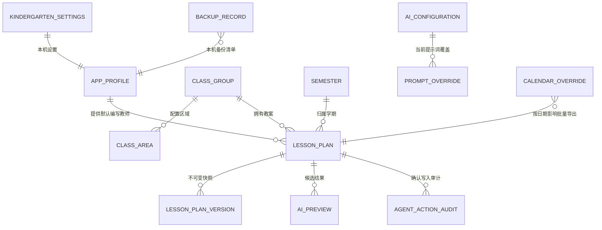

# 桌面首期数据模型

## 1. 建模原则

- 单一 SQLite 文件是业务数据权威；秘密只进入操作系统凭据存储。
- 首期单教师、无账号/角色/租户，因此不创建 `users`、`roles`、`kindergarten_id`、token、
  invite 或 Cloud 审计平台表；Agent 写入阶段只增加不含正文的最小不可变动作审计。
- 不创建幼儿、照片、观察记录、一对一倾听、对象存储或同步表。
- 不创建 Agent conversation/thread/message、embedding、向量索引、教师画像、自动摘要、
  Context、ToolResult、PlanPatch 或 Confirmation 表；这些值对象只在当前进程短期存在。
- 主键使用 SQLite `INTEGER PRIMARY KEY`。备份对外标识使用随机 UUID 文本。
- 业务日期使用 `YYYY-MM-DD` TEXT；UTC 时间使用 Unix epoch milliseconds INTEGER。
- 结构化教案与 AI 结果使用带显式 `schema_version` 的规范 JSON TEXT；解析失败或未知版本不得
  静默降级。
- 所有外键显式命名并启用 `ON DELETE` 语义；所有可枚举状态同时有命名 CHECK 约束。

## 2. 关系概览



## 3. 通用存储约定

| 类型 | SQLite 表示 | 规则 |
|---|---|---|
| 主键 | `INTEGER PRIMARY KEY` | 仅本库内部使用，不暴露为稳定公共 API |
| 布尔 | `INTEGER NOT NULL` | CHECK 值只能为 `0,1` |
| 日期 | `TEXT NOT NULL` | 严格 ISO `YYYY-MM-DD`；应用层解析 |
| UTC 时间 | `INTEGER NOT NULL` | Unix epoch milliseconds；UI 转换为本地时间 |
| JSON | `TEXT NOT NULL` | UTF-8 规范 JSON；顶层包含 `schema_version` |
| SHA-256 | `TEXT NOT NULL` | 64 位小写十六进制 |
| 外部 ID | `TEXT NOT NULL` | 规范 UUID 字符串，仅备份/任务等跨文件对象使用 |

SQLite 连接初始化必须执行：

```text
PRAGMA foreign_keys = ON
PRAGMA busy_timeout = 5000
PRAGMA journal_mode = DELETE
PRAGMA synchronous = FULL
```

连接不得跨线程共享。应用服务串行化写事务；后台任务使用冻结 DTO 或自有连接。

## 4. 实体

### 4.1 `app_profile`（单例）

保存稳定应用资料和非敏感偏好，不是用户账号。

| 字段 | 类型 | 约束/含义 |
|---|---|---|
| `id` | INTEGER | PK；CHECK `id = 1` |
| `application_id` | TEXT | 固定 `cn.kindergartenmanager.desktop` |
| `teacher_display_name` | TEXT | 必填、trim 后 1–50 字；用于新教案默认编写教师 |
| `theme` | TEXT | `system/light/dark` |
| `last_daily_backup_date` | TEXT nullable | 已成功创建每日备份的本地业务日期 |
| `created_at_utc_ms` | INTEGER | 创建时间 |
| `updated_at_utc_ms` | INTEGER | 更新时间 |

教师改名只影响之后创建的教案；既有教案的 `author_name` 保持历史显示。

### 4.2 `kindergarten_settings`（单例）

| 字段 | 类型 | 约束/含义 |
|---|---|---|
| `id` | INTEGER | PK；CHECK `id = 1` |
| `name` | TEXT | trim 后 1–100 字 |
| `timezone` | TEXT | 固定 `Asia/Shanghai`，首期不可编辑 |
| `created_at_utc_ms` | INTEGER | 创建时间 |
| `updated_at_utc_ms` | INTEGER | 更新时间 |

### 4.3 `class_groups`

| 字段 | 类型 | 约束/含义 |
|---|---|---|
| `id` | INTEGER | PK |
| `name` | TEXT | trim 后 1–50 字；NOCASE 唯一 |
| `age_group` | TEXT | `nursery/small/middle/large/mixed` |
| `sort_order` | INTEGER | `>=0` |
| `is_active` | INTEGER | 0/1；有教案后停用而非删除 |
| `created_at_utc_ms` | INTEGER | 创建时间 |
| `updated_at_utc_ms` | INTEGER | 更新时间 |

### 4.4 `class_areas`

| 字段 | 类型 | 约束/含义 |
|---|---|---|
| `id` | INTEGER | PK |
| `class_id` | INTEGER | FK -> `class_groups.id`, `ON DELETE CASCADE` |
| `area_type` | TEXT | `indoor/outdoor` |
| `name` | TEXT | trim 后 1–50 字 |
| `sort_order` | INTEGER | `>=0` |
| `created_at_utc_ms` | INTEGER | 创建时间 |
| `updated_at_utc_ms` | INTEGER | 更新时间 |

唯一约束：`(class_id, area_type, name COLLATE NOCASE)`。

### 4.5 `semesters`

| 字段 | 类型 | 约束/含义 |
|---|---|---|
| `id` | INTEGER | PK |
| `name` | TEXT | trim 后 1–100 字 |
| `start_date` | TEXT | ISO 日期 |
| `end_date` | TEXT | ISO 日期，必须 `>= start_date` |
| `is_current` | INTEGER | 0/1 |
| `created_at_utc_ms` | INTEGER | 创建时间 |
| `updated_at_utc_ms` | INTEGER | 更新时间 |

部分唯一索引保证至多一个 `is_current = 1`。学期之间可以重叠，但 UI 必须提示；创建教案时
由教师当前选择/日期匹配确定 `semester_id`，不得静默在多个重叠学期中猜测。

### 4.6 `lesson_plans`

当前教案权威记录。

| 字段 | 类型 | 约束/含义 |
|---|---|---|
| `id` | INTEGER | PK |
| `class_id` | INTEGER | FK -> `class_groups.id`, `RESTRICT` |
| `semester_id` | INTEGER | FK -> `semesters.id`, `RESTRICT` |
| `plan_date` | TEXT | ISO 日期 |
| `author_name` | TEXT | 创建时复制本地教师显示名，1–50 字 |
| `content_schema_version` | INTEGER | 首期固定 `1` |
| `content_json` | TEXT | `PlanContentV1` 规范 JSON |
| `content_revision` | INTEGER | 从 1 开始，每次成功正文写入递增 |
| `archived_at_utc_ms` | INTEGER nullable | 非空即只读 |
| `created_at_utc_ms` | INTEGER | 创建时间 |
| `updated_at_utc_ms` | INTEGER | 最近成功保存时间 |

唯一约束：`(class_id, plan_date)`。日期不在学期、非工作日或未知只产生软提示，不影响保存。
自动保存只更新本表，不写 `lesson_plan_versions`。

### 4.7 `lesson_plan_versions`

不可变历史快照。

| 字段 | 类型 | 约束/含义 |
|---|---|---|
| `id` | INTEGER | PK |
| `lesson_plan_id` | INTEGER | FK -> `lesson_plans.id`, `ON DELETE CASCADE` |
| `reason` | TEXT | `explicit_save/pre_ai_adopt/pre_history_restore/pre_archive/pre_unarchive` |
| `description` | TEXT nullable | trim 后最多 200 字 |
| `author_name` | TEXT | 快照中的编写教师 |
| `content_schema_version` | INTEGER | 快照 Schema |
| `content_json` | TEXT | 完整内容快照 |
| `source_revision` | INTEGER | 快照对应正文 revision |
| `created_at_utc_ms` | INTEGER | 创建时间 |

数据库触发器拒绝 UPDATE 和 DELETE。恢复历史时先以 `pre_history_restore` 保存当前状态，再把
选中快照写回当前教案并递增 revision；不会修改原快照。

### 4.8 `calendar_overrides`

| 字段 | 类型 | 约束/含义 |
|---|---|---|
| `override_date` | TEXT | PK，ISO 日期 |
| `status` | TEXT | `workday/non_workday` |
| `note` | TEXT nullable | 最多 200 字 |
| `created_at_utc_ms` | INTEGER | 创建时间 |
| `updated_at_utc_ms` | INTEGER | 更新时间 |

删除记录即撤销人工覆盖，恢复 chinesecalendar/未知判断。人工覆盖始终优先。

### 4.9 `ai_configuration`（单例、非敏感）

| 字段 | 类型 | 约束/含义 |
|---|---|---|
| `id` | INTEGER | PK；CHECK `id = 1` |
| `base_url` | TEXT nullable | OpenAI 兼容 Endpoint，不含 userinfo |
| `model_name` | TEXT nullable | 当前唯一模型 |
| `credential_configured` | INTEGER | 只表示 OS 凭据中是否应有 Key |
| `enabled` | INTEGER | 0/1；启用前必须通过配置验证 |
| `created_at_utc_ms` | INTEGER | 创建时间 |
| `updated_at_utc_ms` | INTEGER | 更新时间 |

API Key 不在本表。稳定 keyring 键由应用 ID + 固定账号键组成，日志不得输出键值。

### 4.10 `prompt_overrides`

| 字段 | 类型 | 约束/含义 |
|---|---|---|
| `prompt_code` | TEXT | PK；必须属于内置白名单 |
| `content` | TEXT | 当前本地覆盖文本 |
| `updated_at_utc_ms` | INTEGER | 更新时间 |

默认提示词随只读资源发布；“恢复默认”删除对应 override。首期没有草稿/发布/版本/回滚平台。

### 4.11 `ai_previews`

只持久化已经完成结构校验的预览；运行中任务只存在内存。

| 字段 | 类型 | 约束/含义 |
|---|---|---|
| `id` | INTEGER | PK |
| `lesson_plan_id` | INTEGER | FK -> `lesson_plans.id`, `ON DELETE CASCADE` |
| `operation_id` | TEXT | 随机 UUID，标识一次前台生成 |
| `section_code` | TEXT | 目标栏目或 `daily_reflection` |
| `result_schema_code` | TEXT | 已冻结的结构 Schema |
| `result_json` | TEXT | 已校验结构化结果 |
| `frozen_input_sha256` | TEXT | 生成输入摘要 |
| `target_section_sha256` | TEXT | 生成时目标栏目摘要 |
| `state` | TEXT | `ready/adopted/rejected/invalidated` |
| `created_at_utc_ms` | INTEGER | 创建时间 |
| `decided_at_utc_ms` | INTEGER nullable | 采用/拒绝/失效时间 |

采用时必须在一个事务中：重新计算目标栏目摘要 -> 保存采用前版本 -> 合并结果 -> 更新正文与
revision -> 标记 preview adopted。摘要不一致时只标记 invalidated，不修改正文。

Agent Foundation 的 DRAFT 不写 `ai_previews`；该表仍只服务 Slice 2A 结构化生成与人工采用。

### 4.12 `agent_action_audits`（Agent 写入阶段）

只记录教师确认后实际提交的 Agent WRITE 最小元数据，不是会话、记忆或正文历史。该表在
Slice 3 备份恢复完成后的独立 migration 中加入；Slice 2B 不得提前写入。

| 字段 | 类型 | 约束/含义 |
|---|---|---|
| `id` | INTEGER | PK |
| `action_id` | TEXT | 唯一随机 UUID；一次提交尝试的幂等对账标识 |
| `lesson_plan_id` | INTEGER | FK -> `lesson_plans.id`, `ON DELETE RESTRICT` |
| `tool_name` | TEXT | 已注册 WRITE Tool 的稳定名称 |
| `patch_sha256` | TEXT | 教师看到并确认的规范 Patch 摘要 |
| `confirmation_id` | TEXT | 一次性确认 UUID；UNIQUE |
| `base_revision` | INTEGER | 事务内重检的起始 revision |
| `result_revision` | INTEGER | 成功提交后的 revision；必须大于 base |
| `outcome` | TEXT | 首期仅 `committed`；失败事务不留半条 audit |
| `created_at_utc_ms` | INTEGER | 提交时间 |

数据库触发器拒绝 UPDATE 和 DELETE。表中不得保存 Prompt、Provider 原文、Context、Tool 输入
输出、before/after 正文、教师显示名、Key、口令、token 或绝对路径。完整操作前状态由同事务
创建的 `lesson_plan_versions` 保存，不在 audit 重复正文。

### 4.13 `backup_records`

备份清单只存元数据，不存恢复口令或远程秘密。

| 字段 | 类型 | 约束/含义 |
|---|---|---|
| `id` | INTEGER | PK |
| `backup_id` | TEXT | 唯一随机 UUID |
| `kind` | TEXT | `daily/manual/pre_migration/pre_restore` |
| `target` | TEXT | `local/webdav/s3` |
| `state` | TEXT | `creating/ready/uploading/succeeded/failed/cancelled` |
| `schema_revision` | TEXT | Alembic revision |
| `format_version` | INTEGER | 首期 `1` |
| `encrypted` | INTEGER | 0/1；远程和可携带备份必须为 1 |
| `payload_sha256` | TEXT nullable | 完成后设置 |
| `size_bytes` | INTEGER nullable | `>=0` |
| `local_path` | TEXT nullable | 数据根内相对路径或用户选择路径 |
| `remote_object_key` | TEXT nullable | 不含教师/园所/班级/正文 |
| `error_code` | TEXT nullable | 稳定脱敏错误码 |
| `created_at_utc_ms` | INTEGER | 创建时间 |
| `completed_at_utc_ms` | INTEGER nullable | 完成/失败/取消时间 |

状态与真实文件必须对账：数据库记录 `succeeded` 前，文件/远端对象必须完成长度与哈希验证。

## 5. 状态转换

### 5.1 教案

```text
active --archive(snapshot before)--> archived
archived --unarchive(snapshot before)--> active
active --autosave-------------------> active      # no snapshot
active --explicit save--------------> active      # snapshot current state
active --AI adopt(snapshot before)---> active
active --history restore(snapshot)---> active
```

归档状态下拒绝 autosave、显式正文修改和 AI 采用；允许导出、查看历史和恢复归档。

### 5.2 AI 任务与预览

```text
in-memory: idle -> running -> succeeded | failed | cancelled -> idle
persisted:  ready -> adopted | rejected | invalidated
```

应用关闭时 running 任务请求取消；下次启动直接 idle。数据库中不存在 `running` 任务恢复扫描。

### 5.3 Agent turn、Patch 与写入

```text
in-memory: idle -> running -> awaiting_confirmation -> writing -> succeeded | failed | cancelled -> idle
patch:     drafted -> confirmed | rejected | expired | stale
persisted: no Agent session state; committed WRITE -> one immutable agent_action_audit
```

`AgentContext`、ToolResult、Patch、Confirmation 和 nonce 不落库。WRITE 在一个事务中完成操作前
版本、正文、revision 与 audit；回滚时四者均不改变。重启后只能从 SQLite 经 READ Tool 重建
业务事实，不能从 audit 推断会话或教师偏好。

### 5.4 备份

```text
creating -> ready
ready -> uploading -> succeeded
creating | uploading -> failed | cancelled
failed -> creating            # 新 attempt/新 backup_id，不改写已完成对象
```

本地备份在 `ready` 即可恢复；远程目标只有 `succeeded` 才展示为可恢复远端版本。

## 6. 迁移与完整性门禁

1. `0001_desktop_initial` 只建立 Slice 1 所需的 4.1–4.8 表、命名约束、索引和版本不可变
   触发器；已经验收或投入使用的 `0001` 数据库不得通过改写该 revision 追加表。
2. Slice 2A 使用独立 `0002_desktop_ai`，从 `0001_desktop_initial` 增加 4.9–4.11 的
   `ai_configuration`、`prompt_overrides` 和 `ai_previews` 及其约束/索引；API Key 和运行中
   任务仍不得落库。`0001 -> 0002` 前必须生成并验证最小本地 `pre_migration` 保护副本，失败
   即停止升级；完整每日/远程备份与恢复仍留在 Slice 3。
3. Slice 2B 不增加 Agent 状态表。Slice 3 备份恢复完成后，Agent 写入阶段使用独立
   `0003_agent_action_audit` 增加最小审计表及 UPDATE/DELETE 拒绝触发器；迁移前必须先走已
   验收的 `pre_migration` 备份。
4. 后续 revision 在 SQLite 上使用 Alembic batch mode；不得依赖 PostgreSQL 方言或旧 revision。
5. 每个 revision 测试空库到 head、上一发行 head 到当前 head、失败回滚/备份保留，以及：
   `foreign_key_check`、`integrity_check`、表/索引/触发器清单和关键行数。
6. Schema 升级前一定生成并验证 `pre_migration` 备份。备份失败即不迁移。
7. 比应用支持版本更新的数据库只读拒绝打开，不允许自动降级。

## 7. 明确不迁移的旧模型

- PostgreSQL `kindergartens/users/roles/user_classes` 及所有 `kindergarten_id` 组合外键。
- WebAuthn、密码/TOTP、邀请、刷新令牌、恢复请求与身份审计。
- Redis/Dramatiq job、lease、retry、recovery scan 和 Worker 结果表。
- 多模型档案、提示词发布历史、Cloud 审计与导出下载历史。
- 旧 `kindergartenManager` 和本仓库 PostgreSQL 中的任何业务数据。

旧模型可作为业务规则阅读材料，但不能通过数据转换脚本、兼容视图或保留空表进入桌面库。
